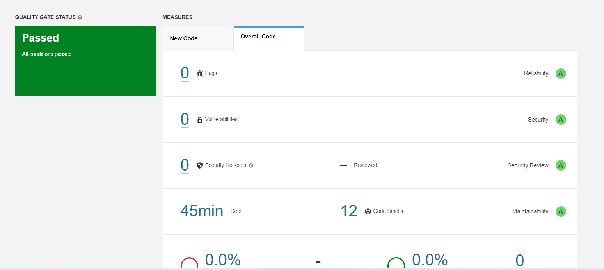

# Actividad-Analisis-codigo-estatico

En esta actividad haremos uso de sonarquebe para el analisis de codigo estatico: 

Veamos el reporte de sonerqube : 

Entramos a issues para ver los olores de cogido : 

Resolvamos algunos olores de codigo : 

1. **Primer olor de codigo(Minor)**

Ejecutamos el sonar nuevamente : 

1. **Segundo olor de codigo (Major)**

Este olor de codigo nos menciona que el primer argumento debe ser el valor esperado , sin embargo los valores de los argumentos esta intercambiados .Corrijamos eso !

Vemos que son 3 clases que presentaban el mismo tipo de olor de codigo.Ahora ejecutemos nuevamente sonarquebe: 

1. **Tercer olor de codigo (Critical)**

 Ejecutemos nuevamente sonarquebe: 

Finalmente hemos reducido de 12 a 4 olores de codigo : 

