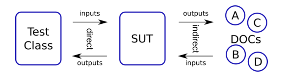
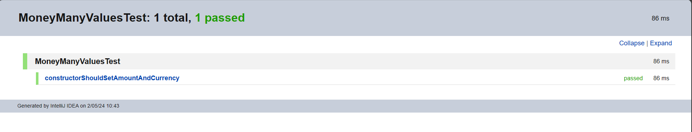
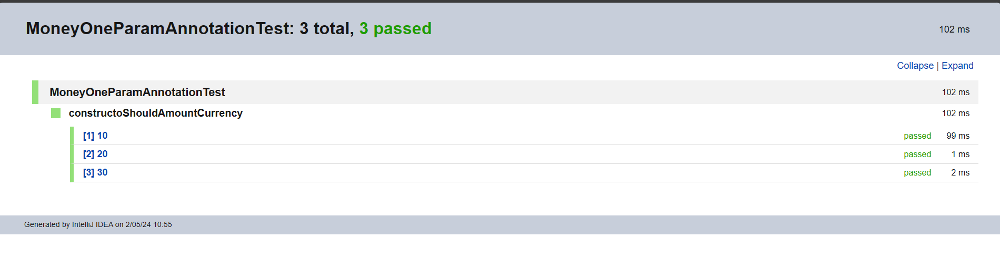

# Actividad1-Testing

1. Explica el siguiente gráfico en términos de SUT y DOC para pruebas unitarias



El gráfico proporcionado ilustra la interacción entre una clase de prueba, el sistema bajo prueba (SUT) y los objetos colaboradores dependientes (DOC) en el contexto de pruebas unitarias.
Interacciones:

- Inputs directos: Datos o llamadas de método que la clase de prueba envía al SUT.
- Outputs directos: Respuestas del SUT a la clase de prueba.
2. Imaginemos algún servicio financiero (clase FinancialService) que, en función del último pago del cliente y su tipo (cualquiera que sea), calcula algún "bonus".

```java
public class FinancialService {
.... // definition of fields and other methods omitted
public BigDecimal calculateBonus(long clientId, BigDecimal payment) {
Short clientType = clientDAO.getClientType(clientId);
BigDecimal bonus = calculator.calculateBonus(clientType, payment);
clientDAO.saveBonusHistory(clientId, bonus);
return bonus;
 }
}
```

Identifica el SUT y sus colaboradores (DOC) y describe los tipos de interacción que ocurren
dentro del método calculateBonus() importantes para la prueba.

El **SUT** en este escenario es el método **`calculateBonus()`** dentro de la clase **`FinancialService`**. Este método es responsable de calcular un bonus basado en el último pago y el tipo de cliente.

Para el método **`calculateBonus()`**, los **DOC** identificables son:

- **`clientDAO`**: Interactúa con la base de datos para obtener y almacenar información del cliente.
- **`calculator`**: Un componente utilizado para calcular el valor del bonus basado en el tipo de cliente y el pago.

Intput indirecto : **`clientDAO.getClientType(clientId)`**

Output indirecto : **`calculator.calculateBonus(clientType, payment)`,`clientDAO.saveBonusHistory(clientId, bonus)`**

3. Sea la abstracción POO siguiente: 


### **Razones para Preocuparse por Interacciones Indirectas**

a. **Impacto en el Cliente**: Las interacciones indirectas, aunque no involucran contacto directo con el cliente, pueden afectar significativamente la calidad del servicio o producto final entregado al cliente.

b. **Efecto Cascada**: Un error en un nivel inferior puede propagarse a través de las interacciones indirectas y magnificar problemas en niveles superiores.

c. **Dependencias Ocultas**: Las interacciones indirectas a menudo revelan dependencias no evidentes entre componentes o roles, que pueden ser críticas para la estabilidad y eficiencia del sistema.


4. Completa en la actividad dada en el repositorio el código fuente para pasar las pruebas.
Uno de los test hechos en clase **`MoneyOneParamAnnotationTest`** y **`MoneyManyValueTest`**
```java

public class MoneyOneParamAnnotationTest {
    @ParameterizedTest
    @ValueSource(ints = {10, 20, 30}) //proveedor de datos de prueba
    void constructoShouldAmountCurrency(int amount) {
        Money money = new Money(amount, "USD");
        assertThat(money.getAmount()).isEqualTo(amount);
    }

}

test2
public class MoneyManyValueTest {
    //evaluar la cantidad de monedas sin cambiar la moneda y sin usar @ValueSource
    @Test //sirve para probar multiples test
    void constructorShouldSetAmountAndCurrency() {
        Money money = new Money(10, "USD");
        assertThat(money.getAmount()).isEqualTo(10);
        assertThat(money.getCurrency()).isEqualTo("USD");
        money = new Money(20, "EUR");
        assertThat(money.getAmount()).isEqualTo(20);
        assertThat(money.getCurrency()).isEqualTo("EUR");
    }
}

```




5. ¿Cuál es la diferencia entre una prueba unitaria y otros tipos de pruebas, como las pruebas de
   integración o las pruebas de aceptación? 

Mientras que las pruebas unitarias se centran en probar unidades individuales de código, las pruebas de integración se centran en la interacción entre esas unidades, y las pruebas de aceptación se centran en verificar si el software cumple con los requisitos y expectativas del cliente