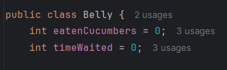

# ActividadHelloCucumber

Objetivos :

- Ejecutar scripts de Cucumber a través de Java usando Gradle
- Extender el archivo `belly.feature`  con algunos escenarios Gherkin adicionales para probar adecuadamente la clase ‘Belly.

Primero descargamos el proyecto Hello-Cucumber del repositorio : 
 [https://github.com/kapumota/Actividades-CC3S2/tree/main/2024-1/Actividad4-](https://github.com/kapumota/Actividades-CC3S2/tree/main/2024-1/Actividad4-)

Luego de abrir el proyecto empezamos con la actividad: 

**Clase `Belly.java` :**

- `eatenCucumbers`: Variable que almacena la cantidad total de pepinos que se han comido.
- `timeWaited`: Variable que almacena el tiempo total que se ha esperado en horas.

Creamos los metodos`reset`, `eat` ,`wait` ,`isGrowLing` :

- `reset()`: Este método restablece las variables `eatenCucumbers` y `timeWaited` a cero.
- `eat(int cukes)`: Este método simula comer pepinos. Acepta un parámetro `cukes`, la cantidad de pepinos comidos.
- `wait(int timeInHours)`: Este metodo simula esperar un cierto tiempo en horas.
- `isGrowling()`: Este método verifica si el estómago está gruñendo. Devuelve `true` si el tiempo esperado es mayor o igual a 2 horas y la cantidad de pepinos comidos es mayor que 10.

**Clase `RunCukesTest.java`**

Esta clase es una configuración para ejecutar pruebas escritas con Cucumber en Java.

- `@RunWith(Cucumber.class)`: Permite que JUnit ejecute las pruebas Cucumber como cualquier otra prueba de JUnit.
- `@CucumberOptions(glue = "skeleton")`: Proporciona opciones de configuración para la ejecución de las pruebas de Cucumber.
- `public class RunCukesTest { }`: Esta es la definición de la clase `RunCukesTest`, que simplemente actúa como un punto de entrada para la ejecución de las pruebas Cucumber.

**Clase `Stepdefs.java`**

Ahora en belly.feature creamos el primer escenario : 

La prueba paso correctamente.

Creamos las siguientes pruebas

Las ejecutamos: 

Las pruebas pasaron exitosamente.