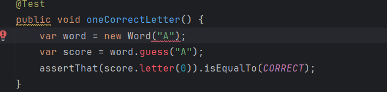
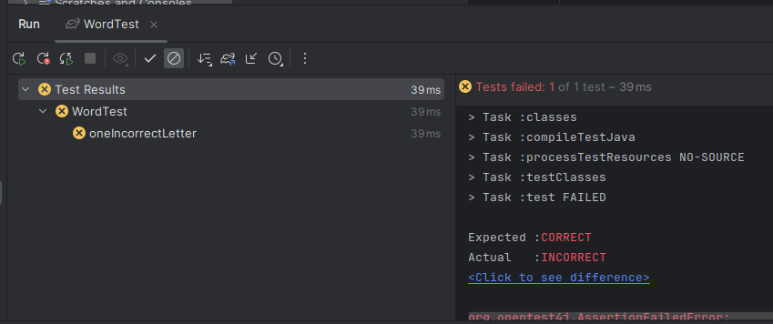

# ActividadTDD3

La actividad consta de 3 ciclos TDD donde cada ciclo se incluirán pruebas con los siguientes pasos: 

rojo → verde → azul

Donde : 

- **`rojo`** = pruebas que fallan
- **`verde`** = pruebas que pasan
- `**azul**` = refactorización

### 1° Ciclo TDD

**1.** Comencemos en **`rojo`**. Escriba una prueba fallida para una sola letra correcta:

Pregunta: Explica que hace esta prueba.
Esta prueba verifica la funcionalidad del método **`guess()`** de la clase **`Word`** al confirmar si la letra ingresada por el usuario coincide correctamente con la letra presente en la palabra representada por el objeto **`Word`**. En este caso específico, la prueba valida que cuando se adivina la letra 'A' en una palabra de una sola letra ('A'), el resultado indicará que la letra adivinada es correcta

**2.** Ahora pasemos a `**verde**` agregando el código de producción para que pase la prueba:

Usamos el IDE para ayudarnos a escribir class Score:

- Para cubrir el nuevo comportamiento probado por la prueba oneCorrectLetter(), agregamos el
código anterior. En lugar de que el método `**assess ()**` siempre devuelva Letter.INCORRECT como lo
hizo anteriormente, la nueva prueba ha forzado una nueva dirección. El método **`assess()`** ahora debe
poder devolver el puntaje correcto cuando una letra adivinada es correcta.
- Para lograr esto, agregamos un campo llamado resultado para contener el último puntaje, código
para devolver ese resultado del método **`letter()`** y código en el método **`assess()`** para verificar si la
primera letra de la adivinación coincide con la primera letra de la palabra Si lo hemos hecho bien,
ambas pruebas deberían pasar ahora.

Pregunta: Ejecuta todas las pruebas para ver cómo lo estamos haciendo. ¿Qué encuentras aquí?.

Vemos que el test ha pasado correctamente (`**VERDE**`).

**Definición de olores de código**

El término olor a código apareció originalmente en la wiki de C2. Vale la pena leer para ver los
ejemplos de olores de código.Tiene una definición útil que señala que el olor del código es algo que
necesita revisión, pero que no necesariamente debe cambiarse: [https://wiki.c2.com/?CodeSmell](https://wiki.c2.com/?CodeSmell).
Reflexionemos sobre el interior del método **`assess()`**. Simplemente parece desordenado con
demasiado código. Extraemos un método auxiliar para agregar algo de claridad. Siempre podemos
revertir el cambio si sentimos que no ayuda.

**3.** Vamos a refactorizar**(`azul`)**. Extrae un método **`isCorrectLetter()`** para mayor claridad:

Una vez más, realizamos todas las pruebas para demostrar que esta refactorización no ha roto nada.
Las pruebas pasan !!!`**(verde)**`

Hay dos áreas más que quiero refactorizar en esta etapa. El primero es un método simple para
mejorar la legibilidad de la prueba. Refactoricemos el código de prueba para mejorar su claridad.
Agregaremos un método de assert personalizado:

La próxima refactorización que quizás queramos hacer es un poco más controvertida, ya que es un
cambio de diseño. Hagamos la refactorización. ¿Estas de acuerdo con ese ‘cambio’?

**4.** Cambiemos cómo especificamos la posición de la letra para verificar en el método **`assess()`**

### **2°Ciclo TDD: Avanzando en el diseño con combinaciones de dos letras**

**1.** Comencemos escribiendo una prueba para una segunda letra que está en la posición incorrecta(**`ROJO`**):

La prueba falla! 

**2.** Agreguemos el código inicial para verificar todas las letras en nuestra adivinación:

**3.** Agreguemos código para detectar cuándo una letra correcta está en la posición incorrecta:

La prueba paso!! (**`Verde`**)

### **3°Ciclo TDD: Prueba** para evaluar el comportamiento en torno a la segunda letra en la posición incorrecta.

1. Agrega una nueva prueba ejercitando las tres posibilidades de puntuació (**`rojo`**)

Ejecutamos la prueba:

La prueba falla ! **`(rojo)`**

1. Agrega una lista List de resultados para almacenar el resultado de cada posición de letra por
separado:

Ejecutemos la prueba , en efecto la prueba pasa  (**`Verde`**)

1.  Extraigamos la lógica dentro del cuerpo del ciclo en un método scoreFor():**`(AZUL)`**

El codigo anterior se lee mucho más claramente. El cuerpo del método scoreFor() es ahora una descripción concisa de las reglas para puntuar cada letra. Reemplazamos la construcción if-else-if con una construcción if-return más simple. Averiguamos cuál es el puntaje, luego salimos del método inmediatamente.

El siguiente trabajo es limpiar el código de prueba **`(AZUL)`**

Finalmente nuestro codigo de prueba es el siguiente:

Ahora toca verificar que todo sigue en verde y no hayamos roto nada ...

Las pruebas pasaron **`(verde)`** con un codigo refactorizado **`( azul)`.**