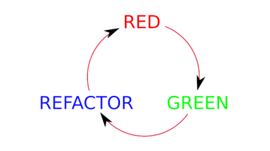

# ActividadRGR+TDD

Trabaje en base a este ritmo de trabajo 

• Escribe una prueba que falle (ROJO).
• Haz que el código funcione (VERDE).
• Elimina la redundancia (REFACTORIZA/BLUE)

## El problema  :

Vamos a jugar un poco al fútbol, ¿de acuerdo? Implementaremos una clase FootballTeam, para que
podamos comparar diferentes equipos y ver quién ocupa el primer lugar en la liga. Cada equipo lleva
un registro del número de juegos ganados.

## **1°Ciclo : Asegurar la funcionalidad del constructor para un valor**

**ROJO - Escribimos una prueba que falle**

Para poder comparar dos equipos, cada uno de ellos debe recordar su número de victorias. Por simplicidad, diseñemos una clase FootballTeam(SUT) que tome el número de juegos como parámetro del constructor. Lo primero es lo primero: asegurémonos de que este constructor funcione.

Comenzamos creando una nueva clase - **`FootballTeamTest`** - en algún lugar del directorio `src/test/java`. Puede lucir de la siguiente manera:

Ejecutamos la prueba y efectivamente, la prueba fallo :

Con ayuda del IDE creamos la clase `**FootballTeam` ,** su constructor y el metodo **`getGamesWon()`** , el minimo codigo para que la prueba pase (verde).

Dado que la prueba se compila, y tiene una aserción que verifica una funcionalidad importante perteneciente a nuestra clase, vale la pena ejecutarla. Una vez que la ejecutamos, falla!. .

Si alguna vez rompemos nuestro código SUT(FoorballTeam), de modo que esta prueba falle, el mensaje de aserción nos dirá precisamente qué está mal y la solución debería ser fácil.

**VERDE - Arregla el Código**

Modificamos el metodo **`getGameWon`** para que retorne 3 como resultado.

La prueba ha pasado , sin embargo eso no es suficiente.Antes de escribir más pruebas, hay otra fase de la que ocuparnos: **refactorización**.

**Refactorizacion- Aunque solo sea un poco(BLUE)**

Lo mínimo que deberíamos hacer es deshacernos del número mágico 3 - por ejemplo, introduciendo una variable **`THREE_GAMES_WON`**.

El cambio fue trivial, y no hay forma de que pudiera romper la prueba.

## 2° Ciclo : Asegurar la funcionalidad del constructor para mas de un valor

**ROJO :** 

Creamos una prueba para que el constructor acepte mas valores .Empecemos!!

**VERDE :** 

La prueba anterior falló , ahora hagamos que la prueba pase con el mínimo codigo posible(VERDE) :

Ejecutamos nuevamente la prueba , esta pasó (verde):

**REFACTORIZAR (BLUE)**

Nuestra prueba puede limpiarse: ya que  no hay necesidad de que el primer método de prueba esté allí. El segundo test cubre el escenario de 3 juegos ganados, y también hace mucho más. 

Por ello eliminamos la primera prueba

Ejecutamos de nuevo la suit de pruebas ,sigue verde !

## 3° Ciclo Asegurar que el constructor no acepte valores negativos

**ROJO**: 

Basándonos en nuestra experiencia anterior, podemos comenzar con una prueba parametrizada ya.

La prueba falla esto se debe a que el constructor de la clase **`FootballTeam`** actualmente acepta cualquier valor: 

**VERDE** : 

Solucionemos el problema anterior , para que la prueba pasa .Para ello modifiquemos la clase **`FootballTeam`** : 

La prueba paso correctamente .

## 4° CICLO : Comparar los puntajes de los equipos de futbol

El constructor funciona bien. Ahora podemos pasar al problema principal: es decir, comparar equipos de fútbol. En primer lugar, hemos decidido que vamos a usar la interfaz `**java.lang.Comparable**.`

ROJO: 

Para ello creemos una prueba para este comportamiento , veamos : 

VERDE : 

Debido a que la prueba fallo, modificaremos la clase **`FootballTeam`** implementado la interfaz Comparable:

Ejecutamos nuevamente la prueba y esta pasa : 

## 5°Ciclo : Pruebas de comparación de teams de futboll

 

Escribiremos la primera prueba de comparación. La idea es simple: tomar dos equipos con diferentes números de victorias y compararlos.

La prueba deberia fallar ,efectivamente …

VERDE : 

Para que la prueba pase , modifcamos el metodo **`compareTo`** de la clase **`FootballTeam`** : 

La prueba paso .

Ahora ejecutemos todas las pruebas para ver que no hayan ocurrido errores.

No hubo algún error , las pruebas pasaron correctamente. 

**REFACTORIZAR (BLUE):**

Vamos a refactorizar el codigo, en la metodo **`compareTo`** podemos renombrar la variable o  por “otherteam”

Ejecutamos nuevamente las pruebas para evitar nuevos errores: 

Las pruebas pasaron exitosamente.

## 6°Ciclo : Prueba de igualdad de puntaje de los Teams de futbol

Bueno, esta prueba pasa de inmediato, porque nuestra implementación ya ha devuelto 0 en casos de igualdad. Entonces, ¿qué deberíamos hacer ahora? Definitivamente hemos omitido un paso en el ritmo TDD.Nunca hemos visto esta prueba de igualdad fallar, así que no sabemos por qué pasa. ¿Por qué?

En nuestro caso, el cambio a introducir sería devolver algún otro valor que no sea 0 en la última línea del método **`compareTo() ,`** por ejemplo:

ROJO : 

Así que la prueba está roja ahora. Después de revertir la línea para devolver 0 podemos ver que
todas nuestras pruebas pasan. Bien, nuestra prueba de igualdad está haciendo lo que debe!

**VERDE** 

La prueba paso!

**BLUE** 

Avancemos a la refactorización. Ahora que tenemos una red de seguridad de pruebas, podemos realmente refactorizar el método que está siendo probado. Después de pensar cuidadosamente en
el asunto, hemos terminado con una implementación mucho más simple.

Las pruebas no se vieron afectadas por la refactorizacion(todas pasaron) :

Nota: 

Volver a ejecutar las pruebas ahora nos dice que esta implementación satisface todos los requisitos
(escritos en forma de pruebas) hasta ahora.