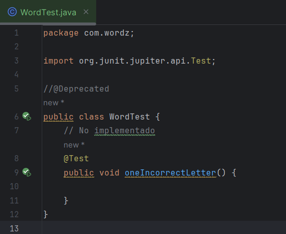

# Actividad TDD1

1. Escribe el siguiente código para comenzar nuestra prueba:

1. Para comenzar el diseño, decidimos usar una clase llamada Word para representar nuestra
   palabra. También decidimos proporcionar la palabra a adivinar como un parámetro de construcción
   para nuestra instancia de objeto de la clase Word que queremos crear. Codificamos estas decisiones
   de diseño en la prueba:

1. Usamos autocompletar en este punto para crear una nueva clase Word en tu propio archivo.
   Doble click en src/main folder tree y no en src/test. Haz clic en OK para crear el archivo en el árbol
   fuente dentro del paquete correcto.

1. Ahora, renombramos el parámetro del constructor de Word

1. A continuación, volvemos a la prueba. Capturamos el nuevo objeto como una variable local para
   que podamos probarlo:

1. Pasar la adivinación es una decisión fácil: usaremos un método que llamaremos guess(). Podemos
   codificar estas decisiones en la prueba:

1. Pasar la adivinación es una decisión fácil: usaremos un método que llamaremos guess(). Podemos
   codificar estas decisiones en la prueba:

1. Haz clic en Enter para agregar el método, luego cambie el nombre del parámetro a un **nombre**
   **descriptivo**:

1. A continuación, agreguemos una forma de obtener la puntuación resultante de esa suposición.
   Comienza con la prueba:

1.  Captura estas decisiones en la prueba
2. Ahora, ejecuta esta prueba. Falla. Este es un paso sorprendentemente importante. Podríamos
   pensar al principio que solo queremos ver pasar las pruebas. Esto no es totalmente cierto. Parte del trabajo en TDD es tener la confianza de que sus pruebas están funcionando. Ver fallar una prueba cuando sabemos que no hemos escrito el código para que pase, nos da la confianza de que nuestra prueba probablemente esté verificando las cosas correctas

3. Hagamos que la prueba pase agregando código a la clase Word:

4. A continuación, crea la clase score:

Nuevamente, usamos atajos de IDE para hacer la mayor parte del trabajo al escribir ese código por
nosotros. ¿La prueba pasa?. Explica los detalles

Vemos que los  test no pasan, ahora escribamos el minimo codigo de prueba para que estas pasen .

- creamos la clase Letter  que tiene como Objeto INCORRECT:

- Ahora en la clase Score adicionamos la línea **`return (Letter) Letter.INCORRECT;`** implica una conversión explícita de un objeto de tipo **`Object`** a un objeto de tipo **`Letter`**.

- Probamos el test y finalmente paso :

Exportamos el test en formato HTML y asi finaliza la actividad TDD1

