# Actividad - Pruebas basadas en especificaciones

Las pruebas basadas en especificaciones son técnicas que utilizan los requisitos del programa, como historias de usuarios ágiles o casos de uso de UML, como entrada de prueba. Los requisitos de software son cruciales para las pruebas.

En este contexto, se requiere implementar un método llamado `substringsBetween()`, el cual busca subcadenas delimitadas por etiquetas de inicio y fin dentro de una cadena dada y devuelve todas las subcadenas coincidentes en un arreglo.

**Requisitos del método `substringsBetween()`:**

- **str**: La cadena que contiene las subcadenas. Si es null, devuelve null; si es una cadena vacía, devuelve otra cadena vacía.
- **open**: La cadena que identifica el inicio de la subcadena. Una cadena vacía devuelve null.
- **close**: La cadena que identifica el final de la subcadena. Una cadena vacía devuelve null.

**Ejemplo**:

- Dado `str = "axcaycazc"`, `open = "a"`, y `close = "c"`, la salida será un arreglo que contiene `["x", "y", "z"]`. Esto se debe a que la subcadena "a<algo>c" aparece tres veces en la cadena original: la primera contiene "x", la segunda "y" y la última "z".

Con estos requisitos en mente, se debe escribir la implementación correspondiente para el método `substringsBetween()`.

## Ejercicio 1: Escribe el código de prueba y considera las entradas str = "axcaycazc", open = "a" y close = "c" y explica lo que hace el código anterior.

## Clase StringUtils

```java
import java.util.ArrayList;
import java.util.List;

public class StringUtils {

    //Metodo para verificar si una cadena está vacia o es nula
    private static boolean isEmpty(final String str) {
        return str == null || str.isEmpty();
    }

    //Metodo para obtener substrings entre dos delimitadores dados
    public static String[] substringsBetween(final String str, final String open, final String close) {
        //Verifica si la cadena o los delimitadores son nulos o vacíos
        if (str == null || isEmpty(open) || isEmpty(close)) {
            return null;
        }

        final int strLen = str.length();
        //Si la cadena esta vacia, retorna un arreglo vacío
        if (strLen == 0) {
            return new String[0]; //Inicializacion correcta del arreglo vacio
        }

        final int closeLen = close.length();
        final int openLen = open.length();
        final List<String> list = new ArrayList<>();
        int pos = 0;

        //Bucle para encontrar substrings entre los delimitadores
        while (pos < strLen - closeLen) {
            int start = str.indexOf(open, pos);
            if (start < 0) {
                break; //Salir si no se encuentra el delimitador de apertura
            }
            start += openLen;
            final int end = str.indexOf(close, start);
            if (end < 0) {
                break; //Salir si no se encuentra el delimitador de cierre
            }
            //Añadir substring a la lista
            list.add(str.substring(start, end));
            //Actualizar posicion
            pos = end + closeLen;
        }

        //Si la lista esta vacia, retornar null
        if (list.isEmpty()) {
            return null;
        }

        //Convertir la lista a un arreglo y retornarlo
        return list.toArray(new String[0]); //Inicializacion correcta del arreglo vacio
    }
}
```

## Clase Main

```java
public class Main {
    public static void main(String[] args) {
        //Llamada al metodo substringsBetween de la clase StringUtils
        //Este metodo busca substrings entre los delimitadores "a" y "c" 
        //en la cadena "axcaycazc"
        String[] result = StringUtils.substringsBetween("axcaycazc", "a", "c");

        //Concatenar los resultados y mostrarlos
        if (result != null) {
            //Si se encuentran substrings, se concatenan en un StringBuilder
            StringBuilder concatenatedResult = new StringBuilder();
            for (String s : result) {
                concatenatedResult.append(s);
            }
            //Imprimir el resultado concatenado
            System.out.println(concatenatedResult.toString());
        } else {
            //Si no se encuentran substrings, se imprime un mensaje indicando esto
            System.out.println("No substrings found");
        }
    }
}

```

## Salida por consola
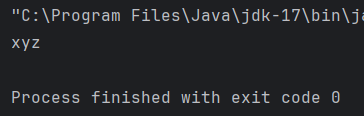

Ejecutando esta implementación, tenemos la subcadena del String original que comienza por el caracter “a” y termina con el caracter “c”.

## Ejercicio 2: Revisa los requisitos una vez más y escribe todos los casos de prueba que se te ocurran. El formato no importa, puede ser algo así como "todos los parámetros son nulos". Cuando hayas terminado con esta nota, compara tu conjunto de pruebas inicial con el que estamos a punto de derivar.

Estos son los escenarios de prueba que he considerado. Cubren diferentes situaciones y combinaciones de entradas para asegurar que el método funcione correctamente en diversos contextos:

### Casos de prueba:

1. **Todos los parámetros son nulos**:
    - `str = null`, `open = null`, `close = null`
    - Resultado esperado: `null`
2. **Cadena de entrada es nula**:
    - `str = null`, `open = "a"`, `close = "c"`
    - Resultado esperado: `null`
3. **Delimitador de apertura es nulo**:
    - `str = "axcaycazc"`, `open = null`, `close = "c"`
    - Resultado esperado: `null`
4. **Delimitador de cierre es nulo**:
    - `str = "axcaycazc"`, `open = "a"`, `close = null`
    - Resultado esperado: `null`
5. **Cadena de entrada es vacía**:
    - `str = ""`, `open = "a"`, `close = "c"`
    - Resultado esperado: `[]` (arreglo vacío)
6. **Delimitador de apertura es vacío**:
    - `str = "axcaycazc"`, `open = ""`, `close = "c"`
    - Resultado esperado: `null`
7. **Delimitador de cierre es vacío**:
    - `str = "axcaycazc"`, `open = "a"`, `close = ""`
    - Resultado esperado: `null`
8. **Cadena de entrada no contiene delimitadores**:
    - `str = "abcdef"`, `open = "x"`, `close = "y"`
    - Resultado esperado: `null`
9. **Delimitadores están al principio y al final de la cadena**:
    - `str = "aHelloWorldc"`, `open = "a"`, `close = "c"`
    - Resultado esperado: `["HelloWorld"]`
10. **Múltiples apariciones de delimitadores**:
    - `str = "axcaycazc"`, `open = "a"`, `close = "c"`
    - Resultado esperado: `["x", "y", "z"]`
11. **Delimitadores superpuestos**:
    - `str = "aaxaaycaazc"`, `open = "aa"`, `close = "c"`
    - Resultado esperado: `["x", "y"]`
12. **Delimitadores anidados**:
    - `str = "aaxcbayc"`, `open = "a"`, `close = "c"`
    - Resultado esperado: `["ax", "b"]`
13. **Delimitadores dentro del contenido**:
    - `str = "aaxaacac"`, `open = "a"`, `close = "c"`
    - Resultado esperado: `["xa", "a"]`
14. **Cadena de entrada contiene sólo delimitadores de apertura**:
    - `str = "aaa"`, `open = "a"`, `close = "c"`
    - Resultado esperado: `null`
15. **Cadena de entrada contiene sólo delimitadores de cierre**:
    - `str = "ccc"`, `open = "a"`, `close = "c"`
    - Resultado esperado: `null`
16. **Delimitadores son iguales**:
    - `str = "aHelloaWorlda"`, `open = "a"`, `close = "a"`
    - Resultado esperado: `["Hello", "World"]`

En el siguiente Test para la clase considere algunos casos para no hacerlo tan extenso

```java
package org.example;

import org.junit.jupiter.api.Test;
import static org.assertj.core.api.AssertionsForClassTypes.assertThat;

public class StringUtilsTest2 {

    //Instancia de la clase StringUtils para realizar las pruebas
    StringUtils stringUtils = new StringUtils();

    //Test para verificar cuando todos los parametros son nulos
    @Test
    void TodosLosParametrosSonNulos() {
        //Verifica que el resultado de substringsBetween con todos los parametros nulos sea null
        assertThat(stringUtils.substringsBetween(null, null, null)).isNull();
    }

    //Test para verificar cuando la cadena de entrada es nula
    @Test
    void CadenaDeEntradaEsNula() {
        //Verifica que el resultado de substringsBetween con la cadena de entrada nula sea null
        assertThat(stringUtils.substringsBetween(null, "a", "c")).isNull();
    }

    //Test para verificar cuando el delimitador de apertura es nulo
    @Test
    void DelimitadorDeAperturaEsNulo() {
        //Verifica que el resultado de substringsBetween con el delimitador de apertura nulo sea null
        assertThat(stringUtils.substringsBetween("axcaycazc", null, "c")).isNull();
    }

    //Test para verificar cuando el delimitador de cierre es nulo
    @Test
    void DelimitadorDeCierreEsNulo() {
        //Verifica que el resultado de substringsBetween con el delimitador de cierre nulo sea null
        assertThat(stringUtils.substringsBetween("axcaycazc", "a", null)).isNull();
    }

    //Test para verificar cuando la cadena de entrada es vacia
    @Test
    void CadenaDeEntradaEsVacia() {
        //Verifica que el resultado de substringsBetween con la cadena de entrada vacia sea una matriz vacia
        assertThat(stringUtils.substringsBetween("", "a", "c")).isEqualTo(new String[0]);
    }
}
```

Al momento de ejecutar los 5 test que seleccione, obtengo el siguiente resultado:

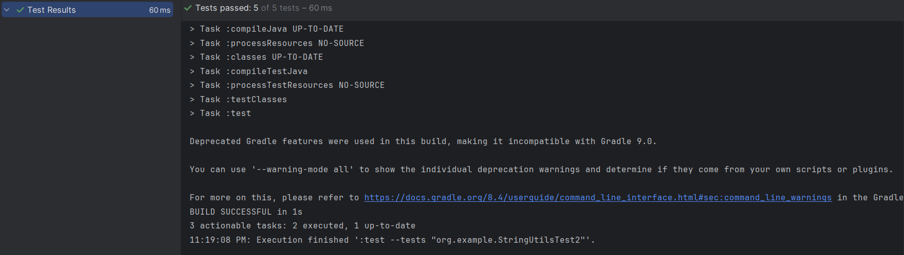

## Ejercicio 3: Escribe un código de prueba llamado stringUtilsExploracionTest.java que albergue el código anterior.

El proceso implica lo siguiente:

1. Pasamos la cadena "abcd" con la etiqueta de apertura "a" y la etiqueta de cierre "d". Se espera que devuelva un arreglo con un solo elemento: ["bc"]. La prueba unitaria confirma este comportamiento.
2. Luego, probamos con una cadena que contiene varias subcadenas iguales. Al pasar la cadena "abcdabcdab" con las mismas etiquetas de apertura y cierre, se espera que devuelva un arreglo con dos cadenas: ["bc", "bc"]. La prueba confirma este comportamiento esperado.
3. Continuamos probando con etiquetas de apertura y cierre que son más grandes que un solo carácter. Repetimos la segunda prueba, duplicando las "a" y las "d" en todos los parámetros. Además, cambiamos uno de los "bc" a "bf" para asegurar que el método devuelva dos subcadenas diferentes: ["bc", "bf"]. La prueba confirma que el programa se comporta como se espera en este caso también.

```java
package org.example;

import org.junit.jupiter.api.Test;
import static org.assertj.core.api.AssertionsForClassTypes.assertThat;

//Clase de pruebas para StringUtils
class StringUtilsTest {

    //Instancia de StringUtils para realizar las pruebas
    StringUtils stringUtils = new StringUtils();

    //Test para un caso simple
    @Test
    void simpleCase() {
        //Verifica que el metodo substringsBetween funcione correctamente con una cadena simple
        assertThat(stringUtils.substringsBetween("abcd", "a", "d")).isEqualTo(new String[] { "bc" });
    }

    //Test para varias ocurrencias de delimitadores en la cadena de entrada
    @Test
    void manyStrings() {
        //Verifica que el metodo substringsBetween funcione correctamente con múltiples ocurrencias de delimitadores
        assertThat(stringUtils.substringsBetween("abcdabcdab", "a", "d")).isEqualTo(new String[] { "bc", "bc" });
    }

    //Test para delimitadores que son mas largos que un caracter
    @Test
    void openAndCloseTagsThatAreLongerThan1Char() {
        //Verifica que el metodo substringsBetween funcione correctamente con delimitadores mas largos
        assertThat(stringUtils.substringsBetween("aabcddaabfddaab", "aa", "dd")).isEqualTo(new String[] { "bc", "bf" });
    }
}
```

Al momento de ejecutar esta clase test de java obtengo lo siguiente:

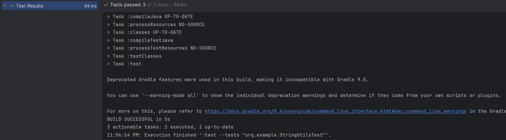
## Ejercicio 4: ¿En nuestro ejemplo cuál es el número de pruebas?

En nuestro ejemplo, el número de pruebas requeridas es:

1. Pruebas para el caso de cadena de longitud 1:
    - Una prueba donde el carácter único de la cadena coincide con open y close.
    - Una prueba donde el carácter único de la cadena no coincide con open y close.
2. Pruebas para etiquetas de open y close de diferentes longitudes:
    - Las cuatro combinaciones de (longitud de open = 1, longitud de close = 1), (longitud de open > 1, longitud de close = 1), (longitud de open = 1, longitud de close > 1), y (longitud de open > 1, longitud de close > 1) no son necesarias, a menos que tengamos una buena razón para creer que el programa maneja etiquetas de open y close de diferentes longitudes de diferentes maneras.
    - Solo (longitud de open = 1, longitud de close = 1) y (longitud de open > 1, longitud de close > 1) son suficientes para cubrir todas las posibilidades y verificar el comportamiento del programa correctamente.

## Ejercicio 5: ¿Encontramos más casos donde se pueda simplificar el número de pruebas?

Con una clara comprensión de qué particiones deben ser examinadas exhaustivamente y cuáles no, podemos generar los casos de prueba combinando diferentes escenarios.

Comenzamos con los casos excepcionales:

- T1: Cuando str es nulo.
- T2: Cuando str está vacío.
- T3: Cuando open es nulo.
- T4: Cuando open está vacío.
- T5: Cuando close es nulo.
- T6: Cuando close está vacío.

Para cadenas de longitud 1:

- T7: El único carácter en str coincide con open.
- T8: El único carácter en str coincide con close.
- T9: El único carácter en str no coincide ni con open ni con close.
- T10: El único carácter en str coincide tanto con open como con close.

Ahora, para cadenas de longitud mayor que 1, con longitud de open = 1 y longitud de close = 1:

- T11: str no contiene ni la etiqueta open ni la de close.
- T12: str contiene la etiqueta open pero no la de close.
- T13: str contiene la etiqueta de close pero no la de open.
- T14: str contiene tanto la etiqueta de open como la de close.
- T15: str contiene las etiquetas de open y close varias veces.

Continuamos con cadenas de longitud mayor que 1, con longitud de open y close mayores que 1:

- T16: str no contiene ni la etiqueta de open ni la de close.
- T17: str contiene la etiqueta open pero no la de close.
- T18: str contiene la etiqueta de close pero no la de open.
- T19: str contiene tanto la etiqueta de open como la de close.
- T20: str contiene las etiquetas de open y close varias veces.

Finalmente, la prueba para el límite:

- T21: str contiene las etiquetas de open y close sin caracteres entre ellas.

Con esto, terminamos con un total de 21 pruebas que cubren exhaustivamente los diferentes casos posibles.

Para ello realizo los siguientes test:

```java
package org.example;

import org.junit.jupiter.api.Test;
import static org.assertj.core.api.AssertionsForClassTypes.assertThat;
import static org.example.StringUtils.substringsBetween;

public class StringUtilsTest3 {
    //Instancia de la clase StringUtils para realizar las pruebas
    StringUtils stringUtils = new StringUtils();

    //Prueba para verificar si str es nulo o vacio
    @Test void strIsNullOrEmpty() {
        assertThat(substringsBetween(null, "a", "b")).isEqualTo(null);
        assertThat(substringsBetween("", "a", "b")).isEqualTo(new String[]{});
    }

    //Prueba para verificar si open es nulo o vacio
    @Test void openIsNullOrEmpty() {
        assertThat(substringsBetween("abc", null, "b")).isEqualTo(null);
        assertThat(substringsBetween("abc", "a", "")).isEqualTo(null);
    }

    //Prueba para verificar si close es nulo o vacio
    @Test void closeIsNullOrEmpty() {
        assertThat(substringsBetween("abc", "a", null)).isEqualTo(null);
        assertThat(substringsBetween("abc", "a", "")).isEqualTo(null);
    }

    //Prueba para verificar el comportamiento con cadenas de longitud 1
    @Test void strOfLength1() {
        assertThat(substringsBetween("a", "a", "b")).isEqualTo(null);
        assertThat(substringsBetween("a", "b", "a")).isEqualTo(null);
        assertThat(substringsBetween("a", "b", "b")).isEqualTo(null);
        assertThat(substringsBetween("a", "a", "a")).isEqualTo(null);
    }

    //Prueba para verificar el comportamiento con etiquetas de apertura y cierre de longitud 1
    @Test void openAndCloseOfLength1() {
        assertThat(substringsBetween("abc", "x", "y")).isEqualTo(null);
        assertThat(substringsBetween("abc", "a", "y")).isEqualTo(null);
        assertThat(substringsBetween("abc", "x", "c")).isEqualTo(null);
        assertThat(substringsBetween("abc", "a", "c")).isEqualTo(new String[]{"b"});
    }

    //Prueba para verificar el comportamiento con etiquetas de apertura y cierre de diferentes tamaños
    @Test void openAndCloseTagsOfDifferentSizes() {
        assertThat(substringsBetween("aabcc", "xx", "yy")).isEqualTo(null);
        assertThat(substringsBetween("aabcc", "aa", "yy")).isEqualTo(null);
        assertThat(substringsBetween("aabcc", "xx", "cc")).isEqualTo(null);
        assertThat(substringsBetween("aabbcc", "aa", "cc")).isEqualTo(new String[]{"bb"});
        assertThat(substringsBetween("aabbccaaeecc", "aa", "cc")).isEqualTo(new String[]{"bb", "ee"});
    }
}
```

Tambien agrego la prueba para cuando no hay una subcadena entre las etiquetas de open y close.

```java
//Prueba para verificar el comportamiento cuando no hay subcadena entre las etiquetas de apertura y cierre
    @Test void notSubstringBetweenOpenAndCloseTags() {
        assertThat(substringsBetween("aabb", "aa", "bb")).isEqualTo(new String[]{""});
    }
```

Al momento de ejecutar estos test obtengo:


También agrego los siguientes test:

```java
@Test void openAndCloseOfLength1() { 
       assertThat(substringsBetween("abcabyt byrc", "a", "c")).isEqualTo(new String[]{"b", "byt byr"}); 
} 
@Test void openAndCloseTagsOfDifferentSizes() {  
       assertThat(substringsBetween("a abb ddc ca abbcc", "a a", "c c")).isEqualTo(new String[]{"bb dd"}); 
} 
```

Al momento de ejecutar los test obtengo:


## Ejercicio 6: Escribe un archivo stringUtilsTest.java y completa el código anterior.

Se han completado 23 casos de prueba ,tomate el tiempo para revisar todos los pasos realizados. Además, plantea la pregunta de si se ha concluido o si aún queda trabajo por hacer. 

La clase `StringUtilsTest3` contiene una serie de pruebas para verificar diferentes escenarios del método `substringsBetween` de la clase `StringUtils`. Las pruebas abarcan casos como cadenas nulas o vacías, etiquetas de apertura y cierre nulas o vacías, cadenas de longitud 1, etiquetas de apertura y cierre de diferentes longitudes, y situaciones donde no hay subcadena entre las etiquetas de apertura y cierre. Por lo que consideramos que se están abarcando todos los casos de prueba para está clase.

## Ejercicio 7: Modificación del método

Modifica el método `substringsBetween` para manejar casos especiales adicionales y asegurar que todas las pruebas existentes pasen. Instrucciones:

1. Ajusta el método `substringsBetween` para ignorar caracteres especiales (como *, ?, !, etc.) y solo considerar letras y números en la búsqueda de subcadenas.
2. Verifica que todas las pruebas existentes sigan funcionando.
3. Crea nuevas pruebas para validar esta funcionalidad.

```java
public class StringUtils {

    //Metodo para verificar si una cadena está vacia o es nula
    private static boolean isEmpty(final String str) {
        return str == null || str.isEmpty();
    }

    //Metodo para obtener substrings entre dos delimitadores dados
    public static String[] substringsBetween(final String str, final String open, final String close) {
        //Verifica si la cadena o los delimitadores son nulos o vacíos
        if (str == null || isEmpty(open) || isEmpty(close)) {
            return null;
        }

        final int strLen = str.length();
        //Si la cadena esta vacia, retorna un arreglo vacío
        if (strLen == 0) {
            return new String[0]; //Inicializacion correcta del arreglo vacio
        }

        final int closeLen = close.length();
        final int openLen = open.length();
        final List<String> list = new ArrayList<>();
        int pos = 0;

        //Bucle para encontrar substrings entre los delimitadores
        while (pos < strLen - closeLen) {
            int start = str.indexOf(open, pos);
            if (start < 0) {
                break; //Salir si no se encuentra el delimitador de apertura
            }
            start += openLen;
            final int end = str.indexOf(close, start);
            if (end < 0) {
                break; //Salir si no se encuentra el delimitador de cierre
            }
            //Añadir substring a la lista
            list.add(str.substring(start, end));
            //Actualizar posicion
            pos = end + closeLen;
        }

        //Si la lista esta vacia, retornar null
        if (list.isEmpty()) {
            return null;
        }

        //Convertir la lista a un arreglo y retornarlo
        return list.toArray(new String[0]); //Inicializacion correcta del arreglo vacio
    }
}
```

Para esa clase comenzamos realizando el siguiente test:

```java
@Test
    void ignoresSpecialCharacters() {
        //Llamada al método substringsBetween con una cadena que contiene caracteres especiales
        //Se espera que el método ignore los caracteres especiales y devuelva las subcadenas correctas
        assertThat(StringUtils2.substringsBetween("a*b?c!a@d", "a", "d")).isEqualTo(new String[] { "bca" });
        }
```

Al momento de ejecutar ese test obtengo:

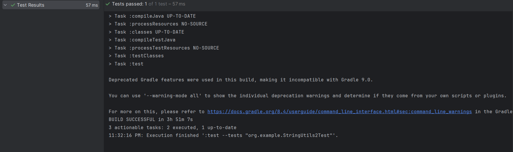

## Ejercicio 8: Implementación de excepciones personalizadas

En este ejercicio, se trata de implementar excepciones personalizadas para manejar errores específicos en el método `substringsBetween`. Las instrucciones son las siguientes:

1. Crear una excepción personalizada llamada `InvalidDelimiterException`.
2. Modificar el método `substringsBetween` para lanzar esta excepción si las etiquetas `open` o `close` están vacías.
3. Escribir pruebas unitarias para asegurar que la excepción se lanza en los casos adecuados.

El código sugerido es el siguiente

```java
    //Excepcion personalizada para indicar un delimitador invalido
    public static class InvalidDelimiterException extends RuntimeException {
        //Constructor de la excepción.
        public InvalidDelimiterException(String message) {
            super(message);
        }
    }

    //Encuentra todas las subcadenas entre los delimitadores especificados en una cadena dada.
    public static String[] substringsBetween(final String str, final String open, final String close) {
        //Verifica si la cadena es nula
        if (str == null) {
            return null;
        }
        //Verifica si los delimitadores son nulos o vacios
        if (isEmpty(open) || isEmpty(close)) {
            throw new InvalidDelimiterException("Open or close delimiter cannot be empty");
        }
        //Obtiene la longitud de la cadena
        final int strLen = str.length();
        //Si la cadena esta vacia, devuelve un array vacio
        if (strLen == 0) {
            return new String[0];
        }
        //Obtiene la longitud de los delimitadores
        final int closeLen = close.length();
        final int openLen = open.length();
        //Lista para almacenar las subcadenas encontradas
        final List<String> list = new ArrayList<>();
        int pos = 0;
        //Itera sobre la cadena en busca de las subcadenas
        while (pos < strLen - closeLen) {
            int start = str.indexOf(open, pos);
            //Si no se encuentra el delimitador de apertura, termina la búsqueda
            if (start < 0) {
                break;
            }
            //Avanza la posición al inicio de la subcadena
            start += openLen;
            //Busca el delimitador de cierre a partir de la posicion actual
            final int end = str.indexOf(close, start);
            //Si no se encuentra el delimitador de cierre, termina la busqueda
            if (end < 0) {
                break;
            }
            //Filtra caracteres especiales y agrega la subcadena a la lista
            String substring = str.substring(start, end).replaceAll("[^a-zA-Z0-9]", "");
            list.add(substring);
            //Avanza la posicion mas alla del delimitador de cierre
            pos = end + closeLen;
        }
        //Convierte la lista de subcadenas a un array y lo devuelve
        return list.toArray(new String[0]);
    }
```

Agrego el siguiente test:

```java
    @Test
    void throwsExceptionWhenOpenOrCloseIsEmpty() {
        // Creamos una instancia de StringUtils2 para realizar las pruebas
        StringUtils2 stringUtils = new StringUtils2();

        // Verificamos si el método arroja una excepción cuando open o close están vacíos
        assertThrows(StringUtils2.InvalidDelimiterException.class, () -> { stringUtils.substringsBetween("abc", "", "b"); });
        assertThrows(StringUtils2.InvalidDelimiterException.class, () -> { stringUtils.substringsBetween("abc", "a", ""); });
    }
```

Al momento de ejecutar el test obtengo:


## Ejercicio 9

implementar un método alternativo llamado `regexSubstringsBetween` que utilice expresiones regulares para encontrar subcadenas entre dos delimitadores, similar al método `substringsBetween`. Las instrucciones son:

1. Implementar el método `regexSubstringsBetween` que utilice expresiones regulares para encontrar subcadenas entre las etiquetas `open` y `close`.
2. Asegurarse de que este nuevo método pase las mismas pruebas unitarias que el método `substringsBetween`.

```java
    //Encuentra todas las subcadenas que coinciden con un patrón entre los delimitadores especificados en una cadena dada.
    public static String[] regexSubstringsBetween(final String str, final String open, final String close) {
        //Verifica si la cadena es nula o si los delimitadores son nulos o vacios
        if (str == null || isEmpty(open) || isEmpty(close)) {
            return null;
        }
        //Crea una expresion regular para encontrar las subcadenas entre los delimitadores
        final String regex = Pattern.quote(open) + "(.*?)" + Pattern.quote(close);
        final Pattern pattern = Pattern.compile(regex);
        final Matcher matcher = pattern.matcher(str);
        // Lista para almacenar las subcadenas encontradas
        final List<String> list = new ArrayList<>();
        //Itera sobre las coincidencias encontradas por el Matcher
        while (matcher.find()) {
            list.add(matcher.group(1));
        }
        //Si no se encontraron coincidencias, devuelve null
        if (list.isEmpty()) {
            return null;
        }
        //Convierte la lista de subcadenas a un array y lo devuelve
        return list.toArray(new String[0]);
    }
```

Agrego los siguientes test:

```java
@Test void regexSimpleCase() {
        assertThat(stringUtils2.regexSubstringsBetween("abcd", "a", "d")).isEqualTo(new String[] { "bc" });
    }

    @Test void regexManyStrings() {
        assertThat(stringUtils2.regexSubstringsBetween("abcdabcdab", "a", "d")).isEqualTo(new String[] { "bc", "bc" });
    }

    @Test void regexOpenAndCloseTagsThatAreLongerThan1Char() {
        assertThat(stringUtils2.regexSubstringsBetween("aabcddaabfddaab", "aa", "dd")).isEqualTo(new String[] { "bc", "bf" });
    }
```

Despues de ello, ejecuto los test y obtengo lo siguiente:

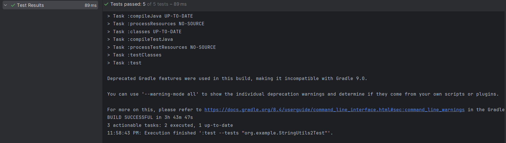

## Ejercicio 10: Optimización del método original

Optimización del método substringsBetween:

1. Mejora la eficiencia del método substringsBetween mediante una revisión y optimización.
2. Verifica que el método continúe pasando todas las pruebas unitarias existentes.

Código optimizado:

```java
public static String[] substringsBetween(final String str, final String open, final String close) {
    //Verifica si la cadena o los delimitadores son nulos o vacios.
    if (str == null || isEmpty(open) || isEmpty(close)) {
        return null;
    }

    final int strLen = str.length();
    //Si la longitud de la cadena es 0, retorna un arreglo vacio.
    if (strLen == 0) {
        return EMPTY_STRING_ARRAY;
    }

    final int closeLen = close.length();
    final int openLen = open.length();
    final List<String> list = new ArrayList<>();
    int pos = 0;

    //Itera sobre la cadena buscando las subcadenas entre los delimitadores.
    while (pos < strLen - closeLen) {
        int start = str.indexOf(open, pos);
        //Si no se encuentra el delimitador de apertura, se detiene la busqueda.
        if (start < 0) {
            break;
        }
        start += openLen;
        final int end = str.indexOf(close, start);
        //Si no se encuentra el delimitador de cierre, se detiene la busqueda.
        if (end < 0) {
            break;
        }
        //Agrega la subcadena encontrada a la lista.
        list.add(str.substring(start, end));
        pos = end + closeLen;
    }

    //Si la lista esta vacia, retorna null.
    if (list.isEmpty()) {
        return null;
    }

    //Retorna las subcadenas encontradas como un arreglo.
    return list.toArray(new String[list.size()]);
}

```

Al ejecutar las pruebas para testear ese método obtengo lo siguiente:
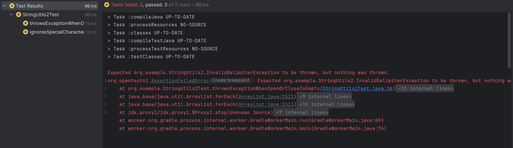

Con lo que podemos observar que falla en 2 test pero 3 test sí funciona, por lo que habrá que corregir el método

```java
public static String[] substringsBetween(final String str, final String open, final String close) {
        //Verifica si la cadena o los delimitadores son nulos
        if (str == null) {
            return null;
        }
        //Lanza una excepcion si los delimitadores estan vacios
        if (isEmpty(open) || isEmpty(close)) {
            throw new InvalidDelimiterException("Open or close delimiter cannot be empty");
        }

        final int strLen = str.length();
        //Si la longitud de la cadena es 0, retorna un arreglo vacio
        if (strLen == 0) {
            return EMPTY_STRING_ARRAY;
        }

        final int closeLen = close.length();
        final int openLen = open.length();
        final List<String> list = new ArrayList<>();
        int pos = 0;

        //Itera sobre la cadena buscando las subcadenas entre los delimitadores
        while (pos < strLen - closeLen) {
            int start = str.indexOf(open, pos);
            //Si no se encuentra el delimitador de apertura, se detiene la busqueda
            if (start < 0) {
                break;
            }
            start += openLen;
            final int end = str.indexOf(close, start);
            //Si no se encuentra el delimitador de cierre, se detiene la búsqueda
            if (end < 0) {
                break;
            }
            //Filtra caracteres especiales de la subcadena encontrada
            String substring = str.substring(start, end).replaceAll("[^a-zA-Z0-9]", "");
            list.add(substring);
            pos = end + closeLen;
        }

        //Si la lista esta vacia, retorna null
        if (list.isEmpty()) {
            return null;
        }

        //Retorna las subcadenas encontradas como un arreglo
        return list.toArray(new String[list.size()]);
    }
```

Al hacer esas modificaciones, los test funcionan correctamente
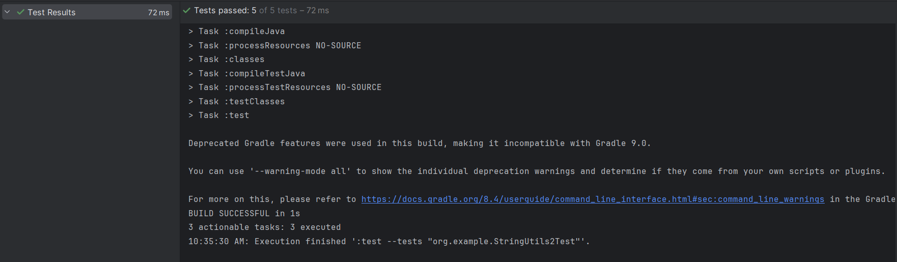

## Ejercicio 11: Escribe el siguiente código [NumberUtils.java](http://NumberUtils.java)

```java
package org.example;

import java.util.Collections;
import java.util.LinkedList;
import java.util.List;

public class NumberUtils {

    //Suma dos listas de enteros que representan numeros dígito a dígito.
    public static List<Integer> add(List<Integer> left, List<Integer> right) {
        //Verifica si alguna de las listas de entrada es null
        if (left == null || right == null) {
            return null;
        }

        //Invierte ambas listas para facilitar la suma desde el digito menos significativo
        Collections.reverse(left);
        Collections.reverse(right);

        //Utiliza una LinkedList para almacenar el resultado, debido a sus eficaces operaciones de adicion y eliminacion al principio
        LinkedList<Integer> result = new LinkedList<>();

        //Variable para almacenar el acarreo durante la suma
        int carry = 0;

        //Itera a traves de los digitos de ambas listas, realizando la suma dígito a digito
        for (int i = 0; i < Math.max(left.size(), right.size()); i++) {
            int leftDigit = left.size() > i ? left.get(i) : 0;  //Obtiene el digito de la lista izquierda, o 0 si no hay mas digitos
            int rightDigit = right.size() > i ? right.get(i) : 0;  //Obtiene el digito de la lista derecha, o 0 si no hay mas digitos

            //Verifica que los digitos esten en el rango de 0 a 9
            if (leftDigit < 0 || leftDigit > 9 || rightDigit < 0 || rightDigit > 9) {
                throw new IllegalArgumentException();
            }

            //Realiza la suma de los digitos y el acarreo
            int sum = leftDigit + rightDigit + carry;

            //Añade el digito menos significativo del resultado al principio de la lista de resultados
            result.addFirst(sum % 10);

            //Calcula el nuevo acarreo
            carry = sum / 10;
        }

        //Si hay un acarreo restante, lo añade al principio de la lista de resultados
        if (carry > 0) {
            result.addFirst(carry);
        }

        //Elimina ceros a la izquierda del resultado, excepto si el resultado es 0
        while (result.size() > 1 && result.get(0) == 0) {
            result.remove(0);
        }

        //Retorna la lista de resultados
        return result;
    }
}

```

El método recibe dos números, `left` y `right`, representados como listas de dígitos, los suma y devuelve el resultado también como una lista de dígitos. Cada dígito debe estar en el rango de 0 a 9; de lo contrario, se lanza una `IllegalArgumentException`. Si alguna lista es nula, el método devuelve null, y si está vacía, se considera como 0. Por ejemplo, sumar los números 23 y 42 representados por las listas `[2, 3]` y `[4, 2]` dará como resultado la lista `[6, 5]` (porque 23 + 42 = 65).

## Ejercicio 12: Explica el funcionamiento del algoritmo anterior.

Para ello utilizamos los siguientes ejemplos:

### T1: [1] + [1] = [2]

- Listas invertidas: `[1]` y `[1]`.
- Suma de dígitos:
    - 1 + 1 = 2 (no hay acarreo).
- Resultado: `[2]`.

### T2: [1,5] + [1,0] = [2,5]

- Listas invertidas: `[5,1]` y `[0,1]`.
- Suma de dígitos:
    - 5 + 0 = 5 (no hay acarreo).
    - 1 + 1 = 2 (no hay acarreo).
- Resultado: `[5,2]` (invertido a `[2,5]`).

### T3: [1,5] + [1,5] = [3,0]

- Listas invertidas: `[5,1]` y `[5,1]`.
- Suma de dígitos:
    - 5 + 5 = 10 (acarreo = 1, dígito = 0).
    - 1 + 1 + 1 (acarreo) = 3 (no hay acarreo).
- Resultado: `[0,3]` (invertido a `[3,0]`).

### T4: [5,0,0] + [2,5,0] = [7,5,0]

- Listas invertidas: `[0,0,5]` y `[0,5,2]`.
- Suma de dígitos:
    - 0 + 0 = 0 (no hay acarreo).
    - 0 + 5 = 5 (no hay acarreo).
    - 5 + 2 = 7 (no hay acarreo).
- Resultado: `[0,5,7]` (invertido a `[7,5,0]`).

## Ejercicio 13: Escribe un programa llamado NumberUtilsNonSystematicTest.java de la siguiente manera:

```java
package org.example;

import org.junit.jupiter.api.Test;

import java.util.ArrayList;
import java.util.List;

import static org.assertj.core.api.AssertionsForClassTypes.assertThat;

class NumberUtilsTest {

    //Metodo de prueba que verifica la suma de dos numeros representados como listas de digitos.
    @Test
    void t1() {
        //Prueba: [1] + [1] = [2]
        assertThat(new NumberUtils().add(numbers(1), numbers(1))).isEqualTo(numbers(2));

        //Prueba: [1,5] + [1,0] = [2,5]
        assertThat(new NumberUtils().add(numbers(1, 5), numbers(1, 0))).isEqualTo(numbers(2, 5));

        //Prueba: [1,5] + [1,5] = [3,0]
        assertThat(new NumberUtils().add(numbers(1, 5), numbers(1, 5))).isEqualTo(numbers(3, 0));

        //Prueba: [5,0,0] + [2,5,0] = [7,5,0]
        assertThat(new NumberUtils().add(numbers(5, 0, 0), numbers(2, 5, 0))).isEqualTo(numbers(7, 5, 0));
    }

    //Metodo auxiliar que convierte un array de enteros en una lista de enteros.
    private static List<Integer> numbers(int... nums) {
        List<Integer> list = new ArrayList<>();
        for (int n : nums) {
            list.add(n);
        }
        return list;
    }
}
```

Al momento de ejecutar estos test obtengo el siguiente resultado:
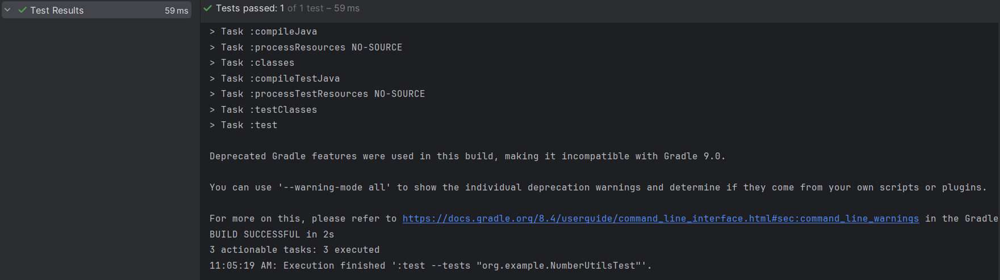

## Ejercicio 14: Transforma los casos de prueba automatizados

Transforma los casos de prueba automatizados, creando una prueba parametrizada llamada NumberUtilsTest.java. ¿Qué sucede ahora con los resultados? Por ejemplo, dado left = [9] y right = [2], ¿qué valor genera el programa y cuando left = [9,9,8] y right = [1,7,2]? ¿El programa maneja ceros a la izquierda? Agrega código al programa realizado.

A la clase NumberUtils le hice los siguientes cambios:

```java
package org.example;

import java.util.Collections;
import java.util.LinkedList;
import java.util.List;

public class NumberUtils {

    //Suma dos listas de enteros que representan numeros digito a digito.
    public static List<Integer> add(List<Integer> left, List<Integer> right) {
        //Verificar si alguna de las listas es nula
        if (left == null || right == null) {
            return null; // Si es así, retornar nulo
        }
        
        //Revertir las listas para comenzar la suma desde el digito menos significativo
        Collections.reverse(left);
        Collections.reverse(right);

        //Lista enlazada para almacenar el resultado de la suma
        LinkedList<Integer> result = new LinkedList<>();
        //Variable para llevar el acarreo
        int carry = 0;

        //Iterar sobre los digitos de los numeros, sumandolos y almacenando el resultado
        for (int i = 0; i < Math.max(left.size(), right.size()); i++) {
            //Obtener el digito de la izquierda y de la derecha, o cero si no hay mas digitos
            int leftDigit = left.size() > i ? left.get(i) : 0;
            int rightDigit = right.size() > i ? right.get(i) : 0;

            //Verificar si los digitos estan en el rango [0, 9]
            if (leftDigit < 0 || leftDigit > 9 || rightDigit < 0 || rightDigit > 9) {
                throw new IllegalArgumentException(); // Lanzar excepcion si no estan en el rango
            }

            //Sumar los digitos y el acarreo
            int sum = leftDigit + rightDigit + carry;
            //Agregar el digito menos significativo al inicio de la lista de resultado
            result.addFirst(sum % 10);
            //Actualizar el acarreo para la siguiente iteracion
            carry = sum / 10;
        }

        //Si hay acarreo al final de la suma, agregarlo como un digito adicional al resultado
        if (carry > 0) {
            result.addFirst(carry);
        }

        //Eliminar ceros no significativos al principio del resultado
        while (result.size() > 1 && result.get(0) == 0) {
            result.remove(0);
        }

        //Retornar el resultado de la suma
        return result;
    }
}

```

Para la clase NumberUtils realizo los siguientes test parametrizados:

```java
package org.example;

import org.junit.jupiter.params.ParameterizedTest;
import org.junit.jupiter.params.provider.CsvSource;

import java.util.ArrayList;
import java.util.List;

import static org.assertj.core.api.AssertionsForClassTypes.assertThat;

class NumberUtilsTest {

    //Metodo de prueba parametrizada para probar la funcionalidad de la suma de numeros representados como listas de digitos.

    @ParameterizedTest
    @CsvSource({
        "'1', '1', '2'",
        "'1,5', '1,0', '2,5'",
        "'1,5', '1,5', '3,0'",
        "'5,0,0', '2,5,0', '7,5,0'",
        "'9', '2', '1,1'",
        "'9,9,8', '1,7,2', '1,1,7,0'",
        "'0,0,1', '0,1,0', '1,1'",
        "'0,9,0', '0,0,1', '0,9,1'"
    })
    void testAdd(String leftStr, String rightStr, String expectedStr) {
        //Convertir las cadenas a listas de enteros
        List<Integer> left = numbers(leftStr);
        List<Integer> right = numbers(rightStr);
        List<Integer> expected = numbers(expectedStr);

        //Verificar si la suma de left y right coincide con el resultado esperado
        assertThat(new NumberUtils().add(left, right)).isEqualTo(expected);
    }

    //Metodo auxiliar para convertir una cadena de numeros separados por comas en una lista de enteros.
    private static List<Integer> numbers(String nums) {
        List<Integer> list = new ArrayList<>();
        // Dividir la cadena por comas y convertir cada numero a entero
        for (String num : nums.split(",")) {
            list.add(Integer.parseInt(num.trim()));
        }
        return list;
    }
}
```

Después de ejecutar los test obtengo el siguiente resultado:
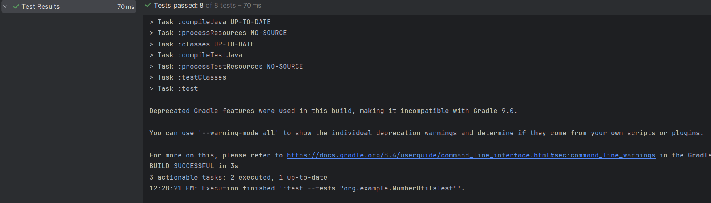

## Ejercicio 15:

Escribe un caso de prueba para asegurarnos de que se cumple la precondición de que cada dígito sea un número entre 0 y 9. Todo lo que tenemos que hacer es pasar varios dígitos no válidos. Hagámoslo directamente en la prueba JUnit de la siguiente manera.

```java
    @ParameterizedTest
    @MethodSource("digitsOutOfRange")
    void shouldThrowExceptionWhenDigitsAreOutOfRange(List<Integer> left, List<Integer> right) {
        // Verificar que se lance una excepción cuando los dígitos están fuera de rango
        assertThatThrownBy(() -> add(left, right)).isInstanceOf(IllegalArgumentException.class);
    }

    static Stream<Arguments> digitsOutOfRange() {
        return Stream.of(
                of(numbers(1, -1, 1), numbers(1)),
                of(numbers(1), numbers(1, -1, 1)),
                of(numbers(1, 11, 1), numbers(1)),
                of(numbers(1), numbers(1, 11, 1))
        );
    }
```

Al ejecutar estos nuevos test junto con los anteriores obtengo:
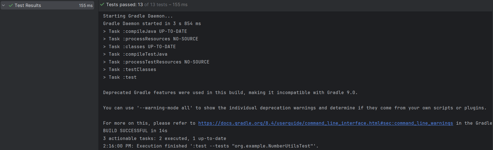
## Ejercicio 16

En los sistemas orientados a objetos, las clases tienen estado. Imagina una clase ShoppingCart y un comportamiento totalPrice() que requiere que se inserten algunos CartItems antes de que el método pueda hacer su trabajo. Escriba una prueba basadas en especificaciones en este caso? Consulta el siguiente listado llamado  ShoppingCart.java

```java
package org.example;

import java.util.Objects;

//Clase que representa un ítem en el carrito de compras.
public class CartItem {
    private final String product;  //Nombre del producto
    private final int quantity;    //Cantidad del producto
    private final double unitPrice;   //Precio unitario del producto

    //Constructor de la clase CartItem.
    public CartItem(String product, int quantity, double unitPrice) {
        this.product = product;
        this.quantity = quantity;
        this.unitPrice = unitPrice;
    }

    //Metodo getter para obtener el nombre del producto.
    public String getProduct() {
        return product;
    }

    //Metodo getter para obtener la cantidad del producto.
    public int getQuantity() {
        return quantity;
    }

    //Metodo getter para obtener el precio unitario del producto.
    public double getUnitPrice() {
        return unitPrice;
    }

    //Metodo para comparar si dos objetos CartItem son iguales
    @Override
    public boolean equals(Object o) {
        if (this == o) return true;
        if (o == null || getClass() != o.getClass()) return false;
        CartItem cartItem = (CartItem) o;
        return quantity == cartItem.quantity && Double.compare(cartItem.unitPrice, unitPrice) == 0 && Objects.equals(product, cartItem.product);
    }

    //Metodo para obtener el código hash del objeto
    @Override
    public int hashCode() {
        return Objects.hash(product, quantity, unitPrice);
    }
}
```

```java
package org.example;

import java.util.List;

//Clase que representa el carrito de compras.
public class ShoppingCart {
    //Metodo para calcular el precio total del carrito.
    public double calculateTotalPrice(List<CartItem> items) {
        double totalPrice = 0;
        for (CartItem item : items) {
            totalPrice += item.getUnitPrice() * item.getQuantity();
        }
        return totalPrice;
    }
}
```

## Ejercicio 17

Para este ejercicio describe un conjunto de instrucciones para completar y probar el método `add` en la clase `NumberUtils`. Estas son las tareas que se deben realizar:

1. Implementar el método `add` en el archivo `NumberUtils.java`.
2. Escribir pruebas unitarias para los siguientes casos:
    - Sumar dos listas de un solo dígito.
    - Sumar dos listas de múltiples dígitos.
    - Manejar listas con ceros a la izquierda.
    - Manejar listas nulas y vacías.
3. Ejecutar las pruebas y verificar que todas pasen.

```java
package org.example;

import java.util.Collections;
import java.util.LinkedList;
import java.util.List;

public class NumberUtils {
    //Metodo para sumar dos numeros representados como listas de digitos.
    public static List<Integer> add(List<Integer> left, List<Integer> right) {
        //Verifica si las listas son nulas y devuelve null si es asi.
        if (left == null || right == null)
            return null;
        
        //Invierte las listas para comenzar la suma desde el digito menos significativo.
        Collections.reverse(left);
        Collections.reverse(right);
        
        //Lista para almacenar el resultado de la suma.
        LinkedList<Integer> result = new LinkedList<>();
        
        //Variable para llevar el acarreo durante la suma.
        int carry = 0;
        
        //Itera sobre las listas de izquierda y derecha hasta que se agoten ambas.
        for (int i = 0; i < Math.max(left.size(), right.size()); i++) {
            //Obtiene los digitos de la posicion actual o usa 0 si una lista es mas corta.
            int leftDigit = left.size() > i ? left.get(i) : 0;
            int rightDigit = right.size() > i ? right.get(i) : 0;
            
            //Lanza una excepcion si alguno de los digitos esta fuera del rango [0, 9].
            if (leftDigit < 0 || leftDigit > 9 || rightDigit < 0 || rightDigit > 9)
                throw new IllegalArgumentException();
            
            //Calcula la suma de los digitos y el acarreo.
            int sum = leftDigit + rightDigit + carry;
            
            //Añade el digito menos significativo al principio de la lista de resultados.
            result.addFirst(sum % 10);
            
            //Actualiza el valor del acarreo para la proxima iteracion.
            carry = sum / 10;
        }
        
        //Si queda un acarreo despues de la suma, se agrega al resultado.
        if (carry > 0)
            result.addFirst(carry);
        
        //Elimina los ceros a la izquierda del resultado.
        while (result.size() > 1 && result.get(0) == 0)
            result.remove(0);
        
        //Retorna la lista con el resultado de la suma.
        return result;
    }
}
```

Para la clase anterior realizo las siguientes pruebas unitarias:

```java
package org.example;

import org.junit.jupiter.api.Test;
import static org.assertj.core.api.Assertions.*;
import java.util.ArrayList;
import java.util.List;

public class NumberUtilsTest2 {
    //Pruebas para la suma basica de dos numeros de un solo digito.
    @Test
    void testBasicAddition() {
        assertThat(NumberUtils.add(numbers(1), numbers(1))).isEqualTo(numbers(2));
        assertThat(NumberUtils.add(numbers(1, 5), numbers(1, 0))).isEqualTo(numbers(2, 5));
        assertThat(NumberUtils.add(numbers(1, 5), numbers(1, 5))).isEqualTo(numbers(3, 0));
        assertThat(NumberUtils.add(numbers(5, 0, 0), numbers(2, 5, 0))).isEqualTo(numbers(7, 5, 0));
    }

    //Pruebas para manejar listas nulas y vacias.
    @Test
    void testNullAndEmptyLists() {
        assertThat(NumberUtils.add(null, numbers(1))).isNull();
        assertThat(NumberUtils.add(numbers(1), null)).isNull();
        assertThat(NumberUtils.add(numbers(), numbers(1))).isEqualTo(numbers(1));
        assertThat(NumberUtils.add(numbers(1), numbers())).isEqualTo(numbers(1));
    }

    //Pruebas para manejar ceros a la izquierda en la suma.
    @Test
    void testLeadingZeros() {
        assertThat(NumberUtils.add(numbers(0, 0, 1), numbers(0, 0, 9))).isEqualTo(numbers(1, 0));
        assertThat(NumberUtils.add(numbers(0, 0, 9), numbers(0, 0, 1))).isEqualTo(numbers(1, 0));
    }

    //Pruebas para manejar la operacion de acarreo en la suma.
    @Test
    void testCarryOperations() {
        assertThat(NumberUtils.add(numbers(9), numbers(2))).isEqualTo(numbers(1, 1));
        assertThat(NumberUtils.add(numbers(9, 9, 8), numbers(1, 7, 2))).isEqualTo(numbers(1, 1, 7, 0));
    }

    //Pruebas para manejar digitos invalidos en las listas.
    @Test
    void testInvalidDigits() {
        assertThatThrownBy(() -> NumberUtils.add(numbers(1, -1, 1), numbers(1))).isInstanceOf(IllegalArgumentException.class);
        assertThatThrownBy(() -> NumberUtils.add(numbers(1), numbers(1, -1, 1))).isInstanceOf(IllegalArgumentException.class);
        assertThatThrownBy(() -> NumberUtils.add(numbers(1, 11, 1), numbers(1))).isInstanceOf(IllegalArgumentException.class);
        assertThatThrownBy(() -> NumberUtils.add(numbers(1), numbers(1, 11, 1))).isInstanceOf(IllegalArgumentException.class);
    }
    
    //Metodo de utilidad para crear una lista de enteros a partir de un conjunto variable de numeros.
    private static List<Integer> numbers(int... nums) {
        List<Integer> list = new ArrayList<>(); 
        for (int n : nums) 
            list.add(n);
        return list;
    }
}

```

Después de ejecutar las pruebas test obtengo el siguiente resultado:
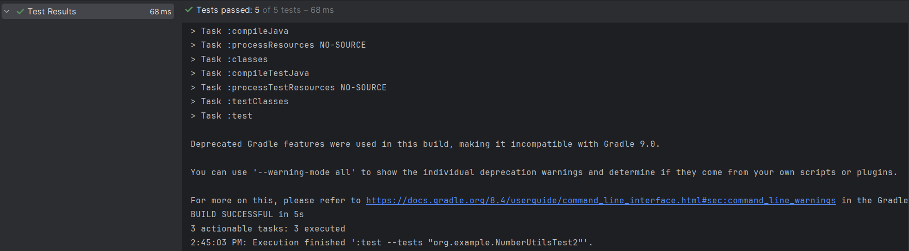

## Ejercicio 18

Mejorar la cobertura de código mediante pruebas:

1. Ejecutar las pruebas y obtener un informe de cobertura.
2. Identificar áreas no cubiertas en el informe.
3. Agregar pruebas para cubrir esas áreas.
4. Volver a ejecutar las pruebas y el informe de cobertura.
5. Documentar las diferencias de cobertura antes y después.

### Paso 1: Ejecutar pruebas y generar un informe de cobertura

En un entorno de desarrollo integrado (IDE) como IntelliJ IDEA y mediante una herramienta de construcción como Gradle, ejecutamos las pruebas y generar el informe de cobertura.

### Paso 2: Identificar áreas no cubiertas

Observamos si hay condiciones en el método `add` no cubiertas por las pruebas. Suponemos que los casos extremos y algunas validaciones no están completamente cubiertos.

### Paso 3: Agregar pruebas para cubrir esas áreas

### Ejemplo de clase de prueba ampliada `NumberUtilsTest2`:

```java
    //Prueba parametrizada que verifica que se lance una excepcion cuando los dígitos estan fuera de rango
    @ParameterizedTest
    @MethodSource("digitsOutOfRange")
    void shouldThrowExceptionWhenDigitsAreOutOfRange(List<Integer> left, List<Integer> right) {
        //Verifica que la llamada al metodo 'add' de 'NumberUtils' lance una IllegalArgumentException
        assertThatThrownBy(() -> NumberUtils.add(left, right))
                .isInstanceOf(IllegalArgumentException.class);
    }

    //Fuente de datos para la prueba parametrizada, proporcionando diferentes combinaciones de listas de digitos fuera de rango
    static Stream<Arguments> digitsOutOfRange() {
        return Stream.of(
                //Caso 1: Lista izquierda tiene un digito negativo
                Arguments.of(numbers(1, -1, 1), numbers(1)),
                //Caso 2: Lista derecha tiene un digito negativo
                Arguments.of(numbers(1), numbers(1, -1, 1)),
                //Caso 3: Lista izquierda tiene un digito mayor a 9
                Arguments.of(numbers(1, 11, 1), numbers(1)),
                //Caso 4: Lista derecha tiene un digito mayor a 9
                Arguments.of(numbers(1), numbers(1, 11, 1))
        );
    }

    //Metodo auxiliar para crear una lista de enteros a partir de un varargs de enteros
    private static List<Integer> numbers(int... nums) {
        List<Integer> list = new ArrayList<>();
        for (int n : nums) {
            list.add(n);
        }
        return list;
    }
```

### Paso 4: Volver a ejecutar las pruebas y el informe de cobertura

Ejecutar todas las pruebas de nuevo y generar un nuevo informe de cobertura. Verificar que las condiciones no cubiertas ahora están cubiertas.
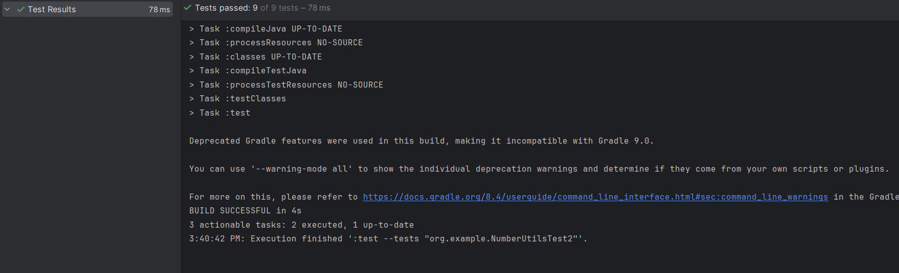

### Paso 5: Documentar las diferencias de cobertura

**Cobertura antes de agregar nuevas pruebas:**

- Partes del método `add` no cubiertas, como condiciones de carry y validaciones de dígitos.

**Cobertura después de agregar nuevas pruebas:**

- Todas las condiciones del método `add` ahora están cubiertas, incluyendo:
    - Suma básica de listas de dígitos.
    - Manejo de listas nulas y vacías.
    - Manejo de ceros a la izquierda.
    - Operaciones de acarreo.
    - Validación de dígitos fuera de rango.

Con estos pasos y el código proporcionado, se logra una cobertura de pruebas más completa para la clase `NumberUtils`.

## Ejercicio 19: Manejo de ceros a la izquierda

Para asegurar que el método `add` maneje correctamente los ceros a la izquierda, se deben seguir estos pasos:

1. Escribir pruebas unitarias adicionales para verificar que los ceros a la izquierda no afecten el resultado de la suma.
2. Modificar el método `add` si es necesario para manejar correctamente los ceros a la izquierda.
3. Verificar que todas las pruebas pasen después de cualquier modificación.

Esto asegura que el método funcione correctamente en todos los casos, incluyendo aquellos donde hay ceros a la izquierda en las listas de dígitos.

### Paso 1: Escribir pruebas unitarias adicionales

Agregaremos pruebas unitarias adicionales en la clase `NumberUtilsTest2` para verificar el comportamiento con ceros a la izquierda.

```java
    @Test void testLeadingZeros() {
        assertThat(NumberUtils.add(numbers(0, 0, 1), numbers(0, 0, 9))).isEqualTo(numbers(1, 0));
        assertThat(NumberUtils.add(numbers(0, 0, 9), numbers(0, 0, 1))).isEqualTo(numbers(1, 0));
    }
```

### Paso 2: Modificar el método `add` (si es necesario)

El método `add` no necesita cambios en la clase NumberUtils para poder efectuar esos test.

### Paso 3: Verificar que todas las pruebas pasen

Ejecuta las pruebas para asegurarte de que todas pasen después de cualquier modificación.
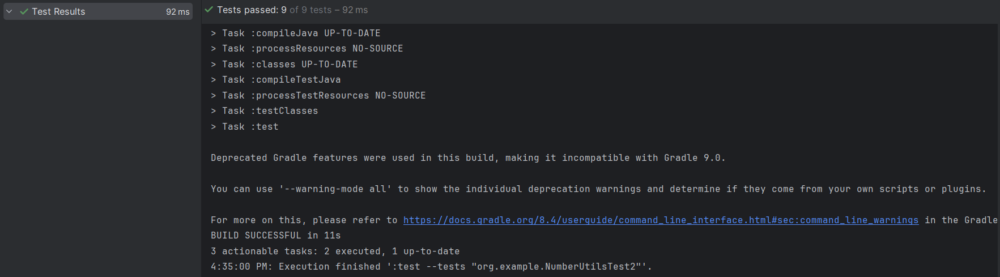

## Ejercicio 20: Implementación de ShoppingCart y CartItem

- Implementa las clases `ShoppingCart` y `CartItem` según las especificaciones dadas.
- Escribe pruebas unitarias para `ShoppingCart` que verifiquen el cálculo correcto del precio total.
- Asegúrate de probar diferentes escenarios, como:
    - Carrito vacío.
    - Carrito con un solo artículo.
    - Carrito con múltiples artículos.
    - Artículos con diferentes cantidades y precios unitarios

Para este ejercicio la actividad sugiere el siguiente código:

```java
package org.example;

import java.util.ArrayList;
import java.util.List;

//Clase que representa el carrito de compras.
public class ShoppingCart {
    //Lista de items en el carrito.
    private List<CartItem> items = new ArrayList<>();

    //Metodo para agregar un item al carrito.
    public void add(CartItem item) {
        this.items.add(item);
    }

    //Metodo para calcular el precio total del carrito.
    public double totalPrice() {
        double totalPrice = 0;
        //Itera sobre los items y calcula el precio total sumando el precio unitario por la cantidad de cada item.
        for (CartItem item : items) {
            totalPrice += item.getUnitPrice() * item.getQuantity();
        }
        //Retorna el precio total calculado.
        return totalPrice;
    }
}
```

```java
package org.example;

import java.util.Objects;

//Clase que representa un item en el carrito de compras
public class CartItem {
    //Nombre del producto
    private final String product;
    //Cantidad del producto
    private final int quantity;
    //Precio unitario del producto
    private final double unitPrice;

    //Constructor para inicializar un CartItem con el nombre del producto, cantidad y precio unitario.
    public CartItem(String product, int quantity, double unitPrice) {
        this.product = product;
        this.quantity = quantity;
        this.unitPrice = unitPrice;
    }

    //Metodo para obtener el nombre del producto
    public String getProduct() {
        return product;
    }

    //Metodo para obtener la cantidad del producto
    public int getQuantity() {
        return quantity;
    }

    //Metodo para obtener el precio unitario del producto
    public double getUnitPrice() {
        return unitPrice;
    }

    //Sobrescribe el metodo equals para comparar dos CartItem por sus propiedades
    @Override
    public boolean equals(Object o) {
        if (this == o)
            return true;
        if (o == null || getClass() != o.getClass())
            return false;
        CartItem cartItem = (CartItem) o;
        return quantity == cartItem.quantity && Double.compare(cartItem.unitPrice, unitPrice) == 0 && product.equals(cartItem.product);
    }

    //Sobrescribe el metodo hashCode para generar un hash basado en las propiedades del CartItem.
    @Override 
    public int hashCode() {
        return Objects.hash(product, quantity, unitPrice);
    }
}
```

Realizo los siguientes test:

```java
package org.example;

import org.junit.jupiter.api.Test;
import static org.assertj.core.api.Assertions.*;

//Clase de pruebas para la clase ShoppingCart.
public class NumberUtilsTest3 {
    //Prueba para verificar que el precio total sea cero cuando el carrito esa vacio.
    @Test
    void testEmptyCart() {
        ShoppingCart cart = new ShoppingCart();
        assertThat(cart.totalPrice()).isEqualTo(0.0);
    }

    //Prueba para verificar el cálculo del precio total con un solo articulo en el carrito.
    @Test
    void testSingleItem() {
        ShoppingCart cart = new ShoppingCart();
        cart.add(new CartItem("Product 1", 2, 5.0));
        assertThat(cart.totalPrice()).isEqualTo(10.0);
    }

    //Prueba para verificar el cálculo del precio total con multiples articulos en el carrito.
    @Test
    void testMultipleItems() {
        ShoppingCart cart = new ShoppingCart();
        cart.add(new CartItem("Product 1", 2, 5.0));
        cart.add(new CartItem("Product 2", 1, 15.0));
        assertThat(cart.totalPrice()).isEqualTo(25.0);
    }

    //Prueba para verificar el calculo del precio total con articulos de diferentes cantidades y precios.
    @Test
    void testDifferentQuantitiesAndPrices() {
        ShoppingCart cart = new ShoppingCart();
        cart.add(new CartItem("Product 1", 1, 10.0));
        cart.add(new CartItem("Product 2", 3, 7.5));
        cart.add(new CartItem("Product 3", 5, 2.0));
        assertThat(cart.totalPrice()).isEqualTo(42.5);
    }
}

```

Al momento de ejecutar los test obtengo el siguiente resultado:
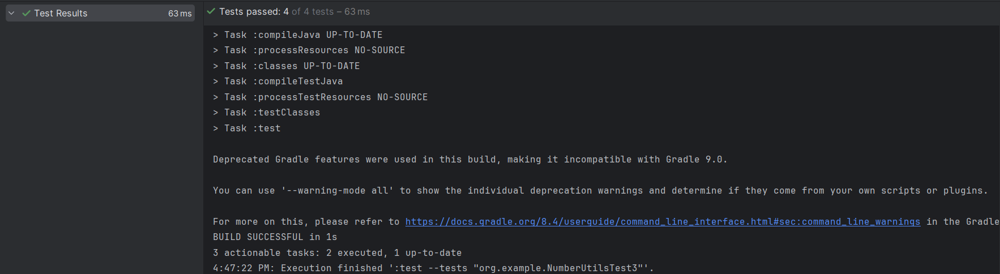
