# Pruebas estructurales

**Pruebas estructurales y cobertura de código**

En esta actividad, aprenderemos cómo reflexionar sistemáticamente sobre el código fuente, ver qué está ejerciendo el conjunto de pruebas derivadas con la ayuda de la especificación y qué queda por probar. El uso de la estructura del código fuente para guiar las pruebas también se conoce como pruebas estructurales. Comprender las técnicas de prueba estructural significa comprender los criterios de cobertura. El resto de esta clase explora el uso de información de cobertura de código para ganar más confianza en que el programa funciona como se espera.

## **Cobertura de código**

Considera el siguiente requisito para un pequeño programa que cuenta la cantidad de palabras en una cadena que terminan con "r" o "s":

Dada una oración, el programa debe contar la cantidad de palabras que terminan con "s" o "r". Una palabra termina cuando aparece una no letra. El programa devuelve el número de palabras. Un desarrollador implementa este requisito como se muestra en la siguiente lista.

Archivo CountWords.java:

```java
package org.example;

public class CountWords {

    //Metodo publico que cuenta el numero de palabras en una cadena que terminan con 'r' o 's'.
    public int count(String str) {
        int words = 0; //Contador de palabras que cumplen con el criterio.
        char last = ' '; //Variable para almacenar el último carácter procesado.

        //Bucle para recorrer cada carácter de la cadena.
        for (int i = 0; i < str.length(); i++) {//1
            //Si el caracter actual no es una letra y el último carácter es 's' o 'r', incrementa el contador de palabras.
            if (!isLetter(str.charAt(i)) && (last == 's' || last == 'r')) {//2
                words++;
            }
            //Actualiza el último carácter procesado.
            last = str.charAt(i);//3
        }

        //Verifica si el último caracter de la cadena es 'r' o 's' y, si es asi, incrementa el contador de palabras.
        if (last == 'r' || last == 's') {
            words++;
        }

        //Devuelve el numero total de palabras que terminan con 'r' o 's'.
        return words;
    }

    //Metodo privado que verifica si un caracter dado es una letra.
    private boolean isLetter(char c) {
        return Character.isLetter(c);
    }
}
```

## Ejercicio 1: Explica qué hacen las líneas 1, 2 y 3 en el código.

### Línea 1

```java
for (int i = 0; i < str.length(); i++)

```

Este bucle recorre cada carácter de la cadena `str` desde el principio hasta el final.

### Línea 2

```java
if (!isLetter(str.charAt(i)) && (last == 's' || last == 'r'))

```

Si el carácter actual no es una letra y el anterior era 's' o 'r', incrementa el contador de palabras.

### Línea 3

```java
last = str.charAt(i);

```

Actualiza `last` con el carácter actual para usarlo en la siguiente iteración del bucle.

## Ejercicio 2: Explica qué hacen las líneas 1 y 2 del código. Presenta un informe generado por JaCoCo ([www.jacoco.org/jacoco](http://www.jacoco.org/jacoco)) u otra herramienta de cobertura de código de tu preferencia en el IDE del curso.

Las líneas 1 y 2 se encuentran en los siguientes test:

```java
package org.example;

import org.junit.jupiter.api.Test;
import static org.assertj.core.api.Assertions.assertThat;

class CountWordsTest {

    @Test
    void twoWordsEndingWithS() {
        //Prueba el metodo count() con una cadena que contiene dos palabras terminadas en 's'.
        //Se espera que el resultado sea 2, ya que ambas palabras "dogs" y "cats" terminan en 's'.
        int words = new CountWords().count("dogs cats");
        assertThat(words).isEqualTo(2); // Verifica que el resultado sea igual a 2.
    }

    @Test
    void noWordsAtAll() {
        //Prueba el metodo count() con una cadena que contiene dos palabras que no terminan en 's' ni en 'r'.
        //Se espera que el resultado sea 0, ya que ninguna de las palabras "dog" y "cat" termina en 's' ni en 'r'.
        int words = new CountWords().count("dog cat");
        assertThat(words).isEqualTo(0); //Verifica que el resultado sea igual a 0.
    }
}
```

- **Línea 1**: `@Test void twoWordsEndingWithS() {`
    - **@Test**: Este es un marcador de JUnit que indica que el método `twoWordsEndingWithS` es un método de prueba. Esto significa que el método será ejecutado por el framework de pruebas JUnit al momento de correr los tests.
    - **void twoWordsEndingWithS() {**: Esta es la declaración del método de prueba `twoWordsEndingWithS`. Este método no retorna ningún valor (es `void`) y tiene el nombre `twoWordsEndingWithS`. Dentro de este método se define una prueba específica para el método `count` de la clase `CountWords`.
- **Línea 2**: `int words = new CountWords().count("dogs cats");`
    - **int words**: Declara una variable de tipo entero llamada `words`.
    - **new CountWords()**: Crea una nueva instancia de la clase `CountWords`.
    - **.count("dogs cats")**: Llama al método `count` de la instancia `CountWords`, pasando la cadena `"dogs cats"` como argumento. Este método cuenta el número de palabras en la cadena que terminan con 'r' o 's' y retorna ese número.
    - **=**: Asigna el valor retornado por el método `count` a la variable `words`.

### Informe de los test mediante JaCoCo

Mediante este informe podemos observar que los 2 test funcionan correctamente.


## Ejercicio 3: Explica la línea 1 y con el caso de prueba recién agregado en el conjunto de pruebas, vuelve a ejecutar la herramienta de cobertura. Explica los cambios obtenidos.

```java
@Test
void wordsThatEndInR() {  // 1
    //Crea una instancia de CountWords y llama al metodo count con la cadena "car bar".
    //Esta cadena contiene dos palabras ("car" y "bar") que terminan con la letra 'r'.
    int words = new CountWords().count("car bar");

    //Verifica que el resultado del metodo count sea igual a 2.
    //Se espera que el metodo cuente correctamente las dos palabras que terminan en 'r'.
    assertThat(words).isEqualTo(2);
}
```

**Línea 1**

- **@Test**: Este es un marcador de JUnit que indica que el método `wordsThatEndInR` es un método de prueba. Este método será ejecutado automáticamente por el framework de pruebas JUnit cuando se ejecuten los tests.
- **void wordsThatEndInR() {**: Esta es la declaración del método de prueba `wordsThatEndInR`. Este método no retorna ningún valor (es `void`) y tiene el nombre `wordsThatEndInR`. Dentro de este método se define una prueba específica para el método `count` de la clase `CountWords`.

Después de agregar y ejecutar ese nuevo test a los demás test, utilizo JaCoCo para generar el informe.
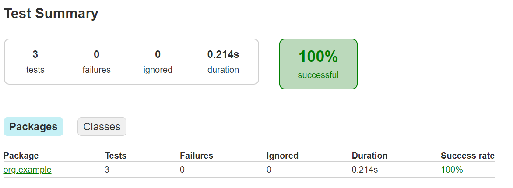

## Ejercicio 4: Análisis del código y cobertura

### Parte A: Análisis de código

### Preguntas y respuestas:

### 1. Explica qué hacen las líneas 1, 2 y 3 en el código.

```java
for (int i = 0; i < str.length(); i++) {  // 1
    if (!isLetter(str.charAt(i)) && (last == 's' || last == 'r')) { // 2
        words++;
    }
    last = str.charAt(i);  // 3
}

```

- **Línea 1**: `for (int i = 0; i < str.length(); i++) {`
    - Esta línea inicia un bucle `for` que recorre cada carácter de la cadena `str`, comenzando en el índice 0 y continuando hasta el final de la cadena (`str.length()`).
- **Línea 2**: `if (!isLetter(str.charAt(i)) && (last == 's' || last == 'r')) {`
    - Esta línea verifica si el carácter actual `str.charAt(i)` no es una letra (`!isLetter(str.charAt(i))`) y si el carácter anterior (`last`) es 's' o 'r'. Si ambas condiciones son verdaderas, se incrementa el contador de palabras (`words`).
- **Línea 3**: `last = str.charAt(i);`
    - Esta línea actualiza la variable `last` con el carácter actual `str.charAt(i)`. Esto asegura que `last` siempre contiene el último carácter procesado en el bucle.

### 2. ¿Qué sucedería si se eliminara la línea 3 del código?

Si se eliminara la línea 3 (`last = str.charAt(i);`), la variable `last` nunca se actualizaría durante el bucle. Como resultado, `last` siempre tendría el valor con el que se inicializó (' '). Esto significaría que la condición en la línea 2 (`if (!isLetter(str.charAt(i)) && (last == 's' || last == 'r'))`) nunca se cumpliría porque `last` nunca sería 's' o 'r' después del primer carácter. En consecuencia, el contador de palabras (`words`) no se incrementaría correctamente y el método `count` no funcionaría según lo esperado.

### 3. Escribe una descripción de alto nivel de lo que hace este método `count`.

El método `count` cuenta el número de palabras en una cadena que terminan con las letras 's' o 'r'. Una palabra se define como una secuencia de letras seguida por un carácter que no es una letra (o el final de la cadena). El método recorre cada carácter de la cadena, utilizando una variable auxiliar para recordar el último carácter procesado. Si se encuentra un carácter no letra y el último carácter es 's' o 'r', se incrementa el contador de palabras. Finalmente, el método verifica si el último carácter de la cadena es 's' o 'r' y ajusta el contador de palabras en consecuencia antes de devolver el resultado.

### Parte B: Pruebas Unitarias

### Preguntas y respuestas:

### 4. Explica qué hacen las líneas 1 y 2 del código de prueba.

```java
@Test  void twoWordsEndingWithS() {  // 1
    int words = new CountWords().count("dogs cats");
    assertThat(words).isEqualTo(2);
}

@Test  void noWordsAtAll() {  // 2
    int words = new CountWords().count("dog cat");
    assertThat(words).isEqualTo(0);
}

```

- **Línea 1**: `@Test void twoWordsEndingWithS() {`
    - Este es un método de prueba anotado con `@Test`, indicando que es una prueba unitaria que se ejecutará con el marco de pruebas JUnit. El nombre del método, `twoWordsEndingWithS`, sugiere que la prueba está diseñada para verificar el conteo de palabras que terminan con 's'.
- **Línea 2**: `@Test void noWordsAtAll() {`
    - Similarmente, este es otro método de prueba anotado con `@Test`. El nombre del método, `noWordsAtAll`, sugiere que la prueba está diseñada para verificar un caso en el que no hay palabras que terminen con 's' o 'r'.

### 5. ¿Qué tipos de casos de prueba adicionales se deberían agregar para mejorar la cobertura?

Para mejorar la cobertura de pruebas, se pueden agregar los siguientes casos:

1. **Palabras que terminan con 'r'**:
    
    ```java
    @Test
    void wordsThatEndInR() {
        int words = new CountWords().count("car bar");
        assertThat(words).isEqualTo(2);
    }
    
    ```
    
2. **Combinación de palabras que terminan con 's' y 'r'**:
    
    ```java
    @Test
    void wordsEndingWithSEndingWithR() {
        int words = new CountWords().count("cats bar dogs");
        assertThat(words).isEqualTo(3);
    }
    
    ```
    
3. **Palabras con caracteres especiales y números entre ellas**:
    
    ```java
    @Test
    void wordsWithSpecialCharacters() {
        int words = new CountWords().count("dogs, cats! car# bar?");
        assertThat(words).isEqualTo(4);
    }
    
    ```
    
4. **Cadena vacía**:
    
    ```java
    @Test
    void emptyString() {
        int words = new CountWords().count("");
        assertThat(words).isEqualTo(0);
    }
    
    ```
    
5. **Cadena con solo caracteres especiales y números**:
    
    ```java
    @Test
    void onlySpecialCharactersAndNumbers() {
        int words = new CountWords().count("123 456! @#$$%");
        assertThat(words).isEqualTo(0);
    }
    
    ```
    
6. **Una sola palabra terminando en 's' o 'r'**:
    
    ```java
    @Test
    void singleWordEndingWithS() {
        int words = new CountWords().count("dogs");
        assertThat(words).isEqualTo(1);
    }
    
    @Test
    void singleWordEndingWithR() {
        int words = new CountWords().count("car");
        assertThat(words).isEqualTo(1);
    }
    
    ```
    
7. **Palabras con letras mayúsculas y minúsculas**:
    
    ```java
    @Test
    void wordsWithMixedCase() {
        int words = new CountWords().count("Dogs Cats Car Bar");
        assertThat(words).isEqualTo(4);
    }
    
    ```
    

Agregando estos casos de prueba adicionales se garantiza una mejor cobertura y verificación de las diferentes posibles entradas y escenarios que el método `count` podría enfrentar.

### Parte C: Ejecución de Herramienta de Cobertura

1. Genera y presenta el informe de cobertura.


1. Identifica las partes del código que no están cubiertas por las pruebas. 

No identificamos partes del código que no estén cubiertas por las pruebas.

## Ejercicio 5: Extensión de pruebas

### Parte A: Nuevas pruebas

No se nos ocurren nuevas pruebas test a parte de las que colocamos en el ejercicio4.

1. **Palabras que terminan con 'r'**:
    
    ```java
    @Test
    void wordsThatEndInR() {
        int words = new CountWords().count("car bar");
        assertThat(words).isEqualTo(2);
    }
    
    ```
    
2. **Combinación de palabras que terminan con 's' y 'r'**:
    
    ```java
    @Test
    void wordsEndingWithSEndingWithR() {
        int words = new CountWords().count("cats bar dogs");
        assertThat(words).isEqualTo(3);
    }
    
    ```
    
3. **Palabras con caracteres especiales y números entre ellas**:
    
    ```java
    @Test
    void wordsWithSpecialCharacters() {
        int words = new CountWords().count("dogs, cats! car# bar?");
        assertThat(words).isEqualTo(4);
    }
    
    ```
    
4. **Cadena vacía**:
    
    ```java
    @Test
    void emptyString() {
        int words = new CountWords().count("");
        assertThat(words).isEqualTo(0);
    }
    
    ```
    
5. **Cadena con solo caracteres especiales y números**:
    
    ```java
    @Test
    void onlySpecialCharactersAndNumbers() {
        int words = new CountWords().count("123 456! @#$$%");
        assertThat(words).isEqualTo(0);
    }
    
    ```
    
6. **Una sola palabra terminando en 's' o 'r'**:
    
    ```java
    @Test
    void singleWordEndingWithS() {
        int words = new CountWords().count("dogs");
        assertThat(words).isEqualTo(1);
    }
    
    @Test
    void singleWordEndingWithR() {
        int words = new CountWords().count("car");
        assertThat(words).isEqualTo(1);
    }
    
    ```
    
7. **Palabras con letras mayúsculas y minúsculas**:
    
    ```java
    @Test
    void wordsWithMixedCase() {
        int words = new CountWords().count("Dogs Cats Car Bar");
        assertThat(words).isEqualTo(4);
    }
    
    ```
    

### Parte B: Ejecución de herramienta de cobertura

1. Agrega las nuevas pruebas al conjunto de pruebas. 

Estos test se encuentran agregados en el archivo java CountWordsTest

2. Vuelve a ejecutar la herramienta de cobertura


1. Explica los cambios obtenidos en el informe de cobertura.

Para este informe JaCoCo nos proporciona información relevante sobre los test realizados, indica que los 10 test fueron ejecutados con éxito, 0 fallaron y 0 fueron ignorados, además de proporcionar el tiempo de ejecución de los test que fue de 0.206 s.

## Ejercicio 6: Exploración y mejora

### Parte A: Exploración

1. Modifica el método count para mejorar su claridad o eficiencia. 

```java
package org.example;

public class CountWords {

    //Metodo publico que cuenta el número de palabras en una cadena que terminan con 'r' o 's'.
    public int count(String str) {
        int words = 0; //Contador de palabras que cumplen con el criterio.
        boolean lastWasLetter = false; //Bandera para verificar si el ultimo caracter procesado fue una letra.
        char last = ' '; //Variable para almacenar el ultimo caracter procesado.

        //Bucle para recorrer cada caracter de la cadena.
        for (char c : str.toCharArray()) {
            if (!isLetter(c) && (last == 's' || last == 'r')) {
                words++;
            }
            lastWasLetter = isLetter(c);
            if (lastWasLetter) {
                last = c;
            }
        }

        //Verifica si el ultimo caracter de la cadena es 'r' o 's' y, si es asi, incrementa el contador de palabras.
        if (last == 'r' || last == 's') {
            words++;
        }

        //Devuelve el numero total de palabras que terminan con 'r' o 's'.
        return words;
    }

    //Mrtodo privado que verifica si un carácter dado es una letra.
    private boolean isLetter(char c) {
        return Character.isLetter(c);
    }
}

```

1. Escribe pruebas unitarias adicionales para asegurar que las modificaciones no rompan la funcionalidad existente. 

Agrego el nuevo test:

```java
    @Test
    public void testCountWordsEndingWithRorS() {
        CountWords counter = new CountWords();

        // Pruebas con diferentes casos
        assertEquals(2, counter.count("car bus")); // 'car' y 'bus'
        assertEquals(1, counter.count("hello world")); // 'world'
        assertEquals(0, counter.count("java programming")); // ninguna palabra termina en 'r' o 's'
        assertEquals(3, counter.count("This is a test.")); // 'This', 'is' y 'test.'
        assertEquals(0, counter.count("")); // cadena vacía
        assertEquals(2, counter.count("stars and mars")); // 'stars' y 'mars'
        assertEquals(1, counter.count("Mr. Rogers.")); // 'Rogers'
        assertEquals(1, counter.count("Super star")); // 'star'
        assertEquals(1, counter.count("Mr.")); // 'Mr.'
        assertEquals(0, counter.count("Hello!")); // ninguna palabra termina en 'r' o 's'
    }
```

### Parte B: Informe final

Al momento de ejecutar este test junto con los otros obtengo:
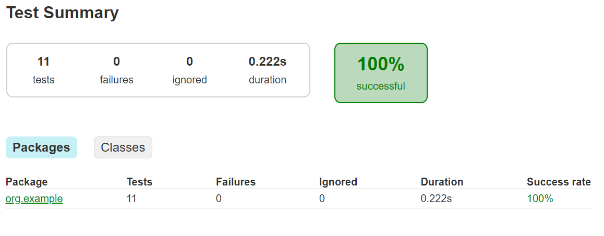

## Ejercicio 7: presenta un gráfico de flujo de control (CFG) del programa CountWords.

El gráfico de flujo de control (CFG) es una representación visual que muestra los distintos caminos que puede tomar un programa durante su ejecución. Para el método `count` en la clase `CountWords`, el CFG se puede representar mediante los nodos (que representan las instrucciones o bloques de código) y los arcos (que representan las transiciones entre estas instrucciones).

A continuación se presenta el CFG del método `count`:

### Método `count` en la clase `CountWords`

```java
javaCopiar código
package org.example;

import java.util.StringTokenizer;

public class CountWords {
    public int count(String input) {
        if (input == null || input.isEmpty()) { //Nodo 1
            return 0; //Nodo 2
        }

        StringTokenizer tokenizer = new StringTokenizer(input, " "); //Nodo 3
        int count = 0; //Nodo 4

        while (tokenizer.hasMoreTokens()) { //Nodo 5
            String word = tokenizer.nextToken(); //Nodo 6
            word = word.replaceAll("[^a-zA-Z0-9]$", ""); //Nodo 7
            if (word.endsWith("r") || word.endsWith("s")) { //Nodo 8
                count++; //Nodo 9
            }
        }

        return count; //Nodo 10
    }
}
```

### Gráfico de Flujo de Control (CFG)

Aquí está el CFG representado gráficamente:
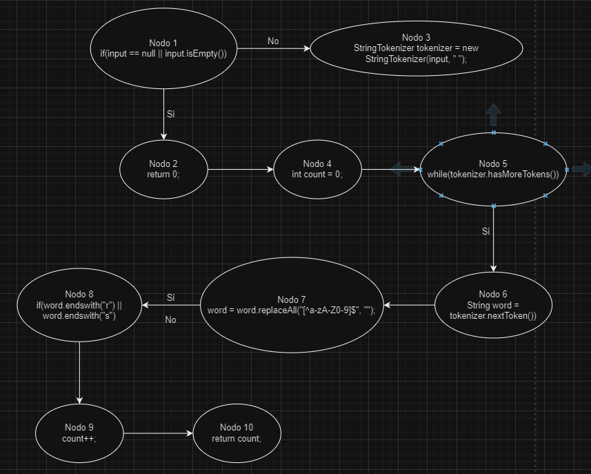
- **Nodo 1:** Verifica si `input` es nulo o está vacío.
- **Nodo 2:** Si `input` es nulo o está vacío, retorna 0.
- **Nodo 3:** Inicializa `StringTokenizer` con el `input`.
- **Nodo 4:** Inicializa el contador `count` en 0.
- **Nodo 5:** Inicia el bucle `while` que verifica si hay más tokens en el `StringTokenizer`.
- **Nodo 6:** Obtiene el siguiente token del `StringTokenizer`.
- **Nodo 7:** Remueve caracteres no alfanuméricos al final de la palabra.
- **Nodo 8:** Verifica si la palabra termina en 'r' o 's'.
- **Nodo 9:** Incrementa el contador `count` si la palabra termina en 'r' o 's'.
- **Nodo 10:** Retorna el valor de `count` después de que el bucle haya terminado.

## Ejercicio 8: Cobertura de línea

Asegura que cada línea de código en el método count de la clase CountWords esté cubierta por al menos una prueba unitaria.

1. Implementa la clase CountWords2 según el siguiente código:

```java
package org.example;

//Clase CountWords2 que cuenta las palabras en una cadena de texto que 
//terminan con las letras 'r' o 's'.

public class CountWords2 {

    //Cuenta las palabras en una cadena que terminan con 'r' o 's'

    public int count(String str) {
        int words = 0;  //Inicializa el contador de palabras a 0
        char last = ' ';  //Inicializa la ultima letra leida a un espacio en blanco
        
        //Recorre cada caracter de la cadena
        for (int i = 0; i < str.length(); i++) {
            //Si el caracter actual no es una letra y el caracter anterior fue 'r' o 's',
            //incrementa el contador de palabras
            if (!Character.isLetter(str.charAt(i)) && (last == 'r' || last == 's')) {
                words++;
            }
            //Actualiza la ultima letra leida al caracter actual
            last = str.charAt(i);
        }
        
        //Si la ultima letra de la cadena es 'r' o 's', incrementa el contador de palabras
        if (last == 'r' || last == 's') {
            words++;
        }
        
        //Retorna el numero total de palabras que terminan en 'r' o 's'
        return words;
    }
}
```

1. Escribe pruebas unitarias para cubrir cada línea del método count.

```java
package org.example;

import static org.assertj.core.api.Assertions.assertThat;
import org.junit.jupiter.api.Test;

//Clase de pruebas para la clase CountWords2.
public class CountWordsTest2 {
    
    //En esta prueba, la cadena "dogs cats" debe devolver 2.
    @Test
    void testCountWordsEndingWithS() {
        int words = new CountWords2().count("dogs cats");
        assertThat(words).isEqualTo(2);
    }

    //En esta prueba, la cadena "car bar" debe devolver 2.
    @Test
    void testCountWordsEndingWithR() {
        int words = new CountWords2().count("car bar");
        assertThat(words).isEqualTo(2);
    }

    //En esta prueba, la cadena "dog cat" debe devolver 0.
    @Test
    void testCountNoWordsEndingWithSOrR() {
        int words = new CountWords2().count("dog cat");
        assertThat(words).isEqualTo(0);
    }

    //En esta prueba, una cadena vacía debe devolver 0.
    @Test
    void testEmptyString() {
        int words = new CountWords2().count("");
        assertThat(words).isEqualTo(0);
    }
}
```

1. Ejecuta las pruebas y verifica que todas las líneas del método count estén cubiertas usando una herramienta de cobertura de código como JaCoCo.

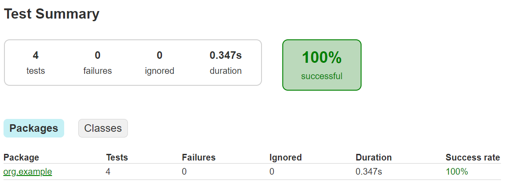

1. Escribe pruebas unitarias para cubrir cada línea del método count.

```java
package org.example;

import static org.assertj.core.api.Assertions.assertThat;
import org.junit.jupiter.api.Test;

//Clase de pruebas para la clase CountWords2.
public class CountWordsTest2 {
    
    //En esta prueba, la cadena "dogs cats" debe devolver 2.
    @Test
    void testCountWordsEndingWithS() {
        int words = new CountWords2().count("dogs cats");
        assertThat(words).isEqualTo(2);
    }

    //En esta prueba, la cadena "car bar" debe devolver 2.
    @Test
    void testCountWordsEndingWithR() {
        int words = new CountWords2().count("car bar");
        assertThat(words).isEqualTo(2);
    }

    //En esta prueba, la cadena "dog cat" debe devolver 0.
    @Test
    void testCountNoWordsEndingWithSOrR() {
        int words = new CountWords2().count("dog cat");
        assertThat(words).isEqualTo(0);
    }

    //En esta prueba, una cadena vacía debe devolver 0.
    @Test
    void testEmptyString() {
        int words = new CountWords2().count("");
        assertThat(words).isEqualTo(0);
    }
}
```

1. Ejecuta las pruebas y verifica que todas las líneas del método count estén cubiertas usando una herramienta de cobertura de código como JaCoCo.


### Ejercicio 9: Cobertura de ramas

Asegurar que cada rama del código en el método count esté cubierta por al menos una prueba unitaria. 

1. Escribe pruebas unitarias para cubrir todas las ramas del método count.

```java
package org.example;

import static org.assertj.core.api.Assertions.assertThat;
import org.junit.jupiter.api.Test;

//Clase de pruebas para la clase CountWords.
public class CountWordsTest2 {

    // En esta prueba, la cadena "dogs cats" debe devolver 2.
    @Test
    void testCountWordsEndingWithS() {
        int words = new CountWords2().count("dogs cats");
        assertThat(words).isEqualTo(2);
    }

    
    //Prueba para contar las palabras que terminan con 'r'.
    @Test
    void testCountWordsEndingWithR() {
        int words = new CountWords().count("car bar");
        assertThat(words).isEqualTo(2);
    }

    //Prueba para contar las palabras que no terminan con 's' o 'r'.
    @Test
    void testCountNoWordsEndingWithSOrR() {
        int words = new CountWords().count("dog cat");
        assertThat(words).isEqualTo(0);
    }

    //Prueba para contar las palabras que terminan con 's' o 'r' en presencia de caracteres especiales.
    @Test
    void testCountWordsWithSpecialCharacters() {
        int words = new CountWords().count("dog's car!");
        assertThat(words).isEqualTo(2);
    }

    //Prueba para una cadena vacia.
    @Test
    void testEmptyString() {
        int words = new CountWords().count("");
        assertThat(words).isEqualTo(0);
    }

    //Prueba para contar una sola palabra que es una 's'.
    @Test
    void testCountSingleCharacterS() {
        int words = new CountWords().count("s");
        assertThat(words).isEqualTo(1);
    }

    //Prueba para contar una sola palabra que es una 'r'.
    @Test
    void testCountSingleCharacterR() {
        int words = new CountWords().count("r");
        assertThat(words).isEqualTo(1);
    }

    //Prueba para contar una sola palabra que es un carácter no alfabetico.
    @Test
    void testCountSingleCharacterNonLetter() {
        int words = new CountWords().count("1");
        assertThat(words).isEqualTo(0);
    }
}
```

1. Ejecuta las pruebas y verifica que todas las ramas del método count estén cubiertas usando una herramienta de cobertura de código como JaCoCo.

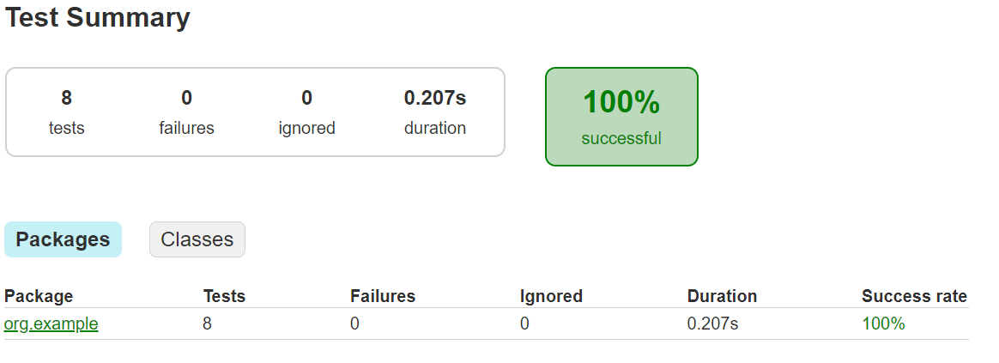
## Ejercicio 10: Condición + cobertura de rama

Asegurar que cada condición y cada rama del código en el método count esté cubierta por al menos una prueba unitaria.

1. Escribe pruebas unitarias para cubrir todas las condiciones y ramas del método count.

```java

    //Prueba para contar las palabras que terminan con 'r' y 's'.
    @Test
    void testCountWordsEndingWithRAndS() {
        int words = new CountWords().count("runners dogs cars");
        assertThat(words).isEqualTo(3);
    }
    
    //Prueba para contar las palabras que no terminan ni con 'r' ni con 's'.
    @Test
    void testCountWordsEndingWithNeither() {
        int words = new CountWords().count("hello world");
        assertThat(words).isEqualTo(0);
    }

    //Prueba para contar las palabras que terminan con 's' seguido de un carácter especial.
    @Test
    void testCountWordsEndingWithSAndSpecialChar() {
        int words = new CountWords().count("dogs cats@");
        assertThat(words).isEqualTo(2);
    }
```

1. Ejecuta las pruebas y verifica que todas las condiciones y ramas del método count estén cubiertas usando una herramienta de cobertura de código como JaCoCo.


## Ejercicio 11: Cobertura de rutas

Asegurar que todas las rutas posibles de ejecución en el método count estén cubiertas por al menos una prueba unitaria.

1. Escribe pruebas unitarias para cubrir todas las rutas posibles del método count. 

```java
    //Prueba para contar las palabras en una cadena donde las palabras comienzan con un carácter no alfabetico.
    @Test
    void testCountWordsStartingWithNonLetter() {
        int words = new CountWords().count("1dogs 2cats");
        assertThat(words).isEqualTo(2);
    }

    //Prueba para contar las palabras en una cadena con multiples espacios entre las palabras.
    @Test
    void testCountWordsWithSpaces() {
        int words = new CountWords().count("dogs  cats");
        assertThat(words).isEqualTo(2);
    }
```

1. Ejecuta las pruebas y verifica que todas las rutas posibles del método count estén cubiertas usando una herramienta de cobertura de código como JaCoCo.


## Ejercicio 12: Explica los comentarios 1, 2, 3, 4 y 5 del siguiente código.

Sea la clase:

```java
package org.example;

public class LeftPadUtils {
    //Caracter de espacio utilizado como relleno por defecto
    private static final String SPACE = " "; 

    //Metodo privado para verificar si una secuencia de caracteres esta vacia
    private static boolean isEmpty(final CharSequence cs) { 
        return cs == null || cs.length() == 0; 
    }
    
    //Metodo estatico para agregar caracteres de relleno a la izquierda de una cadena dad.
    public static String leftPad(final String str, final int size, String padStr) {  
        //Verifica si la cadena original es nula
        if (str == null) {  // 1
            return null;  
        }  

        //Verifica si la cadena de relleno es nula o vacía
        if (isEmpty(padStr)) {  // 2  
            padStr = SPACE;  //Usa espacio en blanco como relleno por defecto
        }  

        //Longitud de la cadena de relleno y longitud de la cadena original
        final int padLen = padStr.length();  
        final int strLen = str.length();  

        //Calcula el numero de caracteres de relleno necesarios
        final int pads = size - strLen;  

        //Si no se necesita ningun relleno, retorna la cadena original
        if (pads <= 0) {  // 3  
            return str;  
        }  

        //Si la longitud del relleno coincide exactamente con el numero de caracteres necesarios, 
        //se concatena el relleno al inicio de la cadena original y se retorna el resultado
        if (pads == padLen) {  // 4  
            return padStr.concat(str);  
        } 
        //Si la longitud del relleno es mayor que el numero de caracteres necesarios, 
        //se toma una subcadena del relleno con la longitud exacta necesaria y se concatena al inicio de la cadena original
        else if (pads < padLen) {  // 5  
            return padStr.substring(0, pads).concat(str);  
        } 
        //Si la longitud del relleno es mayor que el numero de caracteres necesarios, 
        //se crea un arreglo de caracteres de relleno y se concatena al inicio de la cadena original
        else {  // 6
            final char[] padding = new char[pads];  
            final char[] padChars = padStr.toCharArray();  
            for (int i = 0; i < pads; i++) {  
                padding[i] = padChars[i % padLen];  
            }  
            return new String(padding).concat(str);  
        }  
    }  
}
```

### Explicación de los comentarios:

1. **Comentario 1:**
    
    ```java
    javaCopiar código
    if (str == null) {  // 1
        return null;
    }
    ```
    
    Este bloque verifica si la cadena de entrada `str` es nula. Si es así, el método retorna `null`. Esto es un control de nulidad para evitar operaciones sobre un objeto nulo, lo que previene posibles errores de ejecución.
    
2. **Comentario 2:**
    
    ```java
    javaCopiar código
    if (isEmpty(padStr)) {  // 2
        padStr = SPACE;
    }
    ```
    
    Este bloque verifica si la cadena `padStr` es nula o está vacía usando el método `isEmpty`. Si `padStr` está vacía, se asigna un espacio en blanco a `padStr`. Esto garantiza que siempre haya un carácter de relleno disponible para la operación de relleno.
    
3. **Comentario 3:**
    
    ```java
    javaCopiar código
    if (pads <= 0) {  // 3
        return str;
    }
    ```
    
    Este bloque verifica si el número de caracteres de relleno necesarios (`pads`) es menor o igual a cero. Si es así, simplemente se retorna la cadena original `str`, ya que no se necesita ningún relleno adicional.
    
4. **Comentario 4:**
    
    ```java
    javaCopiar código
    if (pads == padLen) {  // 4
        return padStr.concat(str);
    }
    ```
    
    Este bloque verifica si el número de caracteres de relleno necesarios es exactamente igual a la longitud de la cadena de relleno (`padStr`). Si es así, se concatena `padStr` al inicio de `str` y se retorna la cadena resultante. Esta es una optimización para el caso donde la longitud del relleno coincide perfectamente con `padStr`.
    
5. **Comentario 5:**
    
    ```java
    javaCopiar código
    else if (pads < padLen) {  // 5
        return padStr.substring(0, pads).concat(str);
    }
    ```
    
    Este bloque verifica si el número de caracteres de relleno necesarios es menor que la longitud de la cadena de relleno (`padStr`). Si es así, se toma una subcadena de `padStr` con la longitud exacta necesaria (`pads`) y se concatena al inicio de `str`. Esto asegura que no se agreguen más caracteres de los necesarios.
    
    ## Ejercicio 13: Explica las líneas 1, 2 y 3
    
    Utilizando los siguientes test:
    
    ```java
    //Clase de prueba para la clase LeftPadUtils
    class LeftPadUtilsTest {
    
        //Metodo de prueba parametrizado para validar la funcion leftPad
        @ParameterizedTest
        @MethodSource("generator")
        void test(String originalStr, int size, String padString, String expectedStr) {  // 1
            //Se comprueba si el resultado de leftPad coincide con el valor esperado
            assertThat(LeftPadUtils.leftPad(originalStr, size, padString)).isEqualTo(expectedStr);
        }
    
        //Metodo estatico que genera una secuencia de argumentos para el metodo de prueba
        static Stream<Arguments> generator() { // 2
            //Se retorna un Stream de Arguments que contiene los casos de prueba
            return Stream.of(
                    //Casos de prueba con diferentes valores de entrada y salida esperados.
                    Arguments.of(null, 10, "-", null),  // T1
                    Arguments.of("", 5, "-", "-----"),  // T2
                    Arguments.of("abc", -1, "-", "abc"),  // T3
                    Arguments.of("abc", 5, null, "  abc"),  // T4
                    Arguments.of("abc", 5, "", "  abc"),  // T5
                    Arguments.of("abc", 5, "-", "--abc"),  // T6
                    Arguments.of("abc", 3, "-", "abc"),
                    Arguments.of("abc", 0, "-", "abc"),
                    Arguments.of("abc", 2, "-", "abc")
            );
        }
    }
    ```
    
    - `void test(String originalStr, int size, String padString, String expectedStr) {`: Esta línea define un método de prueba llamado `test`. Este método toma cuatro parámetros: `originalStr` (una cadena original), `size` (el tamaño deseado de la cadena resultante), `padString` (el carácter de relleno) y `expectedStr` (la cadena esperada después de aplicar `leftPad`). Este método es anotado con `@ParameterizedTest`, lo que indica que es un método de prueba parametrizado que será ejecutado con diferentes conjuntos de argumentos proporcionados por el método `generator`.
    - `static Stream<Arguments> generator() {`: Esta línea define un método estático llamado `generator`. Este método es responsable de generar una secuencia de argumentos para el método de prueba `test`. Retorna un `Stream` de `Arguments`, donde cada `Arguments` representa un conjunto de argumentos para un caso de prueba específico.
    - `Arguments.of(null, 10, "-", null), // T1`: Esta línea crea un conjunto de argumentos para un caso de prueba específico, etiquetado como `T1`. En este caso, el conjunto de argumentos consiste en cuatro elementos: `null`, `10`, `"-"` y `null`. Estos valores corresponden a la cadena original (`originalStr`), el tamaño deseado de la cadena resultante (`size`), el carácter de relleno (`padString`) y la cadena esperada después de aplicar `leftPad` (`expectedStr`). Cada uno de estos valores se pasará como argumento al método de prueba `test` para verificar su comportamiento.
    
    Al momento de ejecutar estos test:


## Ejercicio 14:

Agrega estos tres casos de prueba adicionales a la prueba parametrizada, como se muestra en el listado, y vuelve a ejecutar la herramienta de cobertura. Explica el informe obtenido, ¿es similar al anterior? Explica tu respuesta.

```java
//T10: Prueba con "abc", tamaño 5 y relleno "--", esperando "--abc".
Arguments.of("abc", 5, "--", "--abc"),
//T11: Prueba con "abc", tamaño 5 y relleno "---", esperando "--abc".
Arguments.of("abc", 5, "---", "--abc"),
//T12: Prueba con "abc", tamaño 5 y relleno "-", esperando "--abc".
Arguments.of("abc", 5, "-", "--abc")
```

Al ejecutar estos test adicionales junto con los anteriores obtengo:

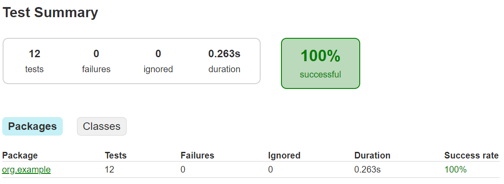

Mediante este informe podemos observar que los 12 test pasaron en un tiempo de 0.263 segundos.

## Ejercicio 15:

Agrega este caso de prueba adicional a la prueba parametrizada y vuelve a ejecutar la herramienta de cobertura. Explica el informe obtenido, ¿es similar al anterior? Explica tu respuesta. 

```java
//Prueba sameInstance: Verifica que leftPad devuelve la misma instancia de cadena original.
@Test
void sameInstance() {
    String str = "sometext";
    assertThat(LeftPadUtils.leftPad(str, 5, "-")).isSameAs(str);
}
```

Después de agregar este test a los demás y ejecutarlos obtengo:
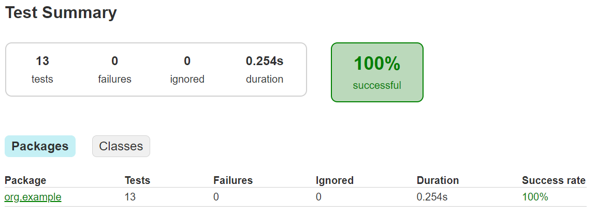

Mediante este informe podemos observar que los 13 test pasaron en un tiempo de 0.254 segundos.

## Pregunta 16 :  explica las líneas 1, 2 y 3 del código anterior

```java
package org.example;

//Clase que contiene un metodo para contar grupos de numeros repetidos en un array
public class Clumps {

    //Metodo que cuenta los grupos de numeros repetidos en un array
    public static int countClumps(int[] nums) {
        //Comprueba si el array es nulo o vacio.
        if (nums == null || nums.length == 0) {// 1
            return 0;
        }
        int count = 0;
        int prev = nums[0];
        boolean inClump = false;
        for (int i = 1; i < nums.length; i++) {
            //Comprueba si el numero actual es igual al anterior y si no esta dentro de un grupo.
            if (nums[i] == prev && !inClump) {// 2
                inClump = true;
                count += 1;
            }
            //Comprueba si el numero actual es diferente al anterior.
            if (nums[i] != prev) { // 3
                prev = nums[i];
                inClump = false;
            }
        }
        return count;
    }
}
```

- `if (nums == null || nums.length == 0) { return 0; }`: Esta línea comprueba si el array de entrada es nulo o vacío. Si lo es, el método devuelve 0, ya que no hay ningún clump en un array nulo o vacío.
- `if (nums[i] == prev && !inClump) { inClump = true; count += 1; }`: Esta línea comprueba si el número actual (`nums[i]`) es igual al número anterior (`prev`) y si no estamos dentro de un clump (`!inClump`). Si ambas condiciones se cumplen, significa que hemos encontrado un nuevo clump, por lo que actualizamos `inClump` a `true` y aumentamos el contador de clumps (`count`).
- `if (nums[i] != prev) { prev = nums[i]; inClump = false; }`: Esta línea comprueba si el número actual (`nums[i]`) es diferente al número anterior (`prev`). Si es así, actualizamos `prev` al nuevo número y marcamos que no estamos dentro de un clump (`inClump = false`). Esto nos permite detectar el final de un clump y comenzar a buscar un nuevo clump.

## Ejercicio 17

Escribe caso de prueba  y vuelve a  ejecutar la herramienta de cobertura. Explica el informe obtenido Explica tu respuesta. ¿ Se logra una cobertura de ramas del 100%?. ¿Se puede confiar  ciegamente en la cobertura? .

Agrego los siguientes test:

```java
     //Prueba parametrizada para verificar el numero de clumps en diferentes arrays.
    @ParameterizedTest
    @MethodSource("generator")
    void testClumps(int[] nums, int expectedNoOfClumps) {
        assertThat(Clumps.countClumps(nums)).isEqualTo(expectedNoOfClumps);
    }

    //Generador de argumentos para las pruebas parametrizadas
    static Stream<Arguments> generator() {
        return Stream.of(
                //Prueba con un array vacio, deberia retornar 0 clumps.
                of(new int[]{}, 0), //vacio
                
                //Prueba con un array nulo, deberia retornar 0 clumps.
                of(null, 0), //null
                
                //Prueba con un array que contiene [1, 2, 2, 2, 1], deberia retornar 1 clump.
                of(new int[]{1,2,2,2,1}, 1), // 1 grupo
                
                //Prueba con un array que contiene un solo elemento [1], deberia retornar 0 clumps.
                of(new int[]{1}, 0), //1 elemento
                
                //Prueba con un array que contiene [2, 2], deberia retornar 1 clump.
                of(new int[]{2,2}, 1) // 1 grupo
        );
    }
```

Después de agregar estos test adicionales y ejecutarlos obtengo lo siguiente:


Mediante este informe podemos observar que los 5 test pasaron en un tiempo de 0.230 segundos.

## Pregunta 18: Explica las líneas 1, 2 y 3 del siguiente código.

```java
package org.example;

public class Clumps {
    public static int countClumps(int[] nums) {
        if (nums == null || nums.length == 0) { // 1
            return 0;
        }
        int count = 0;
        int prev = nums[0];
        boolean inClump = false;
        for (int i = 1; i < nums.length; i++) {
            if (nums[i] == prev && !inClump) {// 2
                inClump = true;
                count += 1;
            }
            if (nums[i] != prev) { // 3
                prev = nums[i];
                inClump = false;
            }
        }
        return count;
    }
}
```

- `if (nums == null || nums.length == 0) { return 0; }`: Esta línea verifica si el array `nums` es nulo o si su longitud es 0. Si cualquiera de estas condiciones es verdadera, la función retorna 0, ya que no hay elementos para formar ningún clump (grupo de números consecutivos iguales). Esto previene errores en la ejecución del código cuando el array de entrada es inválido (nulo o vacío).
- `if (nums[i] == prev && !inClump) { inClump = true; count += 1; }`: Esta línea verifica si el elemento actual `nums[i]` es igual al elemento anterior `prev` y si no estamos actualmente dentro de un clump (`!inClump`). Si ambas condiciones se cumplen, significa que hemos encontrado el inicio de un nuevo clump. Se establece `inClump` a `true` para indicar que estamos dentro de un clump, y se incrementa el contador `count` de clumps en 1.
- `if (nums[i] != prev) { prev = nums[i]; inClump = false; }`: Esta línea verifica si el elemento actual `nums[i]` es diferente del elemento anterior `prev`. Si es diferente, significa que hemos salido de un clump (si estábamos en uno), o simplemente estamos moviéndonos a un nuevo elemento diferente. Se actualiza `prev` al valor del elemento actual `nums[i]` y se establece `inClump` a `false` para indicar que no estamos actualmente dentro de un clump. Esto permite detectar nuevos clumps más adelante en el array.

## Ejercicio 19

Escribe caso de prueba y vuelve a ejecutar la herramienta de cobertura. Explica el informe obtenido. Explica tu respuesta. ¿Se logra una cobertura de ramas del 100%? ¿Se puede confiar ciegamente en la cobertura?

```java
//Clase de prueba para la funcionalidad de contar clumps en un array de enteros.
public class ClumpsOnlyStructuralTest {

    //Prueba parametrizada para verificar el numero de clumps en diferentes arrays
    @ParameterizedTest
    @MethodSource("generator")
    void testClumps(int[] nums, int expectedNoOfClumps) {
        //Verifica que el resultado de countClumps(nums) sea igual al numero esperado de clumps.
        assertThat(Clumps.countClumps(nums)).isEqualTo(expectedNoOfClumps);
    }

    //Generador de argumentos para las pruebas parametrizadas
    static Stream<Arguments> generator() {
        return Stream.of(
                //Prueba con un array vacio, deberia retornar 0 clumps.
                Arguments.of(new int[]{}, 0), //vacio
                
                //Prueba con un array nulo, deberia retornar 0 clumps.
                Arguments.of(null, 0), //null
                
                //Prueba con un array que contiene [1, 2, 2, 2, 1], deberia retornar 1 clump.
                Arguments.of(new int[]{1, 2, 2, 2, 1}, 1), //1 grupo
                
                //Prueba con un array que contiene un solo elemento [1], deberia retornar 0 clumps.
                Arguments.of(new int[]{1}, 0), // 1 elemento

                //Prueba con un array que contiene [2, 2], deberia retornar 1 clump.
                Arguments.of(new int[]{2, 2}, 1)// 1 grupo
        );
    }
}
```

Después de escribir estos test y ejecutarlos obtengo:


Mediante este informe podemos observar que los 5 test pasaron en un tiempo de 0.232 segundos.

## Ejercicio 20

Agrega estos tres casos de prueba adicionales a la prueba parametrizada, como se muestra en el listado, y vuelve a ejecutar la herramienta de cobertura. Explica el informe obtenido, ¿es similar al anterior? Explica tu respuesta.

```java
//Prueba con un array que contiene [1, 1, 2, 2, 3, 3], deberia retornar 3 clumps.
Arguments.of(new int[]{1, 1, 2, 2, 3, 3}, 3),// T10: 3 grupos

//Prueba con un array que contiene [1, 1, 1, 2, 2, 2, 3, 3, 3], deberia retornar 3 clumps grandes.
Arguments.of(new int[]{1, 1, 1, 2, 2, 2, 3, 3, 3}, 3),// T11: 3 grupos grandes

//Prueba con un array que contiene [1, 2, 2, 2, 3, 3, 4, 4, 4], deberia retornar 3 clumps separados.
Arguments.of(new int[]{1, 2, 2, 2, 3, 3, 4, 4, 4}, 3)// T12: 3 grupos separados
```

Al momento de ejecutar estos test adicionales junto con los anteriores obtenemos lo siguiente:
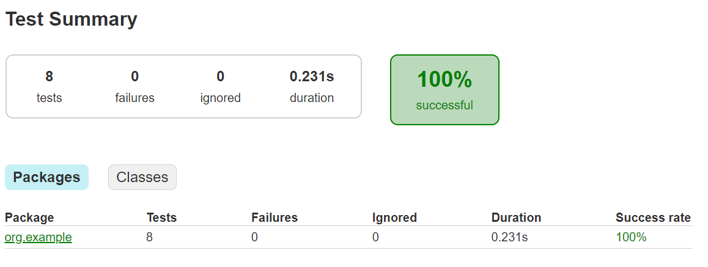

## Ejercicio 21

Agrega este caso de prueba adicional a la prueba parametrizada y vuelve a ejecutar la herramienta de cobertura. Explica el informe obtenido, ¿es similar al anterior? Explica tu respuesta.

```java
    @Test
    void sameInstance() {
        int[] nums = {1, 2, 3};
        //El metodo countClumps no debe modificar el array de entrada.
        Clumps.countClumps(nums);
        assertThat(nums).isEqualTo(new int[]{1, 2, 3});
    }
```

Al momento de ejecutar este test adicional junto con los anteriores obtenemos lo siguiente:

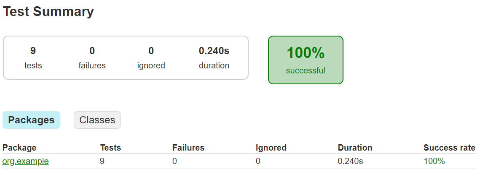

Además considera las siguientes pruebas unitarias:
```java
    //Generador de argumentos para las pruebas parametrizadas.
    static Stream<Arguments> generator() {
        return Stream.of(
                //Prueba con un array vacío, debería retornar 0 clumps.
                Arguments.of(new int[]{}, 0),// vacío

                //Prueba con un array nulo, debería retornar 0 clumps.
                Arguments.of(null, 0),// null

                //Prueba con un array que contiene [1, 2, 2, 2, 1], debería retornar 1 clump.
                Arguments.of(new int[]{1, 2, 2, 2, 1}, 1),// 1 grupo

                //Prueba con un array que contiene un solo elemento [1], debería retornar 0 clumps.
                Arguments.of(new int[]{1}, 0),// 1 elemento

                //Prueba con un array que contiene [2, 2], debería retornar 1 clump.
                Arguments.of(new int[]{2, 2}, 1)// 1 grupo
        );
    }
```

1. Ejecuta las pruebas unitarias proporcionadas y observa el informe de cobertura. ¿La cobertura obtenida es del 100%?.
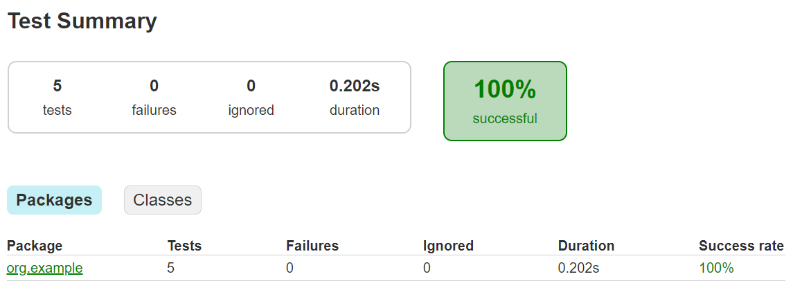

Mediante este informe podemos observar que los 5 test pasaron en un tiempo de 0.202 segundos.

1. ¿Qué casos adicionales podrías agregar para asegurar que todas las ramas del código se prueben adecuadamente? 

```java
//Prueba con un array que contiene [1, 1, 2, 2, 3, 3], deberia retornar 3 clumps.
Arguments.of(new int[]{1, 1, 2, 2, 3, 3}, 3),// T10: 3 grupos

//Prueba con un array que contiene [1, 1, 1, 2, 2, 2, 3, 3, 3], deberia retornar 3 clumps grandes.
Arguments.of(new int[]{1, 1, 1, 2, 2, 2, 3, 3, 3}, 3),// T11: 3 grupos grandes

//Prueba con un array que contiene [1, 2, 2, 2, 3, 3, 4, 4, 4], deberia retornar 3 clumps separados.
Arguments.of(new int[]{1, 2, 2, 2, 3, 3, 4, 4, 4}, 3)// T12: 3 grupos separados
```

1. Agrega tres casos adicionales al generador de argumentos para cubrir más escenarios y vuelve a ejecutar las pruebas. ¿Qué observas en el nuevo informe de cobertura?

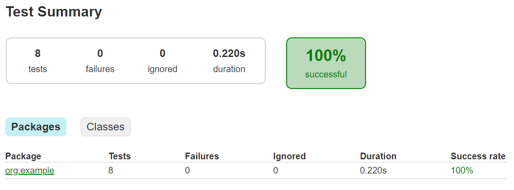

Mediante este informe podemos observar que los 8 test pasaron en un tiempo de 0.200 segundos.