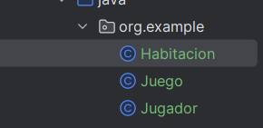

# Spring1:Estructura básica del juego y movimiento

*“El juego será una aventura de texto en la que los jugadores navegan a través de una serie de
habitaciones, recogen objetos, resuelven acertijos y enfrentan desafíos. El juego enfatizará la
aplicación de métricas de acoplamiento (Ce, Ca, CF), TDD y refactorización.”*

**Jugabilidad**:
• Los jugadores pueden moverse entre habitaciones usando comandos (por ejemplo, "mover
norte", "mover sur").

• Los jugadores pueden interactuar con objetos en las habitaciones (por ejemplo, "recoger
llave", "usar poción")

• Los jugadores deben resolver acertijos para desbloquear nuevas áreas.

• El juego termina cuando el jugador alcanza el objetivo final o completa la misión principal.

**Metodología de desarrollo**
• Aplicación de TDD: Desarrollar pruebas antes de implementar la funcionalidad.

• Refactorización continua: Mejorar el código constantemente para mantener alta calidad.

• Métricas de código: Métricas de acoplamiento,

• SOLID, código de cobertura y mantenimiento del código

La resolucion del ejercicio se resolverá en 3 Sprint.

# Spring1:Estructura básica del juego y movimiento

Implementaremos primero 3 clases prinicipales; 

- Juego: Clase principal para iniciar y controlar el flujo del juego
- Jugador: Representa al jugador y rastrea su inventario y ubicación actual.
- Habitación: Representa una habitación en el juego.



Aplicando el enfoque TDD vamos a crear nuestra primera prueba unitaria `testCrearHabitacion` en `CrearHabitacionTest` el cual verificara la correcta creacion de una habitacion : 

```java
package org.example;

import org.junit.jupiter.api.Test;

public class CrearHabitacionTest {
    @Test
    public void testCrearHabitacion() {
        // Arrange
        Juego juego = new Juego();
        // Act
        Habitacion habitacion = juego.crearHabitacion();
        // Assert
        assert (habitacion != null);
    }
}

```

Ejecutamos la prueba `testCrearHabitacion` ,no pasara (**ROJO)**


Para que la prueba pase implementamos el metodo `crearHabitacion`  

en la clase `Juego`  :

```java
package org.example;

public class Juego {
    public static void main(String[] args) {
        System.out.println("Bienvenido al juego");
    }

    public Habitacion crearHabitacion() {
        return new Habitacion();
    }
}

```

Ejecutamos nuevamente la prueba  :


La prueba paso correctamente .(**VERDE)**

- Para la segunda prueba  `MoveJugadorTest`: (**rojo)**

Esta prueba sirve para verificar el movimiento del jugador, es decir si se mueve o no:

```java
package org.example;

import org.junit.jupiter.api.Test;

public class MoveJugadorTest {
    @Test
    public void testMoveJugador() {
        // Arrange
        Juego juego = new Juego();
        // Act
        boolean result = juego.moveJugador();
        // Assert
        assertTrue(result);
    }
}

```

Ejecutamos la prueba  `MoveJugadorTest`


Haremos que la prueba pase haciendo el minimo codigo para que salga verde , veamos: 

Crearemos el metodo `moveJugador`  en la clase **Juego**

```java
package org.example;

public class Juego {
    public static void main(String[] args) {
        System.out.println("Bienvenido al juego");
    }

    public Habitacion crearHabitacion() {
        return new Habitacion();
    }

    public boolean moveJugador() {
        return true;
    }
}

```

Ejecutamos nuevamente la prueba , y esta paso (**verde)**


- Para la ultima prueba del Spring1 donde probaremos la correcta inicializaicon del juego para ello crearemos `JuegoTest` :

```java
package org.example;

import org.junit.jupiter.api.Test;

public class JuegoTest {
    //prueba para verificar la corrcta inicializacion del juego
    @Test
    public void testJuego() {
        Juego juego = new Juego();
        assert (juego != null);
    }
}

```

Ejecutamos la prueba `testJuego` y esta paso correctamente (**verde)**


- Ahora implementamos la prueba `definirHabitacion`  para verificiar que se defina la habitacion inicial para e jugador en el juego :

```java
     //definir la habitacion inicial para el jugador
 @Test
    public void definirHabitacionTest() {
        Juego juego = new Juego();
        Jugador jugador = new Jugador();
        String habitacion = juego.definirHabitacion(jugador);

        assertThat(habitacion).isEqualTo("Habitacion inicial");
    }
```

Ejecutamos la prueba , esta no paso (**rojo)**


Crearemos el minimo codigo para  que la prueba pase para ello crearemos el metodo `definirHabitacion` en la clase Juego :

```java
 public String definirHabitacion(Jugador jugador) {
        return "Habitacion inicial";
    }
```

Ejecutamos nuevamente la prueba y esta pasa (**verde):**


Creamos la prueba `TestNameMoveJugador` para verficar si el movimiento del jugador a otra habitacion es el correcto : 

```java
@Test
    public void testnameMoveJugador2(){
        Juego juego = new Juego();
        Jugador jugador = new Jugador();
        juego.definirHabitacion(jugador);
        // Act
        String resultado = juego.namemoveJugador("mover norte");
        // Assert
        assertEquals("mover norte", resultado);
    }
```

Ejecutamos la prueba y no pasa (**rojo):**


Para que la prueba ´prueba pasar creareamos el metodo `namemoveJugador`:

```java
public String namemoveJugador(Jugador jugador, String moverNorte) {

        return moverNorte;
    }
```

Ahora ejecutamos nuevamente la prueba y pasa (**VERDE):** 


Ahora en la clase Juego implementamos la inicilizacion del juego : 

```java
public class Juego {
    private Habitacion habitacionActual;
    private Map<String, String> movimientos;
    public static void main(String[] args) {
        Juego juego = new Juego();
        juego.iniciarJuego();
    }
    public void iniciarJuego() {
        Scanner scanner = new Scanner(System.in);
        System.out.println("Estas en una habitacion oscura");
        while (true){
            String movimiento = scanner.nextLine();
            if (movimiento.equalsIgnoreCase("salir")){
                System.out.println("Hasta la proxima!");
                break;
            }
            else if (movimiento.equalsIgnoreCase("mover norte")){
                System.out.println("Estas en una biblioteca");
            }
            else if (movimiento.equalsIgnoreCase("mover sur")){
                System.out.println("Estas en una casa");
            }
            else if (movimiento.equalsIgnoreCase("mover este")){
                System.out.println("Estas en una escuela");
            }
            else if (movimiento.equalsIgnoreCase("mover oeste")){
                System.out.println("Estas en una hostpital");
            }
        }
    }

```

Ejecutamos el juego

