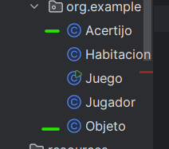

# SRING2

## Spring2 :  Recolección de objetos y resolución de acertijos

**Clases a implementar:**
• Objeto: Representa un objeto que puede ser recogido por el jugador.
• Acertijo: Representa un acertijo que necesita ser resuelto en el juego.

**Tareas:**

1. Gestión de Objetos:
• Permitir a los jugadores recoger y usar objetos.
2. Integración de acertijos:
• Implementar acertijos que los jugadores necesiten resolver para progresar.
3. Mejoras en la interacción:
• Extender los comandos del jugador para incluir interacciones con objetos y acertijos

Creacion de las clases  : 



- Aplicando el enfoque TDD ,creamos la prueba `testRecogerObjeto`

en la que se prueba que si hay un objeto en el cuarto te da la opcion de recogeerlo y guardarlo en un inventario.

```java
 @Test
    public void testRecogerObjeto() {
        Juego juego = new Juego();
        Jugador jugador = new Jugador();
        Habitacion habitacion = juego.crearHabitacion();

        // añadir un objeto
        habitacion.agregarObjeto("llave");

        juego.definirHabitacion(jugador, habitacion);
        juego.moveJugador(jugador, "entrar");

        // verificar el objeto en la lista
        assertThat(jugador.getInventario()).contains("llave");
    }
```

Ejecutamos `testRecogerObjeto` , vemos que sale rojo , la prueba no pasa : 


Haremos el minimo codigo para hacer que la prueba pase : 

Para ello implementaremos `getInventario` en la calse Juego: 


La prueba pasa exitosamente (**VERDE)**

- Prueba para mecánica de resolución de acertijos

```java
@Test
        public void resolucionAcertijosTest() {
            Juego juego = new Juego();
            String enigma = "Abrir la puerta";
            String clave = "usar la llave";
            String solucion = juego.resolucionAcertijos(enigma, clave);
            String esperada = "usar la llave";
            assertThat(solucion).isEqualTo(esperada);
        }
```

La prueba no pasa (**rojo)**


Haremos el minimo codigo para hacer que la prueba pase : 

Para ello implementaremos `resolucionAcertijo` en la clase Juego: 

```java
 public String resolucionAcertijos(String enigma, String clave) {
        if (enigma.equalsIgnoreCase(clave)) {
            return "Enigma resuelto";
        } else {
            return "Enigma no resuelto";
        }
    }
```


ejecutamos nuevamente la prueba y esta paso , ademas ejecutamso toda las prueba para que no haya ocurrido algun error al hacer pasar la prueba `resolucionAcertijo` :


Todas las pruebas pasan , vamos por buen camino .

```java
public class Juego {
    private Habitacion habitacionActual;
    private Map<String, String> movimientos;
    public static void main(String[] args) {
        Juego juego = new Juego();
        juego.iniciarJuego();
    }
    public void iniciarJuego() {
        Scanner scanner = new Scanner(System.in);
        System.out.println("Estas en una habitacion oscura");
        while (true){
            String movimiento = scanner.nextLine();
            if (movimiento.equalsIgnoreCase("salir")){
                System.out.println("Hasta la proxima!");
                break;
            }
            else if (movimiento.equalsIgnoreCase("mover norte")){
                System.out.println("Estas en una biblioteca");
                System.out.println("ves una llave en el suelo");
                //añadir un objeto al inventario
                if(movimiento.equalsIgnoreCase("recoger la llave")){
                    System.out.println("Has recogido la llave");
                }
            }
            else if (movimiento.equalsIgnoreCase("mover sur")){
                System.out.println("Estas en una casa");
            }
            else if (movimiento.equalsIgnoreCase("mover este")){
                System.out.println("Estas en una escuela");
            }
            else if (movimiento.equalsIgnoreCase("mover oeste")){
                System.out.println("Estas en una hostpital");
            }
        }
    }

    public Habitacion crearHabitacion() {
        return new Habitacion();
    }

    public String namemoveJugador(String movimiento) {
        movimientos = new HashMap<>();
        movimientos.put("mover norte", habitacionActual.getHabitacion());
        movimientos.put("mover sur", habitacionActual.getHabitacion());
        movimientos.put("mover este", habitacionActual.getHabitacion());
        movimientos.put("mover oeste", habitacionActual.getHabitacion());
        return movimientos.get(movimiento);
    }
    public boolean moveJugador(Jugador jugador, String movimiento) {
        if (movimiento.equalsIgnoreCase("mover norte")) {
            return true;
        } else if (movimiento.equalsIgnoreCase("mover sur")) {
            return true;
        } else if (movimiento.equalsIgnoreCase("mover este")) {
            return true;
        } else if (movimiento.equalsIgnoreCase("mover oeste")) {
            return true;
        }

        return false;
    }

    public String definirHabitacion(Jugador jugador, Habitacion habitacion) {
        return "Habitacion inicial";
    }

    public String resolucionAcertijos(String enigma, String clave) {
        if (clave.equals("usar la llave")) {
            return "usar la llave";
        } else {
            return "Enigma no resuelto";
        }
    }
}
```

