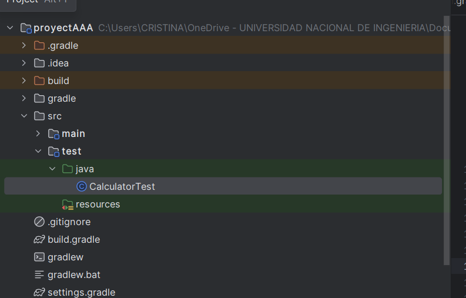
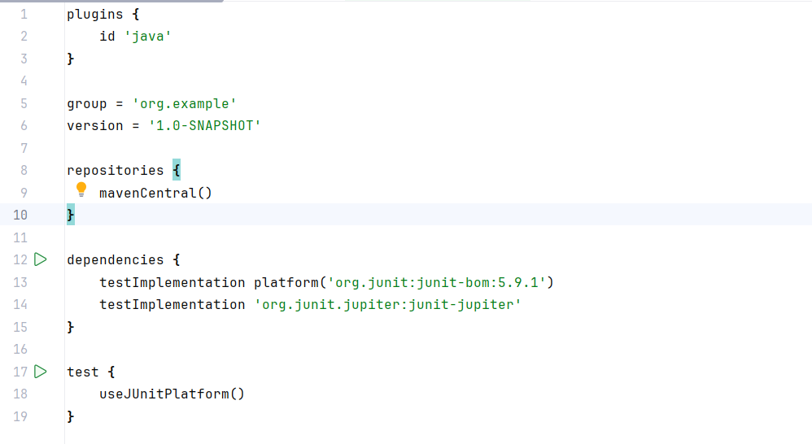
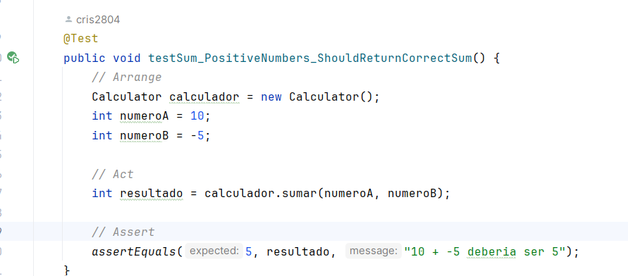
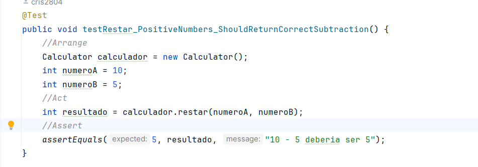
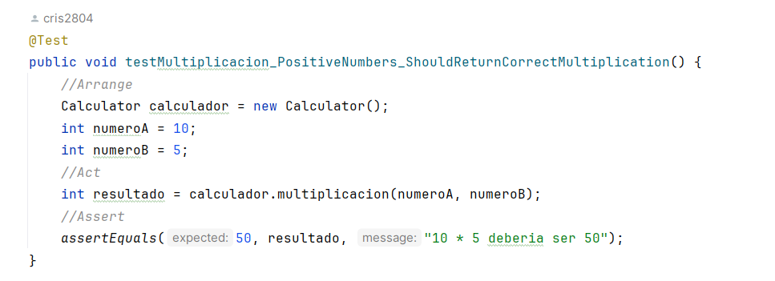
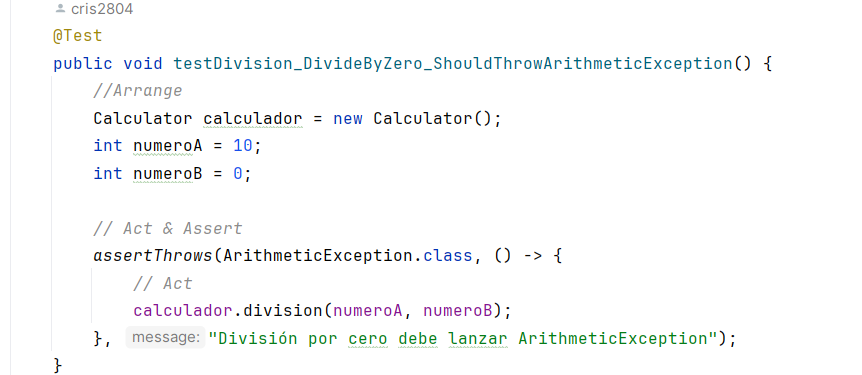
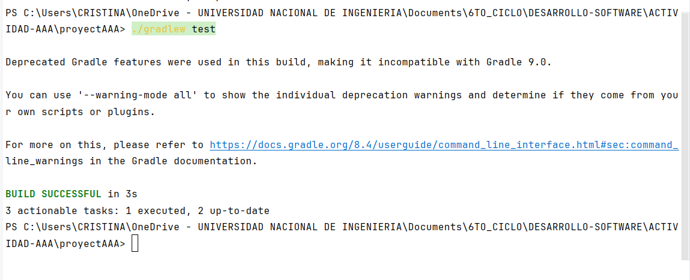
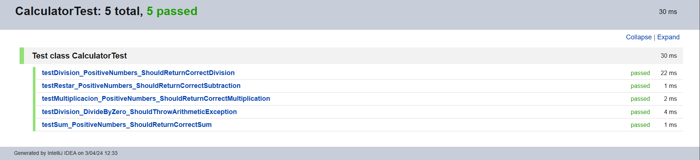

# Actividad AAA 
- Nombre y Apellidos : Milagros Cristina Ruiz Arica
## Parte 1: 
- Abrí IntelliJ IDEA y seleccioné "File" > "New" > "Project".
- En el asistente de nuevo proyecto, elegí "Gradle" como tipo de proyecto y aseguré que la opción "Java" estuviera seleccionada como lenguaje de programación.
- Le di un nombre a mi proyecto y seleccioné una ubicación en mi sistema de archivos para guardarlo.
IntelliJ IDEA generó automáticamente los archivos necesarios para un proyecto Gradle básico, incluido el archivo build.gradle con la configuración del proyecto.
- En el panel izquierdo de IntelliJ IDEA, pude ver la estructura básica del proyecto, incluyendo la carpeta src con los directorios main y test para el código fuente y las pruebas, respectivamente.

- En el archivo build.gradle, agregamos las dependencias necesarias para JUnit 5.

## Parte 2 
- Se implementó la clase _Calculator_ en la main y la clase _CalculatorTest_
- Creamos las pruebas unitarias  para los metodos de la clase _Calculator_ , para la suma,resta,multiplicacion y division tomando en cuenta casos exclusivos como la division sobre cero .
- Capturamos excepciones para casos cuando un numero sea dividido entre 0.
  
  
  
  
- Realizamos la pruebas unitarias :
  
  