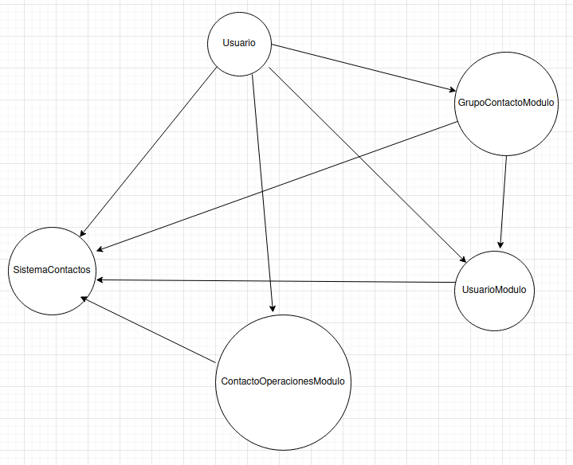
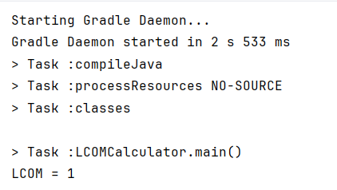
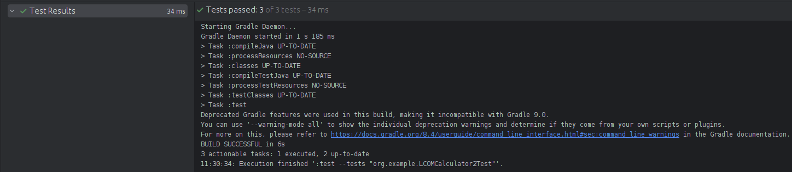
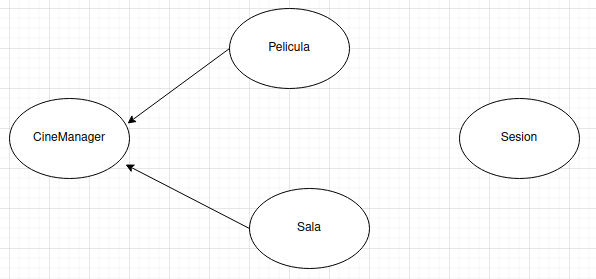
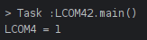
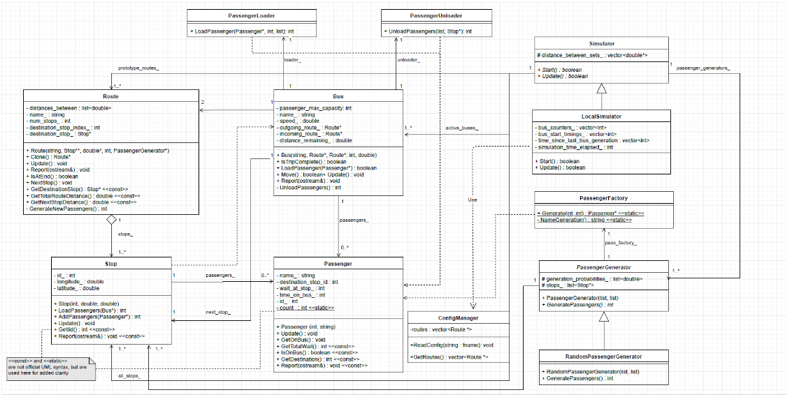
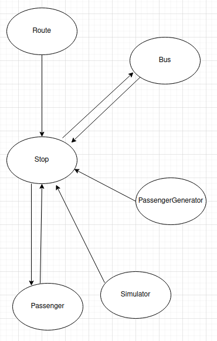

# ResolucionDeLaActividad

# **Actividad de Metricas de calidad de software**

En esta actividad calcularemos las metricas de calidad de software para algunos ejemplos de sistemas en java con una cierta cantidad de modulos.

## **Ejemplo 1 de un sistema en Java con tres modulos**

Supongamos que estamos construyendo un sistema de manejo de contactos, que incluye modulos para usuarios, grupos de contactos y operaciones de contacto. Mostramos una representacion muy simplificada:

## **Modulo UsuarioModulo**

```java
import java.util.ArrayList;
import java.util.List;

public class UsuarioModulo {
    private List<Usuario> usuarios = new ArrayList<>();

//Dependencia a la clase Usuariopublic void agregarUsuario(Usuario usuario) {
        usuarios.add(usuario);

//Dependencia a la clase GrupoContactoModulo
        GrupoContactoModulo.agregarUsuarioAGrupo(usuario, "General");
    }

//Dependencia a la clase Usuariopublic void eliminarUsuario(String nombre) {
        usuarios.removeIf(u -> u.getNombre().equals(nombre));
    }
}

```

`UsuarioModulo` es una clase que gestiona una lista de usuarios, permitiendo agregar y eliminar usuarios. Tambien se integra con el modulo `GrupoContactoModulo` para añadir usuarios a un grupo por defecto llamado "General".

### **Dependencias**

### **Clase `Usuario`:**

- Se usa para crear una lista de objetos `Usuario`.
- Se pasa como parametro en los métodos `agregarUsuario` y `eliminarUsuario`.
- Se llama al metodo `getNombre` del objeto `Usuario` en el metodo `eliminarUsuario`.

### **Clase `GrupoContactoModulo`:**

- Se llama al metodo estatico `agregarUsuarioAGrupo` en el metodo `agregarUsuario`.

## **Clase Usuario**

La clase `UsuarioModulo` utiliza la clase `Usuario` para crear una lista de objetos `Usuario` y gestionar su inserción y eliminación.

```java
package ActividadMetricasDeCalidadDeSoftware.example.demo;

public class Usuario {
    private String nombre;

    public Usuario(String nombre) {
        this.nombre = nombre;
    }

    public String getNombre() {
        return nombre;
    }
}

```

- la clase `Usuario` no presenta dependencias explicitas.

## **Modulo SistemaContactos**

`SistemaContactos` es la clase principal que actua como punto de entrada para la aplicacion. Maneja la creacion de usuarios, el envio de mensajes, y la gestion de grupos de contacto.

```java
public class SistemaContactos {
    public static void main(String[] args) {
        UsuarioModulo usuarioModulo = new UsuarioModulo();
        Usuario nuevoUsuario = new Usuario("Juan");
        usuarioModulo.agregarUsuario(nuevoUsuario);
        ContactoOperacionesModulo operacionesModulo = new ContactoOperacionesModulo();
        operacionesModulo.enviarMensaje("¡Hola!", nuevoUsuario);
        GrupoContactoModulo.crearGrupo("Amigos");
        GrupoContactoModulo.agregarUsuarioAGrupo(nuevoUsuario, "Amigos");
    }
}

```

### **Dependencias**

### **Clase `UsuarioModulo`:**

- Se instancia para manejar operaciones relacionadas con usuarios.
- Se utiliza el metodo `agregarUsuario` de `UsuarioModulo`.

### **Clase `Usuario`:**

- Se instancia un objeto `Usuario` para representar un nuevo usuario llamado "Juan".
- Se pasa como parametro en los metodos `agregarUsuario` y `enviarMensaje`.

### **Clase `ContactoOperacionesModulo`:**

- Se instancia para manejar operaciones de contacto.
- Se utiliza el metodo `enviarMensaje` de `ContactoOperacionesModulo`.

### **Clase `GrupoContactoModulo`:**

- Se llama a los metodos estaticos `crearGrupo` y `agregarUsuarioAGrupo` de `GrupoContactoModulo`.

## **Modulo GrupoContactoModulo**

`GrupoContactoModulo` es una clase que gestiona grupos de contactos, permitiendo la creacion de grupos y la adicion de usuarios a estos grupos.

```java
import java.util.ArrayList;
import java.util.HashMap;
import java.util.List;
import java.util.Map;

public class GrupoContactoModulo {
    static Map<String, List<Usuario>> grupos = new HashMap<>();

    static {
        grupos.put("General", new ArrayList<>());
    }

    public static void agregarUsuarioAGrupo(Usuario usuario, String grupoNombre) {
        grupos.get(grupoNombre).add(usuario);
    }

    public static void crearGrupo(String nombre) {
        if (!grupos.containsKey(nombre)) {
            grupos.put(nombre, new ArrayList<>());
        }
    }
}

```

### **Dependencias**

### **Clase `Usuario`:**

- Los objetos `Usuario` se agregan a las listas dentro del mapa `grupos`.
- Se pasa como parámetro en el método `agregarUsuarioAGrupo`.

## **Modulo ContactoOperacionesModulo**

`ContactoOperacionesModulo` es una clase que maneja operaciones de contacto, especificamente el envio de mensajes a usuarios.

```java
public class ContactoOperacionesModulo {
    public void enviarMensaje(String mensaje, Usuario usuario) {
        System.out.println("Enviando mensaje a " + usuario.getNombre() + ": " + mensaje);
    }
}

```

### **Dependencias**

### **Clase `Usuario`:**

- Se utiliza para obtener informacion del usuario al que se le envia un mensaje.
- Se pasa como parametro en el metodo `enviarMensaje`.

## **Diagrama para observar las dependencias de las clases**



## **Calculo del Factor de acoplamiento (CF)**

- Para calcular el CF utilizaremos la ecuacion: CF = e/a*(n-1)
- Donde **e** es el numero total de conexiones de acoplamiento reales entre modulos, **a** es el numero de modulos en el sistema y **n** es el numero total de modulos
- Observando el diagrama de dependencias tenemos que e es 8, a es 5 y n es 5.
- Entonces en la ecuacion CF = 8/5(5-1) = 0.4
- Teniendo como resultado que el CF es 0.4

# **Ejemplo 2 LCOM**

Un ejemplo detallado de código Java que simula el cálculo de LCOM para una clase ficticia. Este ejemplo muestra cómo se puede comenzar a desarrollar una herramienta que analiza y calcula la métrica LCOM para una clase Java específica. El código incluirá una estructura básica de análisis de métodos y atributos para calcular ∣P∣ y ∣Q|.

Analizamos el codigo que hace 

```java
package Ejemplo_2;

import java.util.*;
public class LCOMCalculator {
    //Clase interna para almacenar informacion de la clase analizada
    private static class ClassInfo {
        List<String> methods = new ArrayList<>();//Lista de nombres de metodos
        Map<String, Set<String>> methodAttributes = new HashMap<>();//Mapa de metodos y los atributos que usan
        Set<String> attributes = new HashSet<>();// Conjunto de todos los atributos de la clase

        //Metodo para agregar un metodo y los atributos que usa
        public void addMethod(String methodName, Set<String> attrs) {
            methods.add(methodName);//Agrega el nombre del metodo a la lista de metodos
            methodAttributes.put(methodName, attrs);//Asocia el metodo con sus atributos
            attributes.addAll(attrs);//Agrega todos los atributos al conjunto de atributos de la Clase.
        }
    }
    public static void main(String[] args) {
        ClassInfo classInfo = new ClassInfo();// Crea una instancia de ClassInfo
        // Simulación de entrada de métodos y sus accesos a atributos
        // method1 usa attr1 y attr2
        classInfo.addMethod("method1", new HashSet<>(Arrays.asList("attr1", "attr2")));
        // method2 usa attr2
        classInfo.addMethod("method2", new HashSet<>(Arrays.asList("attr2")));
        // method3 usa attr3
        classInfo.addMethod("method3", new HashSet<>(Arrays.asList("attr3")));

        //Inizializa los contadores de pares de metodos que no comparten y que si comparten atributos
        int p = 0, q = 0;
        //Obtiene la lista de metodos de la Clase
        List<String> methods = classInfo.methods;

        // Itera sobre todos los pares de metodos
        for (int i = 0; i < methods.size(); i++) {
            for (int j = i + 1; j < methods.size(); j++) {
                String method1 = methods.get(i);// Obtiene el nombre del primer metodo del par
                String method2 = methods.get(j);// Obtiene el segundo nombre del metodo del par
                // Obtiene los atributos usados por el primer metodo
                Set<String> attrs1 = classInfo.methodAttributes.get(method1);
                // Obtiene los atributos usados por el segundo metodo
                Set<String> attrs2 = classInfo.methodAttributes.get(method2);
                // Calcula la interseccion de los conjuntos de atributos de ambos metodos
                Set<String> intersection = new HashSet<>(attrs1);
                intersection.retainAll(attrs2);

                if (intersection.isEmpty()) {
                    p++; // Si la interseccion esta vacia, incrementa el contador de metodos que no comparten atributos
                } else {
                    q++; // Si la interseccion no esta vacia, incrementa el contador de metodos que comparten al menos un atributo
                }
            }
        }
        //Calcula el LCOM
        int lcom = p - q;
        System.out.println("LCOM = " + lcom); // Imprime el valor de LCOM  
    }
}

```

En la funcion principal se crea una clase `classInfo` que sera nuesta clase simulada a la cual se le añaden los metodos  `method1`,`method2` y `method3` y sus accesos a los atributos `attr1`,`attr2` y `attr3`.

`method1` usa attr1 y attr2

`method2` usa attr2

`method3` usa attr3

Ahora sabiendo eso ejecutamos el el codigo para obtener el LCOM de la clase simulada.



Como podemos ver el LCOM nos sale 1

## Ejercicio 1: Extender LCOMCalculator para incluir más métodos y atributos

Vamos a mejorar la comprensión de cómo la estructura y la cohesión de la clase afectan la métrica
LCOM.
Para ello añadiremos más métodos y atributos a la clase ClassInfo simulada en LCOMCalculator cada metodo debe tener un proposito simulado .


1. **method4**: Manipula **`attr1`** y **`attr4`**.
2. **method5**: Manipula **`attr2`** y **`attr3`**.
3. **method6**: Manipula **`attr1`**, **`attr2`**, y **`attr3`**.
4. **method7**: Manipula **`attr4`**.
5. **method8**: Manipula **`attr1`**.
6. **method9**: Manipula **`attr2`** y **`attr4`**.

Ahora ejecutamos para observar como cambian los valores de p y q por lo tanto como afecta al valor de LCOM


Como se puede ver el valor de LCOM cambio y ahora es negativo por lo que ahora la clase tiene mayor cohesion debido a que en valor de LCOM disminuyo.

## Ejercicio 2: Refactorizar LCOMCalculator para mejorar la legibilidad y eficiencia

## Puntos clave para la refactorización:

- Extraer la lógica del cálculo de LCOM a un método separado.
- Mejorar la estructura de `ClassInfo` para facilitar la adición de nuevos métodos y atributos.
- Implementar manejo de errores y validaciones para la entrada de datos.

Presenta el código refactorizado que sea más limpio, más modular, y potencialmente más eficiente.

### Cambios realizados:

1. **Clase `LCOMCalculator2`**:
    - La lógica para calcular el LCOM se extrajo a un método separado para mejorar la modularidad.
    - Este método toma un `ClassInfo` como parámetro y devuelve el valor LCOM.
    
    ```java
    import java.util.HashSet;
    import java.util.List;
    import java.util.Set;
    
    public class LCOMCalculator2 {
        public static int calculateLCOM(ClassInfo classInfo) {
            int p = 0, q = 0;
            List<String> methods = classInfo.getMethods();
    
            // Itera sobre todos los pares de métodos
            for (int i = 0; i < methods.size(); i++) {
                for (int j = i + 1; j < methods.size(); j++) {
                    String method1 = methods.get(i); // Obtiene el nombre del primer método del par
                    String method2 = methods.get(j); // Obtiene el segundo nombre del método del par
    
                    // Obtiene los atributos usados por cada método
                    Set<String> attrs1 = classInfo.getAttributesForMethod(method1);
                    Set<String> attrs2 = classInfo.getAttributesForMethod(method2);
    
                    // Calcula la intersección de los conjuntos de atributos de ambos métodos
                    Set<String> intersection = new HashSet<>(attrs1);
                    intersection.retainAll(attrs2);
    
                    if (intersection.isEmpty()) {
                        p++; // Si la intersección está vacía, incrementa el contador de métodos que no comparten atributos
                    } else {
                        q++; // Si la intersección no está vacía, incrementa el contador de métodos que comparten al menos un atributo
                    }
                }
            }
    
            return p - q; // Calcula el LCOM
        }
    }
    ```
    
2. **Clase `ClassInfo`**:
    - Se agregaron métodos `getMethods` y `getAttributesForMethod` para encapsular mejor la lógica de acceso a los datos.
    - Se implementaron validaciones en `addMethod` para manejar posibles entradas incorrectas.
    
    ```java
    package org.example;
    
    import java.util.*;
    
    public class ClassInfo {
        private List<String> methods = new ArrayList<>(); // Lista de nombres de métodos
        private Map<String, Set<String>> methodAttributes = new HashMap<>(); // Mapa de métodos y los atributos que usan
        private Set<String> attributes = new HashSet<>(); // Conjunto de todos los atributos de la clase
    
        // Método para agregar un método y los atributos que usa
        public void addMethod(String methodName, Set<String> attrs) {
            if (methodName == null || methodName.isEmpty() || attrs == null) {
                throw new IllegalArgumentException("El nombre del método y los atributos no pueden ser nulos o vacíos.");
            }
            methods.add(methodName); // Agrega el nombre del método a la lista de métodos
            methodAttributes.put(methodName, attrs); // Asocia el método con sus atributos
            attributes.addAll(attrs); // Agrega todos los atributos al conjunto de atributos de la Clase.
        }
    
        public List<String> getMethods() {
            return methods;
        }
    
        public Set<String> getAttributesForMethod(String methodName) {
            return methodAttributes.getOrDefault(methodName, Collections.emptySet());
        }
    }
    ```
    
3. **Clase `main`**:
    - Se mantiene la lógica para crear instancias de `ClassInfo` y agregar métodos y atributos.
    - Se llama al método `calculateLCOM` para obtener y mostrar el valor LCOM.

```java
import java.util.Arrays;
import java.util.HashSet;

public class Main {
    public static void main(String[] args) {
        ClassInfo classInfo = new ClassInfo(); // Crea una instancia de ClassInfo

        // Simulación de entrada de métodos y sus accesos a atributos
        try {
            classInfo.addMethod("method1", new HashSet<>(Arrays.asList("attr1", "attr2")));
            classInfo.addMethod("method2", new HashSet<>(Arrays.asList("attr2")));
            classInfo.addMethod("method3", new HashSet<>(Arrays.asList("attr3")));
            classInfo.addMethod("method4", new HashSet<>(Arrays.asList("attr1", "attr4")));
            classInfo.addMethod("method5", new HashSet<>(Arrays.asList("attr2", "attr3")));
            classInfo.addMethod("method6", new HashSet<>(Arrays.asList("attr1", "attr2", "attr3")));
            classInfo.addMethod("method7", new HashSet<>(Arrays.asList("attr4")));
            classInfo.addMethod("method8", new HashSet<>(Arrays.asList("attr1")));
            classInfo.addMethod("method9", new HashSet<>(Arrays.asList("attr2", "attr4")));
        } catch (IllegalArgumentException e) {
            System.err.println(e.getMessage());
        }

        // Calcula el LCOM
        int lcom = LCOMCalculator2.calculateLCOM(classInfo);
        System.out.println("LCOM = " + lcom); // Imprime el valor de LCOM
    }
}
```

Esta refactorización mejora la legibilidad, modularidad y potencialmente la eficiencia del código. 

### Ejercicio 3: Implementar unidades de pruebas para LCOMCalculator

Escribe pruebas unitarias para `LCOMCalculator`, especialmente para la lógica de cálculo de LCOM.
Presenta un conjunto de pruebas unitarias que validen la correcta funcionalidad del calculador LCOM.

- Usar JUnit para crear pruebas unitarias que verifiquen diferentes escenarios de cálculo de LCOM. Asegúrate de que las pruebas cubran casos con alta cohesión, baja cohesión, y sin métodos.

Para realizar estos tests unitarios con JUnit, realice los siguientes 3 tests:

```java
package org.example;

import org.junit.jupiter.api.Test;
import static org.junit.jupiter.api.Assertions.assertEquals;

import java.util.Arrays;
import java.util.HashSet;

public class LCOMCalculator2Test {

    @Test
    public void testHighCohesion() {
        ClassInfo classInfo = new ClassInfo();
        classInfo.addMethod("method1", new HashSet<>(Arrays.asList("attr1", "attr2")));
        classInfo.addMethod("method2", new HashSet<>(Arrays.asList("attr1", "attr2")));

        int lcom = LCOMCalculator2.calculateLCOM(classInfo);
		        assertEquals(-1, lcom); // Todos los métodos comparten atributos
    }

    @Test
    public void testLowCohesion() {
        ClassInfo classInfo = new ClassInfo();
        classInfo.addMethod("method1", new HashSet<>(Arrays.asList("attr1")));
        classInfo.addMethod("method2", new HashSet<>(Arrays.asList("attr2")));

        int lcom = LCOMCalculator2.calculateLCOM(classInfo);
        assertEquals(1, lcom); // Ningún método comparte atributos
    }

    @Test
    public void testNoMethods() {
        ClassInfo classInfo = new ClassInfo();

        int lcom = LCOMCalculator2.calculateLCOM(classInfo);
        assertEquals(0, lcom); // No hay métodos en la clase
    }
}
```

1. **testHighCohesion**:
    - Verifica el cálculo del LCOM para una clase con alta cohesión.
    - Crea una instancia de `ClassInfo` con dos métodos (`method1` y `method2`) que comparten los mismos atributos (`attr1` y `attr2`).
    - LCOM debe ser `1`, ya que todos los métodos comparten atributos, indicando alta cohesión.
2. **testLowCohesion**:
    - Verifica el cálculo del LCOM para una clase con baja cohesión.
    - Crea una instancia de `ClassInfo` con dos métodos (`method1` y `method2`), cada uno utilizando atributos diferentes (`attr1` y `attr2`, respectivamente).
    - LCOM debe ser `1`, ya que ningún método comparte atributos, indicando baja cohesión.
3. **testNoMethods**:
    - Verifica el cálculo del LCOM para una clase sin métodos.
    - Crea una instancia de `ClassInfo` sin agregar ningún método.
    - LCOM debe ser `0`, ya que no hay métodos en la clase para evaluar la cohesión.

Al ejecutar estos tests, obtengo el siguiente resultado:



# Ejemplo 3 LCOM4

## 1. Analiza el nivel de cohesión de una clase Java proporcionada mediante la métrica LCOM4.

Para analizar el nivel de cohesion de una clase utilizamos la clase `LCOM4Calculator` proporcionada utilizando la metrica LCOM4, primero revisemos como se calcula esta metrica:

```java
package com.example.Ejemplo3ActividadMetricasDeCalidadDeSoftware;

import java.util.*;

public class LCOM4Calculator {
    private static class ClassInfo {
        List<String> methods = new ArrayList<>();
        Map<String, Set<String>> methodAttributes = new HashMap<>();
        Set<String> attributes = new HashSet<>();

        public void addMethod(String methodName, Set<String> attrs) {
            methods.add(methodName);
            methodAttributes.put(methodName, attrs);
            attributes.addAll(attrs);
        }

        public int calculateLCOM4() {
            Map<String, Set<String>> graph = new HashMap<>();
            for (String method : methods) {
                graph.put(method, new HashSet<>());
            }
            for (int i = 0; i < methods.size(); i++) {
                for (int j = i + 1; j < methods.size(); j++) {
                    String method1 = methods.get(i);
                    String method2 = methods.get(j);
                    Set<String> attrs1 = methodAttributes.get(method1);
                    Set<String> attrs2 = methodAttributes.get(method2);
                    if (!Collections.disjoint(attrs1, attrs2)) {
                        graph.get(method1).add(method2);
                        graph.get(method2).add(method1);
                    }
                }
            }
            return countComponents(graph);
        }

        private int countComponents(Map<String, Set<String>> graph) {
            Set<String> visited = new HashSet<>();
            int components = 0;
            for (String method : methods) {
                if (!visited.contains(method)) {
                    dfs(graph, method, visited);
                    components++;
                }
            }
            return components;
        }

        private void dfs(Map<String, Set<String>> graph, String method, Set<String> visited) {
            Stack<String> stack = new Stack<>();
            stack.push(method);
            while (!stack.isEmpty()) {
                String current = stack.pop();
                if (!visited.contains(current)) {
                    visited.add(current);
                    for (String neighbor : graph.get(current)) {
                        if (!visited.contains(neighbor)) {
                            stack.push(neighbor);
                        }
                    }
                }
            }
        }
    }

    public static void main(String[] args) {
        ClassInfo classInfo = new ClassInfo();
        classInfo.addMethod("method1", new HashSet<>(Arrays.asList("attr1", "attr2")));
        classInfo.addMethod("method2", new HashSet<>(Arrays.asList("attr2")));
        classInfo.addMethod("method3", new HashSet<>(Arrays.asList("attr3")));
        int lcom4 = classInfo.calculateLCOM4();
        System.out.println("LCOM4 = " + lcom4);
    }
}

```

1. **LCOM4** mide el numero de componentes conexos en un grafo donde:
    - Los nodos representan los metodos de la clase.
    - Hay una arista entre dos nodos si los métodos correspondientes comparten al menos un atributo.
2. Una clase altamente cohesiva tendra pocos componentes conexos (idealmente, uno), mientras que una clase con baja cohesion tendra muchos componentes.

### **Analisis de la clase `LCOM4Calculator`**

La clase `LCOM4Calculator` incluye una clase estatica interna `ClassInfo` que proporciona la funcionalidad principal para calcular LCOM4. Vamos a desglosar el contenido de la clase y calcular LCOM4 paso a paso:

1. **Metodos y Atributos**:
    - `addMethod(String methodName, Set<String> attrs)`: Añade un metodo y sus atributos.
    - `calculateLCOM4()`: Calcula LCOM4 para la clase.
    - `countComponents(Map<String, Set<String>> graph)`: Cuenta los componentes conexos en el grafo.
    - `dfs(Map<String, Set<String>> graph, String method, Set<String> visited)`: Realiza una busqueda en profundidad para contar componentes conexos.
2. **Construccion del grafo**:
    - Los metodos son los nodos del grafo.
    - Se añade una arista entre dos nodos si los metodos correspondientes comparten algun atributo.
3. **Componentes conexos**:
    - Se utiliza DFS (Depth First Search) para contar los componentes conexos en el grafo.

### **Ejemplo de calculo con datos de ejemplo**

En el metodo `main` de `LCOM4Calculator`, se añaden tres metodos con los siguientes atributos:

- `method1` con atributos `attr1` y `attr2`.
- `method2` con atributo `attr2`.
- `method3` con atributo `attr3`.

Los metodos `method1` y `method2` comparten `attr2`, pero `method3` no comparte ningun atributo con los otros metodos.

### **Grafo de metodos y atributos**

Representacion del grafo:

- Nodos: `method1`, `method2`, `method3`.
- Aristas:
    - `method1` - `method2` (comparten `attr2`).

El grafo seria:

- `method1` <-> `method2`
- `method3` (sin conexion)

### **Calculo de LCOM4**

1. **Inicializacion**:
    - Nodos: `method1`, `method2`, `method3`.
    - `method1` y `method2` estan conectados.
    - `method3` esta aislado.
2. **Conteo de componentes conexos**:
    - Componente 1: {`method1`, `method2`}
    - Componente 2: {`method3`}

Total de componentes conexos = 2.

### **Resultado**

Para los metodos y atributos proporcionados:

- LCOM4 = 2.
    
    
    

## **Cálculo de LCOM4**

### **Clase `CineManager`**

### **Atributos**

- `List<Pelicula> peliculas`
- `Map<Integer, Sala> salas`

### **Métodos**

- `agregarPelicula(Pelicula pelicula)`
- `eliminarPelicula(String titulo)`
- `agregarSala(Sala sala)`
- `eliminarSala(int id)`
- `sesionesPorPelicula(String titulo)`
- `programarSesion(String titulo, Sesion sesion)`
- `contarPeliculas()`
- `contarSalas()`

### **Construcción del Grafo**

1. **Nodos**: Representan los métodos.
2. **Aristas**: Dos nodos están conectados si los métodos correspondientes comparten al menos un atributo.

### **Métodos y sus atributos utilizados**

1. `agregarPelicula(Pelicula pelicula)`:
    - Utiliza: `peliculas`
2. `eliminarPelicula(String titulo)`:
    - Utiliza: `peliculas`
3. `agregarSala(Sala sala)`:
    - Utiliza: `salas`
4. `eliminarSala(int id)`:
    - Utiliza: `salas`
5. `sesionesPorPelicula(String titulo)`:
    - Utiliza: `peliculas`
6. `programarSesion(String titulo, Sesion sesion)`:
    - Utiliza: `peliculas`
7. `contarPeliculas()`:
    - Utiliza: `peliculas`
8. `contarSalas()`:
    - Utiliza: `salas`

### **Grafo de métodos**

- Nodos: `agregarPelicula`, `eliminarPelicula`, `agregarSala`, `eliminarSala`, `sesionesPorPelicula`, `programarSesion`, `contarPeliculas`, `contarSalas`.
- Aristas (conexiones):
    - `agregarPelicula` - `eliminarPelicula` (comparten `peliculas`)
    - `agregarPelicula` - `sesionesPorPelicula` (comparten `peliculas`)
    - `agregarPelicula` - `programarSesion` (comparten `peliculas`)
    - `agregarPelicula` - `contarPeliculas` (comparten `peliculas`)
    - `eliminarPelicula` - `sesionesPorPelicula` (comparten `peliculas`)
    - `eliminarPelicula` - `programarSesion` (comparten `peliculas`)
    - `eliminarPelicula` - `contarPeliculas` (comparten `peliculas`)
    - `sesionesPorPelicula` - `programarSesion` (comparten `peliculas`)
    - `sesionesPorPelicula` - `contarPeliculas` (comparten `peliculas`)
    - `programarSesion` - `contarPeliculas` (comparten `peliculas`)
    - `agregarSala` - `eliminarSala` (comparten `salas`)
    - `agregarSala` - `contarSalas` (comparten `salas`)
    - `eliminarSala` - `contarSalas` (comparten `salas`)

### **Componentes Conexos**

1. **Componente 1** (relacionado con `peliculas`):
    - `agregarPelicula`
    - `eliminarPelicula`
    - `sesionesPorPelicula`
    - `programarSesion`
    - `contarPeliculas`
2. **Componente 2** (relacionado con `salas`):
    - `agregarSala`
    - `eliminarSala`
    - `contarSalas`

```java
public static void main(String[] args) {
        ClassInfo classInfo = new ClassInfo();

// Agregar métodos y atributos de CineManager
        classInfo.addMethod("agregarPelicula", new HashSet<>(Arrays.asList("peliculas")));
        classInfo.addMethod("eliminarPelicula", new HashSet<>(Arrays.asList("peliculas")));
        classInfo.addMethod("agregarSala", new HashSet<>(Arrays.asList("salas")));
        classInfo.addMethod("eliminarSala", new HashSet<>(Arrays.asList("salas")));
        classInfo.addMethod("sesionesPorPelicula", new HashSet<>(Arrays.asList("peliculas")));
        classInfo.addMethod("programarSesion", new HashSet<>(Arrays.asList("peliculas")));
        classInfo.addMethod("contarPeliculas", new HashSet<>(Arrays.asList("peliculas")));
        classInfo.addMethod("contarSalas", new HashSet<>(Arrays.asList("salas")));

        int lcom4 = classInfo.calculateLCOM4();
        System.out.println("LCOM4 = " + lcom4);
    }

```

Con el siguiente diagrama podemos observar los componentes conectados, que en este caso son 2.



### **Resultado LCOM4**

- **LCOM4 = 2** (dos componentes conexos).


## 2. Identifica problemas de diseño basados en la métrica calculada.

LCOM4 es 2, esto indica que la clase `CineManager` tiene dos componentes conectados independientes. Aunque este valor no es tan alto como para sugerir una fragmentación severa. 

### Análisis del valor LCOM4 = 2

1. **Cohesión moderada**: Un valor de 2 sugiere que hay dos subgrupos de métodos en `CineManager` que están conectados internamente pero no entre sí. Esto significa que, aunque no hay una cantidad excesiva de fragmentación, aún hay un nivel de separación que podría mejorarse.
2. **Múltiples responsabilidades**: La separación en dos componentes podría indicar que la clase tiene más de una responsabilidad, aunque no de manera tan crítica como en el caso de valores más altos de LCOM4.

### Problemas de diseño identificados:

1. **Baja cohesión**: Un valor alto de LCOM4 indica que los métodos de `CineManager` no están bien relacionados entre sí a través de los atributos compartidos. Esto sugiere que la clase está realizando demasiadas funciones no relacionadas, lo cual es un indicativo de baja cohesión.
2. **Responsabilidades múltiples**: `CineManager` parece manejar tanto la gestión de `Pelicula` como de `Sala`. Esto implica que la clase tiene múltiples responsabilidades, lo cual va en contra del principio de responsabilidad única (SRP).
3. **Acoplamiento débil entre métodos**: Dado que los métodos de la clase no comparten muchos atributos en común, esto podría hacer que sea más difícil entender, mantener y extender la clase. Los métodos relacionados con `peliculas` y `salas` están operando de manera bastante independiente.

### Recomendaciones de diseño:

1. **Dividir la clase `CineManager`**:
    - Crear una clase `PeliculaManager` para manejar todas las operaciones relacionadas con `peliculas`.
    - Crear una clase `SalaManager` para manejar todas las operaciones relacionadas con `salas`.
2. **Asegurar alta cohesión**:
    - Cada nueva clase debe tener métodos que operen sobre un conjunto compartido de atributos relacionados, asegurando así que los métodos dentro de una clase están estrechamente relacionados entre sí.
3. **Aplicar el principio de responsabilidad única (SRP)**:
    - Asegúrate de que cada clase tiene una única responsabilidad clara y bien definida.
    
    ## Clase LCOM42
    
    ```java
                    gimport java.util.*;
    
    public class LCOM42 {
        private static class ClassInfo {
            List<String> methods = new ArrayList<>();
            Map<String, Set<String>> methodAttributes = new HashMap<>();
            Set<String> attributes = new HashSet<>();
    
            public void addMethod(String methodName, Set<String> attrs) {
                methods.add(methodName);
                methodAttributes.put(methodName, attrs);
                attributes.addAll(attrs);
            }
    
            public int calculateLCOM4() {
                Map<String, Set<String>> graph = new HashMap<>();
                for (String method : methods) {
                    graph.put(method, new HashSet<>());
                }
                for (int i = 0; i < methods.size(); i++) {
                    for (int j = i + 1; j < methods.size(); j++) {
                        String method1 = methods.get(i);
                        String method2 = methods.get(j);
                        Set<String> attrs1 = methodAttributes.get(method1);
                        Set<String> attrs2 = methodAttributes.get(method2);
                        // Crear un arco si comparten atributos
                        if (!Collections.disjoint(attrs1, attrs2)) {
                            graph.get(method1).add(method2);
                            graph.get(method2).add(method1);
                        }
                    }
                }
                return countComponents(graph);
            }
    
            private int countComponents(Map<String, Set<String>> graph) {
                Set<String> visited = new HashSet<>();
                int components = 0;
                for (String method : methods) {
                    if (!visited.contains(method)) {
                        dfs(graph, method, visited);
                        components++;
                    }
                }
                return components;
            }
    
            private void dfs(Map<String, Set<String>> graph, String method, Set<String> visited) {
                Stack<String> stack = new Stack<>();
                stack.push(method);
                while (!stack.isEmpty()) {
                    String current = stack.pop();
                    if (!visited.contains(current)) {
                        visited.add(current);
                        for (String neighbor : graph.get(current)) {
                            if (!visited.contains(neighbor)) {
                                stack.push(neighbor);
                            }
                        }
                    }
                }
            }
        }
    
        public static void main(String[] args) {
            ClassInfo classInfo = new ClassInfo();
    
            // Agregar métodos y atributos de CineManager
            classInfo.addMethod("agregarPelicula", new HashSet<>(Arrays.asList("peliculaManager")));
            classInfo.addMethod("eliminarPelicula", new HashSet<>(Arrays.asList("peliculaManager")));
            classInfo.addMethod("sesionesPorPelicula", new HashSet<>(Arrays.asList("peliculaManager")));
            classInfo.addMethod("programarSesion", new HashSet<>(Arrays.asList("peliculaManager")));
            classInfo.addMethod("contarPeliculas", new HashSet<>(Arrays.asList("peliculaManager")));
    
            classInfo.addMethod("agregarSala", new HashSet<>(Arrays.asList("salaManager")));
            classInfo.addMethod("eliminarSala", new HashSet<>(Arrays.asList("salaManager")));
            classInfo.addMethod("contarSalas", new HashSet<>(Arrays.asList("salaManager")));
    
            int lcom4 = classInfo.calculateLCOM4();
            System.out.println("LCOM4 = " + lcom4);
        }
    }
    
    ```
    
    ## Clase CineManager
    
    ```java
    package com.example.Ejemplo3ActividadMetricasDeCalidadDeSoftware;
    
    public class CineManager {
        private PeliculaManager peliculaManager;
        private SalaManager salaManager;
    
        public CineManager() {
            peliculaManager = new PeliculaManager();
            salaManager = new SalaManager();
        }
    
        // Métodos delegados para gestión de peliculas
        public void agregarPelicula(Pelicula pelicula) {
            peliculaManager.agregarPelicula(pelicula);
        }
    
        public boolean eliminarPelicula(String titulo) {
            return peliculaManager.eliminarPelicula(titulo);
        }
    
        public List<Sesion> sesionesPorPelicula(String titulo) {
            return peliculaManager.sesionesPorPelicula(titulo);
        }
    
        public void programarSesion(String titulo, Sesion sesion) {
            peliculaManager.programarSesion(titulo, sesion);
        }
    
        public int contarPeliculas() {
            return peliculaManager.contarPeliculas();
        }
    
        // Métodos delegados para gestión de salas
        public void agregarSala(Sala sala) {
            salaManager.agregarSala(sala);
        }
    
        public boolean eliminarSala(int id) {
            return salaManager.eliminarSala(id);
        }
    
        public int contarSalas() {
            return salaManager.contarSalas();
        }
    }
    
    ```
    
    ## Clase PeliculaManager
    
    ```java
    public class PeliculaManager {
        private List<Pelicula> peliculas;
    
        public PeliculaManager() {
            peliculas = new ArrayList<>();
        }
    
        public void agregarPelicula(Pelicula pelicula) {
            peliculas.add(pelicula);
        }
    
        public boolean eliminarPelicula(String titulo) {
            return peliculas.removeIf(p -> p.getTitulo().equals(titulo));
        }
    
        public List<Sesion> sesionesPorPelicula(String titulo) {
            return peliculas.stream()
                .filter(p -> p.getTitulo().equals(titulo))
                .flatMap(p -> p.getSesiones().stream())
                .collect(Collectors.toList());
        }
    
        public void programarSesion(String titulo, Sesion sesion) {
            peliculas.stream()
                .filter(p -> p.getTitulo().equals(titulo))
                .findFirst()
                .ifPresent(p -> p.agregarSesion(sesion));
        }
    
        public int contarPeliculas() {
            return peliculas.size();
        }
    }
    ```
    
    ## Clase SalaManager
    
    ```java
    public class SalaManager {
        private Map<Integer, Sala> salas;
    
        public SalaManager() {
            salas = new HashMap<>();
        }
    
        public void agregarSala(Sala sala) {
            salas.put(sala.getId(), sala);
        }
    
        public boolean eliminarSala(int id) {
            return salas.remove(id) != null;
        }
    
        public int contarSalas() {
            return salas.size();
        }
    }
    ```
    
    ## Calculamos la metrica LCOM4 de nuevo
    



Podemos observar que la metrica ahora es 1, ya que ahora solo hay 1 solo componente.

# Ejercicios:

1. Para el siguiente diagrama de clases, calcula el valor de Inestabilidad para la clase Stop. Usa hasta 3 cifras significativas (por ejemplo, .5 para 1/2 y .333 para 1/3 son aceptables).



Para el calculo de la Inestabilidad utilizamos la siguiente expresion: 

**I = Ce/Ca + Ce**

donde:

- **Ce** es el acoplamiento eferente (número de clases externas utilizadas por la clase actual).
- **Ca** es el acoplamiento aferente (número de clases externas que utilizan la clase actual).

Realizo el diagrama de las dependencias para la clase Stop:



Con ayuda de este diagrama podremos obtener el Ce y el Ca mas facilmente, Ce seria el numero de flechas que parten desde una clase externa hacia la clase Sop y el Ca seria el numero de flechas que parten desde la clase Stop hacia las clases externas.

Entonces: Ce = 5 y Ca = 2, con lo que tenemos I = 5/7 = 0.714

La métrica de inestabilidad de una clase es **0.714**, esto indica que la clase es relativamente inestable. Es decir, la clase depende en mayor medida de otras clases y es más probable que deba cambiar si cambian las clases de las que depende. En este caso, la clase tiene un alto grado de acoplamiento eferente en comparación con su acoplamiento aferente.

### Interpretación de una Inestabilidad de 0.714:

- **Alta Inestabilidad**: Con un valor de 0.714, la clase se encuentra en el extremo más inestable del espectro, lo que sugiere que está fuertemente acoplada a muchas otras clases.
- **Riesgo de Cambios**: Esto implica que cualquier cambio en las clases de las que depende esta clase podría requerir modificaciones en esta clase también, lo que podría llevar a un mayor esfuerzo de mantenimiento.
- **Arquitectura y Diseño**: Un valor alto puede ser una señal de que el diseño podría beneficiarse de una revisión para reducir el acoplamiento y aumentar la cohesión, haciendo la clase más modular y menos dependiente de otras clases.
1. Para el siguiente diagrama de clases, calcula el valor de Inestabilidad para la clase PassengerUnloader


Ca : 1 `(Bus)`

Ce : 1  `(Passenger)` 

CF = 1 / (1+1) = 1/2 = 0.5 

Una inestabilidad de 0.5 indica que la clase tiene un equilibrio entre sus dependencias y las clases que dependen de ella. Debido a que esta en un punto medio ,su diseño puede ser flexible.

# Complejidad Ciclomatica

La complejidad ciclomática se calcula mediante la fórmula:
M=E−N+2P
donde:
E = el número de aristas del grafo.
N = el número de nodos del grafo.
P = el número de componentes conectados}

**Problema1**

Calcula la complejidad ciclomática para el siguiente grafo de flujo de control:


N = 8nodos 

E = 9 aristas 

P = 4 componentes conectadas .


M = E-N+2P  = 9-8 +2(4) = 7

El código es probablemente fácil de entender y mantener.

**Problema2**

Calcula la complejidad ciclomática para el siguiente grafo de flujo de control:


N = 8nodos 

E = 10 aristas 

P = 1 componentes conectadas .

M = E-N+2P  = 10-8 +2(1) = 4

El código es probablemente fácil de entender y mantener.

**Problema2**

Calcula la complejidad ciclomática para el siguiente grafo de flujo de control:


N = 7nodos 

E = 9 aristas 

P = 1 componentes conectadas .

M = E-N+2P  = 9-7 +2(1) = 4

El código es probablemente fácil de entender y mantener.

# Ejercicio 1: Análisis de complejidad ciclomática

Dado el siguiente fragmento de código Java:

```java
public class Analysis {
public static void process(int number) {
if (number > 0) {
if (number % 2 == 0) {
System.out.println("Positive even number");
} else {
System.out.println("Positive odd number");
}
} else if (number < 0) {
if (number % 2 == 0) {
System.out.println("Negative even number");
} else {
System.out.println("Negative odd number");
}
} else {
System.out.println("Number is zero");
}
}
}
```

- Calcula la complejidad ciclomática del método process.

N= 5 nodos

E = 6 aristas

P = 2componentes conexas

M = E -N +2P = 6-5 + 2(2) = 1 +4 = 5

- Dibuja el grafo de flujo de control para este método.


- Identifica todos los caminos independientes en el código.
1. **Camino 1**: **`number > 0`** y **`number % 2 == 0`** (Número positivo y par)
2. **Camino 2**: **`number > 0`** y **`number % 2 != 0`** (Número positivo e impar)
3. **Camino 3**: **`number < 0`** y **`number % 2 == 0`** (Número negativo y par)
4. **Camino 4**: **`number < 0`** y **`number % 2 != 0`** (Número negativo e impar)
5. **Camino 5**: **`number == 0`** (Número es cero)

# Ejercicio 2: Refactorización para reducir complejidad

```java
public class Refactor {
 public static void main(String[] args) {
 int a = Integer.parseInt(args[0]);
 if (a > 50) {
 if (a > 100) {
 System.out.println("A is greater than 100");
 } else {
 System.out.println("A is greater than 50 but not more than 100");
 }
 } else {
 if (a < 20) {
 System.out.println("A is less than 20");
 } else {
 System.out.println("A is between 20 and 50");
 }
 }
 }
}
```

Refactorizamos el codigo para reducir su complejidad ciclomatica ,quedando asi : 

```java
public class Refactor {
    public static void main(String[] args) {
        int a = Integer.parseInt(args[0]);
        System.out.println(determineMessage(a));
    }

    private static String determineMessage(int a) {
        if (a > 100) {
            return "A is greater than 100";
        } else if (a > 50) {
            return "A is greater than 50 but not more than 100";
        } else if (a < 20) {
            return "A is less than 20";
        } else {
            return "A is between 20 and 50";
        }
    }
}

```

# Ejercicio 3: Diseño de grafo de flujo de control

Escribe un programa Java que se ajuste al siguiente grafo de flujo de control:
• Un nodo de inicio.
• Dos decisiones consecutivas que bifurcan el flujo en cuatro caminos.
• Cuatro nodos finales, uno para cada posible camino.
Proporciona el código Java y dibuja el grafo correspondiente

# Ejercicio 4: Test de camino de vases

Para el código Java que desarrollaste en el ejercicio 3: enumera todos los casos de prueba necesarios
para cubrir todos los caminos del grafo de flujo de control basados en la prueba de caminos de bases.
**Problemas**
Desarrolla una herramienta en Java que analice un conjunto de clases Java y calcule la complejidad
ciclomática de cada método.
• Parsear el código fuente Java para identificar métodos y sus flujos de control (if, for, while,
switch, etc.).
• Calcular la complejidad ciclomática según la fórmula mencionada previamente.
• Genera un reporte que indique la complejidad ciclomática de cada método y sugiera puntos de
refactorización para métodos con alta complejidad.

**Pasos para desarrollar el simulador de refactorización**

**Paso 1: Análisis de código base**
Primero, necesitas una forma de analizar el código base para identificar oportunidades de
refactorización. Esto podría incluir identificar métodos largos, clases con alta complejidad ciclomática, bajo acoplamiento o baja cohesión, etc.

```java
import com.github.javaparser.JavaParser;
import com.github.javaparser.ast.CompilationUnit;
import com.github.javaparser.ast.body.MethodDeclaration;
import com.github.javaparser.ast.visitor.VoidVisitorAdapter;
import java.io.FileInputStream;
import java.util.ArrayList;
import java.util.List;
public class RefactoringSimulator {
 public static void main(String[] args) throws Exception {
 FileInputStream in = new FileInputStream("Path/To/Your/JavaFile.java");
 CompilationUnit cu = JavaParser.parse(in);
 List<RefactoringSuggestion> suggestions = analyzeCode(cu);
 List<RefactoringImpact> impacts = simulateRefactorings(suggestions, cu);
 reportResults(impacts);
 }
 static List<RefactoringSuggestion> analyzeCode(CompilationUnit cu) {
 // Implement analysis logic here
 return new ArrayList<>();
 }
 static List<RefactoringImpact> simulateRefactorings(List<RefactoringSuggestion> suggestions,
CompilationUnit cu) {
 // Simulate refactorings and calculate potential impact on metrics
 return new ArrayList<>();
 }
 static void reportResults(List<RefactoringImpact> impacts) {
 // Output the simulation results
 impacts.forEach(impact -> System.out.println(impact));
 }
}
class RefactoringSuggestion {
 // Details about suggested refactorings
}
class RefactoringImpact {
 // Details about the impact of a refactoring
}
```

**Paso 2: Sugerencia de refactorizaciones**
Basado en el análisis, tu herramienta debe ser capaz de sugerir diferentes tipos de refactorizaciones. Por ejemplo:
• Extraer método (para reducir la complejidad ciclomática).
• Mover método (para mejorar la cohesión o reducir el acoplamiento).
• Dividir clase (para clases con demasiadas responsabilidades).

**Clase** `RefactoringSimulator`

```java
import com.github.javaparser.JavaParser;
import com.github.javaparser.ast.CompilationUnit;
import com.github.javaparser.ast.body.ClassOrInterfaceDeclaration;
import com.github.javaparser.ast.body.MethodDeclaration;
import com.github.javaparser.ast.visitor.VoidVisitorAdapter;

import java.io.FileInputStream;
import java.util.ArrayList;
import java.util.List;

public class RefactoringSimulator {
    public static void main(String[] args) throws Exception {
        FileInputStream in = new FileInputStream("Path/To/Your/JavaFile.java");
        CompilationUnit cu = JavaParser.parse(in);
        List<RefactoringSuggestion> suggestions = analyzeCode(cu);
        List<RefactoringImpact> impacts = simulateRefactorings(suggestions, cu);
        reportResults(impacts);
    }

    static List<RefactoringSuggestion> analyzeCode(CompilationUnit cu) {
        List<RefactoringSuggestion> suggestions = new ArrayList<>();
        cu.accept(new VoidVisitorAdapter<Void>() {
            @Override
            public void visit(ClassOrInterfaceDeclaration cid, Void arg) {
                super.visit(cid, arg);
                for (MethodDeclaration md : cid.getMethods()) {
                    int complexity = calculateCyclomaticComplexity(md);
                    if (complexity > 10) {
                        suggestions.add(new RefactoringSuggestion(md.getNameAsString(), "Extract Method", complexity));
                    }
                }
                // Additional analysis for other refactorings
            }
        }, null);
        return suggestions;
    }

    static int calculateCyclomaticComplexity(MethodDeclaration md) {
        int complexity = 1;
        complexity += md.findAll(com.github.javaparser.ast.stmt.IfStmt.class).size();
        complexity += md.findAll(com.github.javaparser.ast.stmt.ForStmt.class).size();
        complexity += md.findAll(com.github.javaparser.ast.stmt.WhileStmt.class).size();
        complexity += md.findAll(com.github.javaparser.ast.stmt.SwitchStmt.class).size();
        return complexity;
    }

    static List<RefactoringImpact> simulateRefactorings(List<RefactoringSuggestion> suggestions, CompilationUnit cu) {
        List<RefactoringImpact> impacts = new ArrayList<>();
        for (RefactoringSuggestion suggestion : suggestions) {
            int originalComplexity = suggestion.getComplexity();
            int newComplexity = originalComplexity - 5; // Example simplification
            impacts.add(new RefactoringImpact(suggestion.getMethodName(), suggestion.getType(), originalComplexity, newComplexity));
        }
        return impacts;
    }

    static void reportResults(List<RefactoringImpact> impacts) {
        for (RefactoringImpact impact : impacts) {
            System.out.println("Method: " + impact.getMethodName() + ", Refactoring: " + impact.getType() +
                    ", Original Complexity: " + impact.getOriginalComplexity() + ", New Complexity: " + impact.getNewComplexity());
        }
    }
}
```

**Clase `RefactoringSuggestion`**

```java
class RefactoringSuggestion {
    private String methodName;
    private String type;
    private int complexity;

    public RefactoringSuggestion(String methodName, String type, int complexity) {
        this.methodName = methodName;
        this.type = type;
        this.complexity = complexity;
    }

    public String getMethodName() {
        return methodName;
    }

    public String getType() {
        return type;
    }

    public int getComplexity() {
        return complexity;
    }
}

```

**Clase** `RefactoringImpact`

```java
class RefactoringImpact {
    private String methodName;
    private String type;
    private int originalComplexity;
    private int newComplexity;

    public RefactoringImpact(String methodName, String type, int originalComplexity, int newComplexity) {
        this.methodName = methodName;
        this.type = type;
        this.originalComplexity = originalComplexity;
        this.newComplexity = newComplexity;
    }

    public String getMethodName() {
        return methodName;
    }

    public String getType() {
        return type;
    }

    public int getOriginalComplexity() {
        return originalComplexity;
    }

    public int getNewComplexity() {
        return newComplexity;
    }
}
```

**Paso 3: Simulación de refactorización**
Antes de aplicar los cambios, simula el efecto que tendrán estas refactorizaciones en las métricas delcódigo. Esto podría hacerse mediante un modelo de predicción o estimaciones basadas en heurísticas conocidas.

**Paso 4: Evaluación y reporte**
Evalúa los posibles cambios en las métricas después de la refactorización simulada y presenta los resultados al usuario, permitiendo comparar el "antes" y el "después".

```java
import com.github.javaparser.JavaParser;
import com.github.javaparser.ast.CompilationUnit;
import com.github.javaparser.ast.body.MethodDeclaration;
import com.github.javaparser.ast.visitor.VoidVisitorAdapter;
import java.io.FileInputStream;
import java.util.ArrayList;
import java.util.List;
public class RefactoringSimulator {
 public static void main(String[] args) throws Exception {
 FileInputStream in = new FileInputStream("Path/To/Your/JavaFile.java");
 CompilationUnit cu = JavaParser.parse(in);
 List<RefactoringSuggestion> suggestions = analyzeCode(cu);
 List<RefactoringImpact> impacts = simulateRefactorings(suggestions, cu);
 reportResults(impacts);
 }
 static List<RefactoringSuggestion> analyzeCode(CompilationUnit cu) {
 // Implement analysis logic here
 return new ArrayList<>();
 }
 static List<RefactoringImpact> simulateRefactorings(List<RefactoringSuggestion> suggestions,
CompilationUnit cu) {
 // Simulate refactorings and calculate potential impact on metrics
 return new ArrayList<>();
 }
 static void reportResults(List<RefactoringImpact> impacts) {
 // Output the simulation results
 impacts.forEach(impact -> System.out.println(impact));
 }
}
class RefactoringSuggestion {
 // Details about suggested refactorings
}
class RefactoringImpact {
 // Details about the impact of a refactoring
}
```

1. **Camino 1**: **`number > 0`** y **`number % 2 == 0`** (Número positivo y par)
2. **Camino 2**: **`number > 0`** y **`number % 2 != 0`** (Número positivo e impar)
3. **Camino 3**: **`number < 0`** y **`number % 2 == 0`** (Número negativo y par)
4. **Camino 4**: **`number < 0`** y **`number % 2 != 0`** (Número negativo e impar)
5. **Camino 5**: **`number == 0`** (Número es cero)