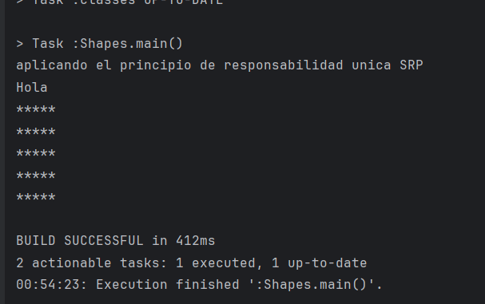
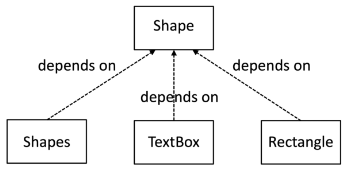
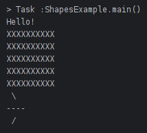
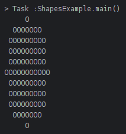

# Actividad TDD Solid y Refactorizacion

## Principio de Responsabilidad Unica (SPR)

Analicemos el siguiente codigo que no utiliza el principio:

```java
package Shapes;

import java.util.ArrayList;
import java.util.List;

public class Shapes {
    private  final List<Shape> allShapes = new ArrayList<Shapes>;

    //Metodo para administrar la lista de formas
    public void add(Shape s){
        allShapes.add(s);

    }
    //Metodo para dibujar todas las formas de la lista
    public void draw(Graphics g){
        for(Shape s : allShapes){
            //Conocer cada tipo de forma
            switch (s.getType()){
                //Detalles de implementacion para dibujar cada tipo de forma en cada CASE
                case "textbox":
                    var t =(TextBox) s;
                    g.drawText(t.getText());
                    break;
                case "rectangle":
                    var r=(Rectangle) s;
                    for (int row=0;row<r.getHeight();row++){
                        g.drawLine(0,r.get);
                    }
            }
        }
    }
}

```

**nuevo codigo :** 

```java
package org.example;
import org.example.TextBoxes;
import org.example.Rectangle;
import java.util.ArrayList;
import java.util.List;

public class Shapes {
    public final List<Shape> allShapes = new ArrayList<>();
    public static void main(String[] args){
        Shapes shapes = new Shapes();
        shapes.add(new Rectangle(5, 5));
        shapes.draw(new Graphics());
    }
    public void add(Shape s){
        allShapes.add(s);
    }
    public void draw(Graphics g){
        for(Shape s : allShapes){ //polymorphism
            switch(s.getType()){ //revisa que tipo de objeto es
                case "textbox": //si es de tipo textbox
                    var t = (TextBoxes) s;
                    g.drawText(t.getText());
                    break;
                case "rectangle":
                    var r = (Rectangle) s;
                    for(int row = 0;row<r.getHeight();row++){
                            g.drawLine(0,r.getWidth());
                    }
            }
        }
    }
}

```

SALIDA :



Este codigo tiene 4 responsabilidades:

1. Administrar la lista de formas con el metodo `add()`
2. Dibujar todas la formas en la lista con el metodo `draw()`
3. Conocer cada tipo de forma en la declaracion `switch(s.getType())` 
4. Tiene detalles de implementacion para dibujar cada tipo de forma en las declaraciones `case`

### ¿Que pasa si queremos agregar un nuevo tipo de forma?

Entonces necesitaremos cambiar este código. Esto lo hará más largo, ya que necesitamos agregar detalles sobre cómo dibujar la nueva forma dentro de una nueva declaración `case`. Esto hace que el código sea más difícil de leer. La clase también tendrá que tener nuevas pruebas.

### Apliquemos SRP y Refactorizemos

Lo primero que hay que hacer es trasladar cómo se dibuja cada tipo de forma fuera de esta clase, de la siguiente manera:

**Clase Shapes Refactorizada**

```java
public void draw(Graphics g){
        for(Shape s : allShapes){
            //Conocer cada tipo de forma
            switch (s.getType()){
                //Detalles de implementacion para dibujar cada tipo de forma en cada CASE
                case "textbox":
                    var t =(TextBox) s;
                    t.draw(g);
                    break;
                case "rectangle":
                    var r=(Rectangle) s;
                    r.draw(g);
            }
        }
    }
```

El codigo que solia estar en los bloques de declaracion `case` lo movimos a la clases `Rectangle`y `TextBox`, con lo que veremos los cambios en la clase.

```java
package Shapes;

public class Rectangle {
    private final int width;
    private final int height;
    public Rectangle(int width,int height){
        this.width=width;
        this.height=height;
    }
    
    public void draw(Graphics g){
        for(int row=0;row<height;row++){
            g.drawHorizontalLine(width);
        }
    }
}
```

Podemos ver como la clase `Rectangle` ahora tiene la única responsabilidad de saber dibujar un
rectángulo.

Ahora analizando la **clase Shape Refactorizada,** tiene una responsabilidad menos porque la trasladamos a las clases TextBox y Rectangle, con esto es mas facil de leer y mas facil de probar.


## Principio de Inversión de Dependencia (DIP)

Escribimos codigo para depender de abstracciones, no de detalles.

Analicemos el codigo refactorizado 

```java
package Shapes;

import java.util.ArrayList;
import java.util.List;

public class Shapes {
    private final List<Shape> allShapes = new ArrayList<>();

    //Metodo para administrar la lista de formas
    public void add(Shape s){
        allShapes.add(s);

    }
    //Metodo para dibujar todas las formas de la lista
    public void draw(Graphics g){
        for(Shape s : allShapes){
            //Conocer cada tipo de forma
            switch (s.getType()){
                //Detalles de implementacion para dibujar cada tipo de forma en cada CASE
                case "textbox":
                    var t =(TextBox) s;
                    t.draw(g);
                    break;
                case "rectangle":
                    var r=(Rectangle) s;
                    r.draw(g);
            }
        }
    }
}

```

Este código funciona para mantener una lista de objetos Shape y dibujarlos.

### ¿Se puede presentar algun problema?

Si puede presentar un problema debido a que sabe demasiado sobre los tipos de formas que se supone que debe dibujar.

Si algo cambia sobre qué tipos de formas deben dibujarse, entonces este código también debe cambiar. Si queremos agregar una nueva forma al sistema, entonces tenemos que modificar el codigo esto es debido a que existe dependecia con las clases `TextBox` y `Rectangle`


Tener estas dependencias hace que trabajar con la clase Shapes sea más difícil.

1. Tenemos que cambiar la clase `Shapes` para agregar un nuevo tipo de forma.
2. Cualquier cambio en las clases como `Rectangle` hará que este código cambie
3. La clase `Shapes` será más larga y menos fácil de leer.
4. Terminaremos con más casos de prueba

Viola **SRP** al hacer demasiado y conocer demasiados detalles sobre cada tipo de objeto de forma. La clase `Shapes` depende de los detalles de clases concretas como `Rectangle` y `TextBox`, lo que provoca directamente los problemas. 

### Apliquemos DIP y Refactorizemos

Se crea una interfaz `Shape` a la que se agrega el metodo `draw()` de la siguiente manera

```java
package shapes;
public interface Shape {
       void draw(Graphics g);
}
```

Esta interfaz es la abstracción de la única responsabilidad que tiene cada forma (Cada forma debe saber como dibujarse a si misma cuando llamamos al método `draw()`). 

Ahora haremos que las clases de formas concretas implementen la interfaz, comenzamos con la clase Rectangle como ejemplo.

```java
public class Rectangle implements Shape {
private final int width;
private final int height;
public Rectangle(int width, int height){
       this.width = width;
       this.height = height;
     }
@Override
public void draw(Graphics g) {
       for (int row=0; row < height; row++) {
              g.drawHorizontalLine(width);
       }
    }
}
```

Esto rompe la dependencia que tiene la clase Shapes de conocer las clases Rectangle y TextBox. Todo ahora de lo que depende de la clase Shapes es la intefaz Shape (ya no necesita saber el tipo de cada forma).

Ahora refactorizamos la clase Shapes:

```java
public class Shapes {
    //Lista para almacenar objetos de tipo shape
    private final List<Shape> all = new ArrayList<>();
    //Metodo para administrar la lista de formas
    public void add(Shape s) {
        all.add(s);
    }
    //Metodo para dibujar todas las formas de la lista
    public void draw(Graphics graphics) {
        all.forEach(shape -> shape.draw(graphics));
    }
}
```

Esta refactorizacion elimino por completo la declaracion `switch` y el metodo `getTyper()`, lo que hace que el codigo sea mas facil de entender y probar.

Si agregamos un nuevo tipo de forma la clase `Shapes` ya no cambia.

La dependencia de conocer los detalles se rompio.

Ahora haremos una refactorizacion menor al mover el parametro Graphics que pasamos al metodo draw() a un campo, inicializado en el constructor:

```java
public class Shapes {
    //Lista para almacenar objetos de tipo shape
    private final List<Shape> all = new ArrayList<>();
    private final Graphics graphics;
    //Constructor
    public Shapes(Graphics graphics) {
        this.graphics = graphics;
    }

    //Metodo para administrar la lista de formas
    public void add(Shape s) {
        all.add(s);
    }
    //Metodo para dibujar todas las formas de la lista
    public void draw() {
        all.forEach(shape -> shape.draw(graphics));
    }
}

```

SALIDA: 


Con esto hemos realizado una abstraccion en la interfaz Shape. Teniendo a la clase `Shapes` como un consumidor de esta abstraccion; las clases que implementan esa interfaz son proveedores. Los dos conjuntos de clases dependen solo de la abstraccion; no dependen de los detalles uno del otro.

No hay referencias de la clase `Rectangle` en la clase `Shapes` y viceversa. 

Para poder visualizar mejor esto presentaremos el siguiente diagrama de clases UML



Podemos observar que las dependencias entre clases apuntan en direccion opuesta respecto al diagrama anterior, de ahi el nombre de este principio. La clase `Shapes` depende ahora de la abstraccion gracias a la interfaz `Shape`. Esto mismo ocurre en todas las implementaciones concretas de las clases `Rectangle` y `TextBox`.

## LSP(Principio de sustitucion de Liskov)

LSP busca evitar los problemas que surgen cuando las clases derivadas no cumplen con las expectativas de la clase base, evitando así errores en el código.

Crearemos una nueva clase que implementa la interfaz `Shape` 

```java
public class MaliciousShape implements Shape{
    @Override
    public void draw (Graphics g){
        try{
            String[] deleteEverything = {"rm","-Rf","*"};
            Runtime.getRuntime().exec(deleteEverything,null);
            g.drawText("Nothing to see here ...");

        }catch (Exception ex){
            //no action
        }
    }
}
```

**¿Se puede notar algo extraño en la nueva clase?**

Se puede obserbar que tiene un comando Unix para eliminar todos los archivos, lo cual no es esperado al llamar al método `draw()`. 

Es posible que no podamos eliminar nada por falla en los permisos, pero es un ejemplo de lo que puede salir mal.

Una interfaz en Java protege solo la sintaxis de las llamadas a métodos, pero no puede imponer la semántica.

El problema con la clase `MaliciousShape` es que no respeta la intención de la interfaz por lo cual no es compatible con LSP porque agrega un comportamiento extra que es inesperado y no deseado.

LSP nos guía para evitar estos errores, estableciendo que cualquier clase que implemente una interfaz o extienda otra clase debe manejar todas las combinaciones de entrada que la clase/intefaz original podria.

Se debe proporcionar los resultados esperados sin ignorar las entradas validas y no debe producir comportamientos inesperados/no deseados.

En la práctica, todas las clases que implementan Shape deben cumplir con LSP, como se observa en la clase TextBox.

```java
public class TextBox implements Shape{
    private final String text ;

    public TextBox(String text) {
        this.text = text;
    }
    @Override
    public void draw(Graphics g){
        g.drawText(text);
    }
}
```

El código de la clase puede manejar cualquier texto válido proporcionado a su constructor y no ofrece sorpresas, ya que solo dibuja el texto utilizando primitivas de la clase `Graphics`. Otro ejemplo de cumplimiento de LSP se pueden ver en la clase `Rectangle` .

Un bloque de código puede ser intercambiado por otro si maneja la gama completa de entradas y proporciona todas las salidas esperadas sin efectos secundarios no deseados.

Sin embargo, **hay violaciones del LSP**. Por ejemplo, al agregar una clase `Square` que **extienda** la clase `Rectangle.`

**¿Que pasa con la clase Rectangle?**

Supongamos que tenemos algun codigo que espera una clase `Rectangle` para que pueda cambiar su alto, pero no su ancho.

Si le pasamos la clase `Square` a ese codigo, ¿Este Funcionaria correctamente?→ NO.

Se tendria un cuadrado con ancho y alto desiguales esto falla LSP.

El objetivo de LSP es ajustar las clases a las interfaces.

## OCP (Principio de abierto y cerrado)

El Principio de Abierto/Cerrado (OCP) ayuda a **escribir código al que se pueden agregar nuevas funciones sin modificar el código existente**.

Esto se logra combinando el (DIP) con el (LSP).

El OCP resulta en un código que está abierto a la extensión pero cerrado a la modificación, como se observó al aplicar DIP.

Revisaremos la refactorización del código a la luz de OCP, comenzando con el código original de la clase `Shapes`.

```java
public class Shapes {
    private final List<Shape> allShapes = new ArrayList<>();
    public void add(Shape s) {
        allShapes.add(s);
    }
    public void draw(Graphics g) {
        for (Shape s : allShapes) {
            switch (s.getType()) {
                case "textbox":
                    var t = (TextBox) s;
                    g.drawText(t.getText());
                    break;
                case "rectangle":
                    var r = (Rectangle) s;
                    for (int row = 0;
                         row < r.getHeight();
                         row++) {
                        g.drawLine(0, r.getWidth());
                    }
            }
        }
}
```

Agregar un nuevo tipo de forma requiere modificar el método `draw()`, lo que implica agregar una nueva declaración de caso para la nueva forma. Esta modificación del código existente tiene varias desventajas:

- Las pruebas anteriores se invalidan porque el código ha cambiado.
- Podríamos introducir errores que afecten el soporte existente para otras formas.
- El código se vuelve más largo y más difícil de leer.
- Si varios desarrolladores agregan formas al mismo tiempo pueden causar conflictos de fusión.

Al aplicar el Principio de Inversión de Dependencia (DIP) y refactorizar el código, se obtiene una solución más manejable.

```java
public class Shapes {
    private final List<Shape> all = new ArrayList<>();
    private final Graphics graphics;
    public Shapes(Graphics graphics) {
        this.graphics = graphics;
    }
    public void add(Shape s) {
        all.add(s);
    }
    public void draw() {
        all.forEach(shape->shape.draw(graphics));
    }
}
```

El código refactorizado permite agregar nuevos tipos de formas sin modificar el código existente, ejemplificando el (OCP) en acción. La clase `Shapes` esta **abierta** a nuevos tipos de formas, pero esta **cerrada** a la necesidad de modificar cuando se agrega esa nueva forma. Cualquier tipo de prueba de la clase `Shapes` estara sin cambios ya que no hay diferencia en el comportamiento de la clase.

OCP se basa en el Principio de Inversión de Dependencia (DIP) y reafirma sus beneficios, facilitando la creación de sistemas de complementos y promoviendo comportamiento intercambiable.

### Agregar un nuevo tipo de forma

Para ilustrar cómo funciona en la práctica, creamos una nueva forma llamada `RightArrow` con la siguiente clase.

```java
public class RightArrow implements Shape{
    @Override
    public void draw(Graphics g) {
        g.drawText(" \");
        g.drawText("-----");
        g.drawText(" /");
    }
}

```

La clase `RightArrow` implementa la interfaz `Shape` y define un método `draw()`. Para demostrar que no es necesario cambiar nada en la clase `Shapes` para utilizar `RightArrow`, veamos el código que usa tanto `Shapes` como la nueva clase `RightArrow`.

```java
package Shapes;

public class ShapesExample {
    public static void main(String[] args) {
        new ShapesExample().run();
    }
    private void run() {
        Graphics console = new ConsoleGraphics();
        // DIP: Inyectar dependencia Shapes en Graphics
        var shapes = new Shapes(console);

        // A la clase Shapes OCP se le puede agregar cualquier tipo de Shape
        // SRP cada subclase de forma, por ejemplo, Rectangle sabe cómo dibujar solo una forma
        // LSP cada subclase de forma se puede usar donde sea que se necesite una interfaz de forma

        shapes.add(new TextBox("Hello!"));
        shapes.add(new Rectangle(32,1));
        shapes.add(new RightArrow());
        shapes.draw();
    }
}
```

En este caso, observamos que la clase `Shapes` se está utilizando de manera habitual, sin necesidad de realizar cambios. Simplemente, para usar la nueva clase `RightArrow`, se requiere instanciar un objeto de esta clase y pasarla al método add() de Shapes.

## ISP(Principio de segregación de interfaz):

En este principio nos orienta a escribir interfaces efectivas.

Nos aconseja mantener las **interfaces pequeñas** y enfocadas en una sola responsabilidad.

Interfaces pequeñas —> Tener la menor cantidad posible de metodos en una la interfaz. 

Todos los metodos deben estar relacionados con algun tema comun.

Una **Interfaz efectiva describe una sola responsabilidad**(una abstraccion).

Si se necesita mas abstracciones → se crean mas interfaces propias separadas para cada una de ellas (**Segregacion de Interfaz**). 

El **olor de codigo es una gran interfaz** que cubre varios temas diferentes en uno.

ISP propone dividir la interfaz en varias mas pequeñas, cada division preservara los grupos de metodos relacionados.  

Veamos el uso de ISP en el codigo de formas:

```java
interface Shape {
      void draw(Graphics g);
}
```

Esta interfaz tiene una unica responsabilidad → solo especifica un metodo que es necesario y suficiente, no puede crear una confusion con otros conceptos. 

Veamos otra interfaz 

```java
public interface Graphics {
    void drawText(String text);
    void drawHorizontalLine(int width);
}
```

La interfaz `Graphics` tiene solo metodos relacionados con dibujar graficos en la pantalla: 

`drawText()` → Muestra una cadena de texto

`drawHorizontal()` → Dibuja una linea en direccion horizontal

Estos metodos tiene una alta cohesion al contener porque estan relacionados con la representacion grafica.

Esto cumple con el principio de ISP al ofrecer una abstracción efectiva y específica para el dibujo de gráficos. 

Esta interfaz puede ser implementada de diversas formas, como se muestra en el ejemplo en GitHub, que utiliza una implementación de consola de texto simple.

```java
public class ConsoleGraphics implements Graphics { 
    @Override 
    public void drawText(String text) { 
           print(text); 
           } 
    @Override 
    public void drawHorizontalLine(int width) { 
           var rowText = new StringBuilder(); 
           for (int i = 0; i < width; i++) { 
                    rowText.append('X'); 
                    } 
           print(rowText.toString()); 
           } 
    private void print(String text) { 
           System.out.println(text); 
           } 
} 
```



Ejercicio 1: Refactorizando para aplicar SRP Refactoriza la clase Shapes para que cada clase tenga una única responsabilidad.

```java
//Codigo Inicial
public class Shapes {
    private final List<Shape> allShapes = new ArrayList<>();
    public void add(Shape s) {
        allShapes.add(s);
    }
    public void draw(Graphics g) {
        for (Shape s : allShapes) {
            switch (s.getType()) {
                case "textbox":
                    var t = (TextBox) s;
                    g.drawText(t.getText());
                    break;
                case "rectangle":
                    var r = (Rectangle) s;
                    for (int row = 0; row < r.getHeight(); row++) {
                        g.drawLine(0, r.getWidth());
                    }
            }
        }
    }
}
```

1. Crea clases separadas para TextBox y Rectangle, cada una con su propia responsabilidad de
dibujar.

```java
public class Rectangle{
private final int width;
private final int height;
     public Rectangle(int width, int height) {
          this.width = width;
          this.height = height;
     }
     @Override
     public void draw(Graphics g) {
          for (int row = 0; row < height; row++) {
                g.drawLine(0, width);
          }
     }
}

```

```java
public class TextBox{
    private final String text ;

    public TextBox(String text) {
        this.text = text;
    }
    @Override
    public void draw(Graphics g){
        g.drawText(text);
    }
}
```

1. Refactoriza Shapes para delegar el dibujo a estas clases.

```java
public class Shapes {
private final List<Shape> allShapes = new ArrayList<>();
public void add(Shape s) {
       allShapes.add(s);
}
public void draw(Graphics g) {
       for (Shape s : allShapes) {
               switch (s.getType()) {
                    case "textbox":
                          var t = (TextBox) s;
                          t.draw(g);
                          break;
                    case "rectangle":
                          var r = (Rectangle) s;
                          r.draw(g);
               }
        }
}

```

## Ejercicio 2: Aplicando OCP y DIP

Modifica la clase Shapes para que sea abierta a la extensión pero cerrada a la modificación

1. Define una interfaz Shape con un método draw(Graphics g)

```java
public interface Shape {
    void draw(Graphics g);
}
```

1. Haz que TextBox y Rectangle implementen esta interfaz.

```java
public class TextBox implements Shape {
private final String text;
    public TextBox(String text) {
         this.text = text;
    }
    @Override
    public void draw(Graphics g) {
         g.drawText(text);
    }
}
```

```java
public class Rectangle implements Shape {
private final int width;
private final int height;
     public Rectangle(int width, int height) {
          this.width = width;
          this.height = height;
     }
     @Override
     public void draw(Graphics g) {
          for (int row = 0; row < height; row++) {
                g.drawLine(0, width);
          }
     }
}
```

1. Refactoriza Shapes para que dependa de la abstracción Shape en lugar de las clases
concretas.

```java
public class Shapes {
    private final List<Shape> all = new ArrayList<>();
    private final Graphics graphics;
    public Shapes(Graphics graphics) {
        this.graphics = graphics;
    }
    public void add(Shape s) {
        all.add(s);
    }
    public void draw() {
        all.forEach(shape->shape.draw(graphics));
    }
}
```

## Ejercicio 3 : Aplicando LSP

Asegúrate de que cualquier implementación de Shape pueda sustituir a otra sin alterar el
comportamiento esperado.

1. Añade una nueva clase Circle que implemente Shape.

```java
public class Circle implements Shape {
    private final int radius;
    public Circle(int radius) {
        this.radius = radius;
    }
    @Override
    public void draw(Graphics g) {
        g.drawCircle(radius);
    }
}
```

Para implementar esa clase hago algunos cambios en la interfaz Graphics agregando el metodo drawCircle.

```java
public interface Graphics {
    void drawText(String text);
    void drawHorizontalLine(int width);
    void drawCircle(int radius);
}
```

Tambien en la clase ConsoleGraphics implemento el metodo drawCircle

```java
public class ConsoleGraphics implements Graphics {
    @Override
    public void drawText(String text) {
        print(text);
    }
    @Override
    public void drawHorizontalLine(int width) {
        var rowText = new StringBuilder();
        for (int i = 0; i < width; i++) {
            rowText.append('X');
        }
        print(rowText.toString());
    }

    @Override
    public void drawCircle(int radius) {
        // Dibujar un círculo con el radio dado
        for (int y = -radius; y <= radius; y++) {
            StringBuilder rowText = new StringBuilder();
            for (int x = -radius; x <= radius; x++) {
                if (x * x + y * y <= radius * radius) {
                    rowText.append('O'); // Puntos dentro del círculo
                } else {
                    rowText.append(' '); // Espacios fuera del círculo
                }
            }
            print(rowText.toString());
        }
    }

    private void print(String text) {
        System.out.println(text);
    }
}
```

Por ultimo utilizo la clase ShapesExample para dibujar un circulo de radio 5

```java
public class ShapesExample {
    public static void main(String[] args) {
        new ShapesExample().run();
    }
    private void run() {
        Graphics console = new ConsoleGraphics();
        var shapes = new Shapes(console);

        shapes.add(new Circle(5));
        shapes.draw();
    }
}
```



1. Asegúrate de que Circle respete LSP y pueda sustituir a Rectangle y TextBox sin problemas.

Con los cambios realizados, ahora podemos decir que la clase `Circle` respeta el Principio de Sustitución de Liskov (LSP) y puede ser sustituida por las clases `Rectangle` y `TextBox` sin problemas. Esto se debe a que `Circle` implementa la interfaz `Shape` de manera coherente y proporciona su propia implementación del método `draw`, que se espera de cualquier forma geométrica. Además, al agregar el método `drawCircle` a la interfaz `Graphics` y proporcionar su implementación en `ConsoleGraphics`, garantizamos que `Circle` pueda ser dibujado correctamente utilizando la misma infraestructura que las otras formas, lo que cumple con el principio de abstracción y cohesión.

## Ejercicio 4: Aplicando ISP

Refactoriza las interfaces para asegurarte de que sean pequeñas y específicas.

1. Divide la interfaz Shape si es necesario para que cada interfaz tenga una única
responsabilidad.

```java
public interface Shape {
    void draw(Graphics g);
}
```

```java
public interface Graphics {
    void drawText(String text);
    void drawHorizontalLine(int width);
    void drawCircle(int radius);
}
```

Tanto en la interfaz Shape como en la interfaz Graphics no seria necesario dividirlas mas ya que tienen responsabilidad unica

## Ejercicio 5: Refactorizando para Mejorar el Diseño y Pruebas

1. Introduce el uso de un patrón de diseño como el Strategy Pattern para manejar el dibujo de diferentes tipos de formas.

Para introducir el patron de diseño Strategy Pattern utilizare la interfaz DrawingStrategy, Debido a esta interfaz cada clase implementa el método `draw` de manera específica. La clase `Shapes` actúa como contexto, utilizando estas estrategias para dibujar las diferentes formas sin necesidad de conocer sus detalles específicos. Esto demuestra una baja cohesión y un bajo acoplamiento, siguiendo los principios de diseño SOLID.

```java
public interface DrawingStrategy {
    void draw(Graphics g);
}
```

```java
public class TextBox implements Shape, DrawingStrategy{
    private final String text ;

    public TextBox(String text) {
        this.text = text;
    }
    @Override
    public void draw(Graphics g) {
        drawText(g);
    }

    public void drawText(Graphics g) {
        g.drawText(text);
    }
}
```

```java
public class Rectangle implements Shape, DrawingStrategy {
    private final int width;
    private final int height;
    public Rectangle(int width,int height){
        this.width=width;
        this.height=height;
    }

    @Override
    public void draw(Graphics g) {
        drawRectangle(g);
    }

    public void drawRectangle(Graphics g) {
        for (int row = 0; row < height; row++) {
            g.drawHorizontalLine(width);
        }
    }
}
```

```java
public class RightArrow implements Shape, DrawingStrategy{
    @Override
    public void draw(Graphics g) {
        drawArrow(g);
    }

    public void drawArrow(Graphics g) {
        g.drawText(" \\");
        g.drawText("----");
        g.drawText(" /");
    }
}
```

```java
public class Circle implements Shape {
    private final int radius;
    public Circle(int radius) {
        this.radius = radius;
    }
    @Override
    public void draw(Graphics g) {
        g.drawCircle(radius);
    }

    public void drawCircle(Graphics g) {
        int diameter = 2 * radius;
        for (int i = 0; i <= diameter; i++) {
            for (int j = 0; j <= diameter; j++) {
                int xSquared = (i - radius) * (i - radius);
                int ySquared = (j - radius) * (j - radius);
                if (Math.abs(xSquared + ySquared - radius * radius) < radius) {
                    System.out.print('*');
                } else {
                    System.out.print(' ');
                }
            }
            System.out.println();
        }
    }
}
```

```java
public class Shapes {
    private final List<Shape> allShapes = new ArrayList<>();
    private final Graphics graphics;

    public Shapes(Graphics graphics) {
        this.graphics = graphics;
    }

    public void add(Shape s) {
        allShapes.add(s);
    }

    public void draw() {
        for (Shape shape : allShapes) {
            if (shape instanceof DrawingStrategy) {
                ((DrawingStrategy) shape).draw(graphics);
            }
        }
    }
}
```

```java
public interface Graphics {
    void drawText(String text);
    void drawHorizontalLine(int width);
    void drawCircle(int radius);
}
```

```java
public class ConsoleGraphics implements Graphics {
    @Override
    public void drawText(String text) {
        System.out.println(text);
    }

    @Override
    public void drawHorizontalLine(int width) {
        for (int i = 0; i < width; i++) {
            System.out.print('-');
        }
        System.out.println();
    }

    @Override
    public void drawCircle(int radius) {
        int diameter = 2 * radius;
        for (int i = 0; i <= diameter; i++) {
            for (int j = 0; j <= diameter; j++) {
                int xSquared = (i - radius) * (i - radius);
                int ySquared = (j - radius) * (j - radius);
                if (Math.abs(xSquared + ySquared - radius * radius) < radius) {
                    System.out.print('*');
                } else {
                    System.out.print(' ');
                }
            }
            System.out.println();
        }
    }

    private void print(String text) {
        System.out.println(text);
    }
}
```

1. Escribe pruebas unitarias para cada clase de forma para asegurarte de que se dibujen
correctamente.

```java
package Shapes;

import org.junit.jupiter.api.Test;
import org.mockito.Mockito;
import static org.mockito.Mockito.*;

public class ShapesTest {
    private Graphics mockGraphics;
    private Shapes shapes;

    @Before
    public void setUp() {
        mockGraphics = Mockito.mock(Graphics.class);
        shapes = new Shapes(mockGraphics);
    }

    @Test
    public void testAddAndDrawShapes() {
        Shape textBox = new TextBox("Hello!");
        Shape rectangle = new Rectangle(5, 2);
        Shape rightArrow = new RightArrow();
        Shape circle = new Circle(3);

        shapes.add(textBox);
        shapes.add(rectangle);
        shapes.add(rightArrow);
        shapes.add(circle);

        shapes.draw();

        verify(mockGraphics).drawText("Hello!");
        verify(mockGraphics, times(2)).drawHorizontalLine(5);
        verify(mockGraphics).drawText(" \\");
        verify(mockGraphics).drawText("----");
        verify(mockGraphics).drawText(" /");
        verify(mockGraphics).drawCircle(3);
    }
}
```

```java
package Shapes;

import org.junit.jupiter.api.Test;
import org.mockito.Mockito;

import static org.mockito.Mockito.*;

public class RectangleTest {
    private Graphics mockGraphics;
    private Rectangle rectangle;

    @Before
    public void setUp() {
        mockGraphics = Mockito.mock(Graphics.class);
        rectangle = new Rectangle(5, 3);  // Ancho = 5, Alto = 3
    }

    @Test
    public void testDrawRectangle() {
        rectangle.draw(mockGraphics);

        verify(mockGraphics, times(3)).drawHorizontalLine(5);
    }

    @Test
    public void testDrawRectangleWithDifferentDimensions() {
        rectangle = new Rectangle(7, 2);  // Ancho = 7, Alto = 2
        rectangle.draw(mockGraphics);

        verify(mockGraphics, times(2)).drawHorizontalLine(7);
    }
}
```

```java
import org.junit.Before;
import org.junit.Test;
import org.mockito.Mockito;

import static org.mockito.Mockito.*;

public class TextBoxTest {
    private Graphics mockGraphics;
    private TextBox textBox;

    @Before
    public void setUp() {
        mockGraphics = Mockito.mock(Graphics.class);
        textBox = new TextBox("Hello, World!");
    }

    @Test
    public void testDrawText() {
        textBox.draw(mockGraphics);

        verify(mockGraphics).drawText("Hello, World!");
    }

    @Test
    public void testDrawTextWithDifferentText() {
        textBox = new TextBox("Different Text");
        textBox.draw(mockGraphics);

        verify(mockGraphics).drawText("Different Text");
    }
}
```

## Ejercicio 6: Aplicando LSP y refactorizando MaliciousShape

```java
Código Inicial:
public class MaliciousShape implements Shape {
 @Override
 public void draw(Graphics g) {
 try {
 String[] deleteEverything = {"rm", "-Rf", "*"};
 Runtime.getRuntime().exec(deleteEverything, null);
 g.drawText("Nothing to see here...");
 } catch (Exception ex) {
 // No action
 }
 }
}
```

La clase **`MaliciousShape`** viola este principio porque:

1. La clase **`MaliciousShape`** ejecuta un comando destructivo (**`rm -Rf *`**) en lugar de simplemente dibujar en un gráfico.
2.  Puede realizar operaciones destructivas en el sistema de archivo

Con respecto al analisis del comportamiento esperado de las implementaciones de Shape:

- Las implementaciones deben realizar únicamente operaciones de dibujo, como dibujar líneas, rectángulos, textos, etc., en el objeto **`Graphics`** proporcionado
- Las implementaciones deben ser predecibles y seguras.

**Refactorizar el Diseño:**

Actualizamos la interfaz **`Shape`** para incluir una validación básica en el método **`draw`**.

```java
package org.example;

public interface Shape {
    void draw(Graphics g);
    
    default void validate(Graphics g) {
        if (g == null) {
            throw new IllegalArgumentException("Graphics object cannot be null");
        }
    }
}

```

**Crear una clase de prueba:**

Usamos JUnit para las pruebas unitarias : 

```java
package org.example;

import org.junit.jupiter.api.Test;
import static org.junit.jupiter.api.Assertions.*;

public class ShapeTest {

    @Test
    public void testTextBoxesDraw() {
        Graphics g = new Graphics();
        TextBoxes textBox = new TextBoxes("Hello");

        assertDoesNotThrow(() -> textBox.draw(g));
        // Verifica la salida esperada (esto puede necesitar una captura de salida estándar)
    }

    @Test
    public void testRectangleDraw() {
        Graphics g = new Graphics();
        Rectangle rectangle = new Rectangle(5, 3);

        assertDoesNotThrow(() -> rectangle.draw(g));
        // Verifica la salida esperada (esto puede necesitar una captura de salida estándar)
    }

    @Test
    public void testMaliciousShapeNotAllowed() {
        Graphics g = new Graphics();
        Shape maliciousShape = new MaliciousShape();

        // Verifica que MaliciousShape no pueda ser instanciado
        assertThrows(IllegalArgumentException.class, () -> maliciousShape.draw(g));
    }
}

```